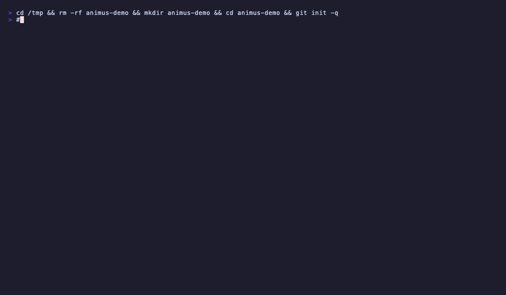
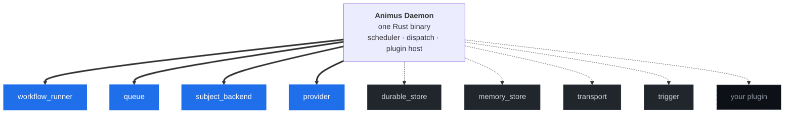

# Animus

<!-- TODO: hero PNG / logo asset goes here once design lands -->

**Animus is how you run a workforce of AI agents — a real engineering team that runs itself.** Built by [launchapp-dev](https://github.com/launchapp-dev).

Go to the gym. See your kids. Build the next thing. Your workforce keeps shipping.

[](https://github.com/launchapp-dev/animus-cli/releases/latest) &nbsp; [](https://www.rust-lang.org) &nbsp; []() &nbsp; [](LICENSE) &nbsp; [](https://github.com/launchapp-dev/awesome-ai-coding-tools)

---

<!-- 30-second install + first-workflow demo. Recorded with vhs (charm.sh). Source: assets/install-demo.tape -->
<!-- TODO: record + commit assets/install-demo.gif. Until then this image link will show GitHub's "image not found" placeholder. -->


---

## Install

### One paste, any agent

Open a fresh **Claude Code** (or **Codex** / **OpenCode** / **Cursor**) session and paste this. The agent installs the Animus CLI, clones `animus-skills`, runs the setup script, and adds the project section to `CLAUDE.md` / `AGENTS.md`. You'll be running workflows in about a minute.

> Install Animus + Animus Skills: run **`curl -fsSL https://raw.githubusercontent.com/launchapp-dev/animus-cli/main/scripts/install.sh | bash`** to install the `animus` CLI (latest stable — kernel + flavors architecture), then **`animus plugin install-defaults --include-subjects --include-transports`** to pull in the provider + subject + transport + workflow_runner + queue plugins the daemon needs (one-time setup, idempotent). Then **`git clone --single-branch --depth 1 https://github.com/launchapp-dev/animus-skills.git ~/.claude/skills/animus-skills && cd ~/.claude/skills/animus-skills && ./setup`** to link the skills and write `.mcp.json`. Add an "Animus" section to CLAUDE.md (or AGENTS.md for Codex) listing the slash commands: `/animus-setup`, `/animus-getting-started`, `/animus-mcp-setup`, `/animus-workflow-authoring`, `/animus-pack-authoring`, `/animus-skill-authoring`, `/animus-troubleshooting`. Restart the agent so the new `animus` MCP server is picked up. From a project root, run `/animus-setup` to scaffold `.animus/` and the first workflow.

**For Codex CLI, swap the clone path to `~/.codex/skills/animus-skills` and edit `AGENTS.md` instead of `CLAUDE.md`.**

### Manual install (no agent)

```bash
curl -fsSL https://raw.githubusercontent.com/launchapp-dev/animus-cli/main/scripts/install.sh | bash
animus plugin install-defaults --include-subjects --include-transports
```

The upstream installer currently targets macOS. On Linux and Windows, use a [release archive](https://github.com/launchapp-dev/animus-cli/releases/latest) or build from source.

The second command is **required in v0.5 and later** — the daemon refuses to start until plugins for all required roles are installed (provider, subject backend, `workflow_runner`, `queue`). The command is idempotent and skips anything already installed.

<details>
<summary><kbd>options</kbd></summary>

```bash
# Specific version
ANIMUS_VERSION=v0.5.0 curl -fsSL https://raw.githubusercontent.com/launchapp-dev/animus-cli/main/scripts/install.sh | bash

# Custom directory
ANIMUS_INSTALL_DIR=/usr/local/bin curl -fsSL https://raw.githubusercontent.com/launchapp-dev/animus-cli/main/scripts/install.sh | bash

# Run install-defaults automatically as the last step
ANIMUS_INSTALL_PLUGINS=1 curl -fsSL https://raw.githubusercontent.com/launchapp-dev/animus-cli/main/scripts/install.sh | bash

# Skip the post-install plugin step (CI / Docker)
ANIMUS_SKIP_PLUGIN_INSTALL=1 curl -fsSL https://raw.githubusercontent.com/launchapp-dev/animus-cli/main/scripts/install.sh | bash
```

</details>

<details>
<summary><kbd>upgrading from v0.4.11 or earlier</kbd></summary>

Stop the running daemon first, then upgrade. See [`docs/migration/v0.4.11-to-v0.4.12.md`](docs/migration/v0.4.11-to-v0.4.12.md) for the full rationale and rollback procedure.

```bash
animus daemon stop
curl -fsSL https://raw.githubusercontent.com/launchapp-dev/animus-cli/main/scripts/install.sh | bash
animus plugin install-defaults --include-subjects --include-transports
animus daemon preflight                 # verify all required plugins present
animus daemon start --autonomous
```

</details>

<details>
<summary><kbd>prerequisites</kbd></summary>

You need at least one AI coding CLI:

```bash
npm install -g @anthropic-ai/claude-code    # Claude (recommended)
npm install -g @openai/codex                # Codex
npm install -g @google/gemini-cli           # Gemini
```

</details>

---

## Quick start

```bash
cd your-project                                  # any git repo
animus doctor                                    # check prerequisites and auto-remediate
animus init --template task-queue --non-interactive   # scaffold .animus/ from the task-queue template

# v0.5 one-time setup: install the provider + subject + transport + workflow_runner + queue plugins.
# (Installed plugins live in ~/.animus/plugins/ and are shared across projects.)
animus plugin install-defaults --include-subjects --include-transports
animus daemon preflight                          # verify all required plugins are present

# Option 1: run a workflow on demand
animus subject create --kind task --title "Add rate limiting" --priority p1
animus workflow run --task-id TASK-001

# Option 2: go fully autonomous
animus daemon start --autonomous                 # daemon executes ready subjects continuously
animus daemon health                             # verify it's up
animus logs tail --limit 100                     # inspect recent daemon events
animus daemon stream                             # live structured event stream

# Scaffold a brand-new subject backend (Jira, Notion, anything with an API):
animus plugin new --kind subject --name jira
```

Bundled `init` templates: **`task-queue`**, **`conductor`**, **`direct-workflow`**.

> **v0.5 note:** the daemon refuses to start unless plugins for all required roles are installed — provider, subject backend, `workflow_runner`, and `queue`. Run `animus daemon preflight` for the exact remediation command if startup fails.

---

## Architecture

**The Animus daemon is one Rust binary.** Scheduler, dispatch, IPC, plugin host. Everything else is a plugin you choose.



Solid arrows are **required plugin kinds** — the daemon refuses to start without one of each. Dotted arrows are **optional kinds** you turn on when you need them (durable workflow execution, agent memory, HTTP/GraphQL transports, webhook/Slack triggers). The dashed box is **yours** — `animus plugin install owner/repo` and your code joins the kernel.

Plugins speak JSON-RPC 2.0 over stdio. The protocol is published as a versioned Rust workspace at [`launchapp-dev/animus-protocol`](https://github.com/launchapp-dev/animus-protocol). Authors write against the protocol types and ship a binary; the daemon discovers it on disk and routes calls.

For the source-of-truth architecture docs: [`docs/architecture/kernel-and-flavors.md`](docs/architecture/kernel-and-flavors.md), [`docs/architecture/full-system-architecture.md`](docs/architecture/full-system-architecture.md), [`docs/architecture/plugin-system.md`](docs/architecture/plugin-system.md).

---

## Flavors

The kernel is small. The flavors are yours to compose. Here's what's published today by [launchapp-dev](https://github.com/launchapp-dev):

| Plugin | Kind | What it does |
|---|---|---|
| [`animus-workflow-runner-default`](https://github.com/launchapp-dev/animus-workflow-runner-default/releases/latest) | `workflow_runner` | Runs your workflow phases (Rust) |
| [`animus-queue-default`](https://github.com/launchapp-dev/animus-queue-default/releases/latest) | `queue` | Durable subject dispatch queue (Rust) |
| [`animus-subject-default`](https://github.com/launchapp-dev/animus-subject-default/releases/latest) | `subject_backend` | File-based task tracker |
| [`animus-subject-requirements`](https://github.com/launchapp-dev/animus-subject-requirements/releases/latest) | `subject_backend` | Requirement docs as the source of work |
| [`animus-subject-linear`](https://github.com/launchapp-dev/animus-subject-linear/releases/latest) | `subject_backend` | Linear issues mirror |
| [`animus-provider-claude`](https://github.com/launchapp-dev/animus-provider-claude/releases/latest) | `provider` | Claude Code CLI wrapper |
| [`animus-provider-codex`](https://github.com/launchapp-dev/animus-provider-codex/releases/latest) | `provider` | OpenAI Codex CLI wrapper |
| [`animus-provider-gemini`](https://github.com/launchapp-dev/animus-provider-gemini/releases/latest) | `provider` | Gemini CLI wrapper |
| [`animus-step-durable-dbos`](https://github.com/launchapp-dev/animus-step-durable-dbos/releases/latest) | `durable_store` | Postgres-backed step fence (DBOS Transact) |
| [`animus-memory-zep`](https://github.com/launchapp-dev/animus-memory-zep/releases/latest) | `memory_store` | Semantic memory with graph scopes (Zep Cloud) |
| [`animus-transport-http`](https://github.com/launchapp-dev/animus-transport-http/releases/latest) | `transport` | REST/JSON API |
| [`animus-transport-graphql`](https://github.com/launchapp-dev/animus-transport-graphql/releases/latest) | `transport` | GraphQL API |
| [`animus-web-ui`](https://github.com/launchapp-dev/animus-web-ui/releases/latest) | `web_ui` | Browser control center |
| [`animus-trigger-webhook`](https://github.com/launchapp-dev/animus-trigger-webhook/releases/latest) | `trigger` | Generic + GitHub webhook events |
| [`animus-trigger-slack`](https://github.com/launchapp-dev/animus-trigger-slack/releases/latest) | `trigger` | Slack event source |

[Browse all 20+ official plugins →](https://github.com/launchapp-dev)

**Build your own:** `animus plugin new --kind subject --name jira` scaffolds a typed plugin in a fresh repo. Write it. Tag it. Anyone in the world can `animus plugin install your-org/animus-subject-jira` and you're shipping for their workforce too.

Plugins verify a sigstore cosign signature when one is published. Use `--require-signature` to enforce. See [`docs/architecture/plugin-signing.md`](docs/architecture/plugin-signing.md).

---

## Features

### The kernel is small. The workforce is yours.

Animus is one Rust binary holding the scheduler, the dispatch loop, the plugin host, and the control socket. **That's the kernel.** Everything else — running phases, queuing subjects, talking to a model, persisting durable state, remembering across sessions — is a plugin you install. Swap any piece without touching the rest. The kernel never knew about Postgres, never knew about Zep, never knew about Claude. It just speaks JSON-RPC.

### Define your team in YAML

Bind models, tools, MCP servers, and system prompts to named agent profiles. Route subjects by complexity. The whole team lives in `.animus/agents.yaml` and `.animus/workflows.yaml`.

```yaml
agents:
  default:
    model: claude-sonnet-4-6
    tool: claude
    mcp_servers: ["animus", "context7"]

workflows:
  - id: standard
    phases: [requirements, implementation, push-branch, create-pr]
    post_success:
      merge: { strategy: squash, auto_merge: true, cleanup_worktree: true }
```

### Parallel git worktrees

Every active workflow gets its own git worktree on its own branch. Agents work in parallel without conflicts. Capacity-aware scheduling keeps the queue full without thrashing the box. Post-success hooks handle merge, cleanup, and PR creation.

### Phase gates before merge

Phases are typed: **agent** (AI with decision contracts), **command** (shell), **manual** (human gate). Every agent phase returns `advance`, `rework`, `skip`, or `fail`. Rework loops pass the reviewer's feedback back to the implementer. Failed gates reroute, not crash.

### Run unattended

Daemon mode + cron schedules + webhook triggers + Slack event sources. Workflows fire on `git push`, on Linear status changes, on `*/5 * * * *`, on whatever you wire up. `animus daemon start --autonomous` and your workforce starts shipping. (Occasionally check that the agents are still on the rails. They mostly are.)

### Survive failure

v0.5 ships agent reattach + LLM-decision recording. Kill the daemon mid-workflow; restart; agents resume from where they were; decisions replay from log. No re-burning tokens on retries. With the `durable_store` plugin installed, step-level idempotency means workflow retries consume the prior decision instead of re-calling the model.

---

## How Animus compares

There are good tools in adjacent shapes. Here's where Animus is the right answer vs each:

| | **Animus** | [Temporal](https://github.com/temporalio/temporal) | [DBOS Transact](https://github.com/dbos-inc/dbos-transact-ts) | [Hermes](https://github.com/NousResearch/hermes-agent) |
|---|---|---|---|---|
| **Parallel AI agent workforce** | ✅ | ❌ | ❌ | partial (personal agent, not parallel) |
| **Kernel + plugin architecture** | ✅ (6 plugin kinds) | ❌ (monolithic server) | ❌ (TypeScript library) | ❌ (framework) |
| **Local-first by default** | ✅ | partial (self-host) | partial (Postgres) | partial (cloud or self-host) |
| **Multi-provider** (Claude / Codex / Gemini / OpenCode / OAI) | ✅ (provider plugins) | n/a | n/a | ✅ |
| **Durable workflow execution** | ✅ (`durable_store` plugin, DBOS-backed) | ✅ (most mature) | ✅ (native) | ❌ |
| **Agent-CLI orchestration** | ✅ | ❌ | ❌ | partial |

Temporal is more mature for workflows that aren't agents. DBOS is faster if you don't need agents. Hermes is the right call for a single personal assistant. Animus is for the parallel-agent-workforce shape specifically.

---

## Claude Code Integration

[**Animus Skills**](https://github.com/launchapp-dev/animus-skills) is the companion skill bundle. Install with the one-paste prompt above, or directly:

```bash
git clone https://github.com/launchapp-dev/animus-skills.git ~/animus-skills
cd ~/animus-skills && ./setup           # auto-detects installed agent hosts
```

The `./setup` script supports `--host claude|codex|opencode|cursor|slate|kiro|all`, `--no-cli` (skip animus install), and `--no-mcp` (skip writing project `.mcp.json`).

<table>
<tr>
<td width="50%">

**Slash Commands**

| Command | What it does |
|:---|:---|
| `/animus-setup` | Initialize Animus in your project |
| `/animus-getting-started` | Install, concepts, first task |
| `/animus-mcp-setup` | Connect AI tools via MCP |
| `/animus-workflow-authoring` | Write custom YAML workflows |
| `/animus-pack-authoring` | Build workflow packs |
| `/animus-skill-authoring` | Author Animus skills |
| `/animus-troubleshooting` | Debug common issues |

</td>
<td width="50%">

**Auto-Loaded References**

| Skill | Coverage |
|:---|:---|
| `animus-configuration` | Config files, state layout, model routing |
| `animus-task-management` | Full task lifecycle via CLI and MCP |
| `animus-daemon-operations` | Daemon monitoring and troubleshooting |
| `animus-queue-management` | Dispatch queue operations |
| `animus-workflow-patterns` | Patterns from autonomous PRs |
| `animus-agent-personas` | PO, architect, auditor agents |
| `animus-mcp-tools` | Complete `animus.*` tool reference |
| `animus-mcp-servers-for-agents` | Context7, GitHub, memory MCP wiring |

</td>
</tr>
</table>

---

## CLI

```
animus subject       Unified subject surface: list/get/create/update/next/status --kind <kind>
                     (kind=task and kind=requirement are served by installed subject_backend plugins)
animus workflow      Run and manage multi-phase workflows
animus daemon        Start/stop the autonomous scheduler (--autonomous, health, stream, preflight)
animus queue         Inspect and manage the dispatch queue
animus agent         Control agent runner processes
animus runner        Inspect and restart the agent runner pool
animus output        Stream and inspect agent output
animus logs          Tail daemon events.jsonl or whichever log-storage plugin is active
animus trigger       Manage event triggers (file_watcher, webhook, github_webhook, slack)
animus pack          Install, list, and update workflow packs
animus plugin        Install, list, inspect, and scaffold stdio plugins
animus flavor        Manage installed plugin flavors
animus skill         Install and inspect Animus skills
animus model         Inspect the model registry and routing
animus project       Per-project config and scope helpers
animus git           Worktree and branch helpers
animus history       Inspect run history (includes phase + runtime error reports)
animus init          Initialize a project from a template registry or local template
animus mcp           Start Animus as an MCP server
animus web           Launch installed web dashboard/transport plugins
animus status        Project overview at a glance
animus doctor        Health checks, auto-remediation, and troubleshooting
```

Run `animus --help` for the full surface, or see [`docs/reference/cli/index.md`](docs/reference/cli/index.md) for the source-backed reference.

---

## Platforms

| Platform | Architecture | Target triple |
|:---|:---|:---|
| macOS | Apple Silicon (M1+) | `aarch64-apple-darwin` |
| macOS | Intel | `x86_64-apple-darwin` |
| Linux | x86_64 | `x86_64-unknown-linux-gnu` |
| Linux | arm64 | `aarch64-unknown-linux-gnu` |
| Windows | x86_64 | `x86_64-pc-windows-msvc` |

---

## License

[Elastic License 2.0](LICENSE). Use it, modify it, distribute it. Don't resell it as a managed service.

---

<details>
<summary><kbd>update or uninstall</kbd></summary>

**Update**

```bash
curl -fsSL https://raw.githubusercontent.com/launchapp-dev/animus-cli/main/scripts/install.sh | bash
```

**Uninstall**

```bash
rm -f ~/.local/bin/animus \
  ~/.local/bin/agent-runner \
  ~/.local/bin/animus-oai-runner
```

</details>
