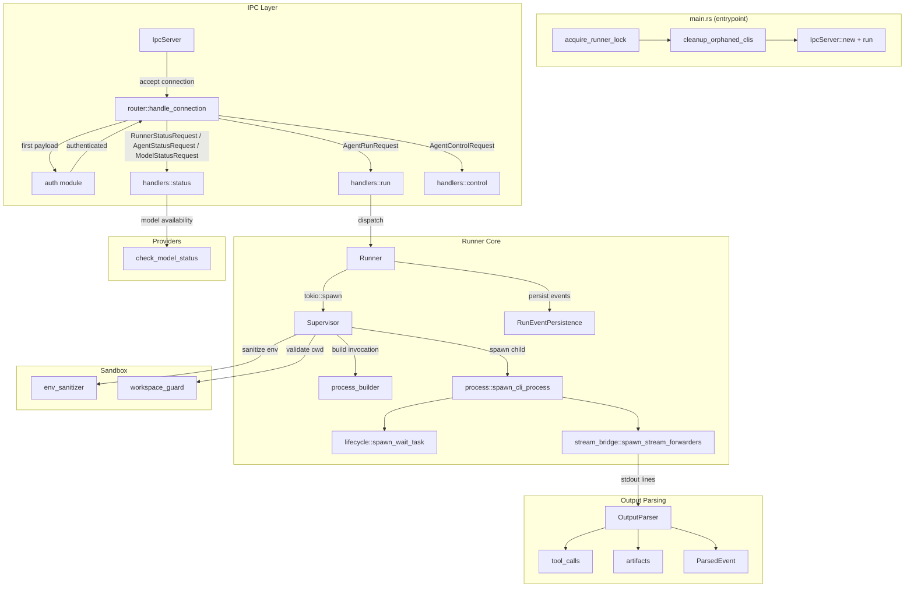
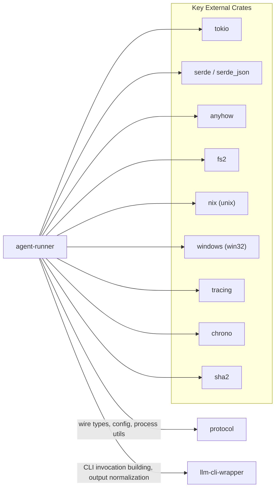

# agent-runner

Standalone daemon that spawns, supervises, and streams output from LLM CLI processes over an authenticated IPC channel.

## Overview

`agent-runner` is the process-management backbone of the AO workspace. It runs as a singleton daemon, accepting requests from the orchestrator (or any authenticated IPC client) to launch AI CLI tools such as `claude`, `codex`, `gemini`, and `opencode`. Each request spawns a supervised child process whose stdout/stderr is parsed in real time, producing a structured event stream (tool calls, artifacts, thinking blocks) that is forwarded back to the caller and persisted to disk.

The crate is a standalone binary (`main.rs`) rather than a library, and communicates exclusively through a newline-delimited JSON protocol over Unix domain sockets (or TCP on Windows).

## Architecture

## Key Components

### Entry Point and Singleton Lock

- **`main.rs`** -- Initializes tracing, acquires a file-based singleton lock (`agent-runner.lock` in the global config directory), cleans up orphaned CLI processes from prior sessions, then starts the IPC server.
- **`lock.rs`** -- `acquire_runner_lock()` uses `fs2` exclusive file locking. The lock file stores `PID|IPC_ADDRESS`. Stale locks (where the recorded PID is no longer alive) are automatically removed and re-acquired.
- **`cleanup.rs`** -- Maintains a JSON tracker file mapping `run_id -> PID`. On startup, any tracked processes still alive are killed. Provides `track_process` / `untrack_process` for runtime bookkeeping.

### IPC Layer (`ipc/`)

- **`IpcServer`** (`server.rs`) -- Binds a Unix domain socket at `~/.ao/agent-runner.sock` (or TCP `127.0.0.1:9001` on Windows). Each accepted connection is handled in a dedicated tokio task. A `SocketCleanupGuard` removes the socket file on shutdown.
- **`auth.rs`** -- Every connection must authenticate as its first message by sending an `IpcAuthRequest` with a token matching the server's configured token (from `protocol::Config`). Unauthenticated connections are rejected and closed.
- **`router.rs`** (`handle_connection`) -- After authentication, the router reads newline-delimited JSON payloads and dispatches them by type:
  - `AgentRunRequest` -> `handlers::run`
  - `ModelStatusRequest` -> `handlers::status`
  - `AgentStatusRequest` -> `handlers::status`
  - `RunnerStatusRequest` -> `handlers::status`
  - `AgentControlRequest` -> `handlers::control`

  A `tokio::select!` loop interleaves incoming requests with outbound `AgentRunEvent` streaming.

- **Handlers** (`handlers/`):
  - `run.rs` -- Validates protocol version, then delegates to `Runner::handle_run_request`.
  - `status.rs` -- Queries runner status (active agent count, protocol version, build ID), individual agent status (running/finished/not found), and model availability.
  - `control.rs` -- Supports `Terminate` action (sends cancellation signal via oneshot channel). `Pause`/`Resume` are defined but not yet implemented.

### Runner Core (`runner/`)

- **`Runner`** (`mod.rs`) -- Central state holder. Maintains `HashMap<RunId, RunningAgent>` and `HashMap<RunId, FinishedAgent>`. Handles run requests by spawning a `Supervisor` task, agent status queries, stop/cancel operations, and cleanup of completed agents. Non-terminal statuses are coerced to `Failed` during cleanup.
- **`Supervisor`** (`supervisor.rs`) -- Orchestrates a single agent run end-to-end:
  1. Emits a `Started` event.
  2. Validates the workspace (cwd must be within project root or a managed worktree).
  3. Sanitizes the environment via `env_sanitizer`.
  4. Injects MCP endpoint environment variables if the CLI supports MCP.
  5. Delegates to `spawn_cli_process` and maps exit codes to `AgentStatus`.
- **`process_builder.rs`** -- Resolves the CLI invocation. For AI CLI tools, it requires a `runtime_contract.cli.launch` block (parsed via `llm-cli-wrapper`). For generic tools (`npm`, `cargo`, `git`, etc.), it falls back to splitting the prompt into arguments. Also resolves idle timeout configuration from contract, environment, or defaults.
- **`process.rs`** -- `spawn_cli_process` is the core process spawner. Builds a `tokio::process::Command` with sanitized environment, configures MCP tool enforcement (allowed tool prefixes, deny lists, additional MCP servers written to temp config files), pipes stdout/stderr, tracks the PID for orphan cleanup, and runs the process under an idle-timeout watchdog that kills the child if no output is received within the configured window. Supports cancellation via a oneshot channel.
- **`lifecycle.rs`** -- `spawn_wait_task` spawns a background task that awaits the child process exit and sends the result over a oneshot channel.
- **`stream_bridge.rs`** -- `spawn_stream_forwarders` creates two tokio tasks that read stdout and stderr line-by-line. Stdout lines are fed through `OutputParser` to extract structured events (tool calls, artifacts, thinking blocks), which are forwarded as `AgentRunEvent` variants. Stderr lines are forwarded as raw `OutputChunk` events.
- **`RunEventPersistence`** (`event_persistence.rs`) -- Persists every `AgentRunEvent` as a JSONL line to `~/.ao/<repo-scope>/runs/<run_id>/events.jsonl`. JSON-structured output chunks are additionally written to `json-output.jsonl` with timestamps. Run IDs containing path traversal characters are rejected.

### Output Parsing (`output/`)

- **`OutputParser`** (`parser/state.rs`) -- Stateful line-by-line parser that detects:
  - **JSON tool calls** -- Handles multiple envelope formats: direct `tool_call`, nested `item.tool_call`, `function_call`, `content[].tool_call`, OpenAI-style `tool_calls` arrays, and MCP tool calls with server attribution.
  - **XML tool calls** -- Tracks `<function_calls>`/`<tool_use>` blocks across lines, extracting `<parameter>` elements.
  - **Phase transition signals** -- Special-cased detection of `phase_transition` / `phase-transition` events with placeholder filtering (template tokens like `VALID_PHASE_ID` are ignored).
  - **Artifacts** -- Extracts file paths from `artifact created:` / `file created:` lines and infers artifact type from file extension.
  - **Thinking blocks** -- Buffers content between `<thinking>` / `</thinking>` tags.
  - **Multi-line JSON accumulation** -- Reassembles JSON objects split across multiple lines by tracking brace depth.
- **`ParsedEvent`** (`events.rs`) -- Enum: `Output`, `ToolCall`, `Artifact`, `Thinking`.
- **`tool_calls.rs`** -- JSON and XML tool call extraction with normalization of argument formats (stringified JSON is auto-parsed).
- **`artifacts.rs`** -- Extracts artifact metadata and infers `ArtifactType` (Code, Image, Document, Data, File) from file extension.

### Sandbox (`sandbox/`)

- **`env_sanitizer.rs`** -- Filters the process environment to an explicit allowlist: system essentials (`PATH`, `HOME`, `SHELL`, etc.), API keys (`ANTHROPIC_API_KEY`, `OPENAI_API_KEY`, `GEMINI_API_KEY`, etc.), and vars matching `AO_*` or `XDG_*` prefixes. All other environment variables are stripped before spawning child processes.
- **`workspace_guard.rs`** -- `validate_workspace` ensures the working directory is either within the project root or inside a managed AO worktree (by walking up to find a `worktrees/` directory and verifying the `.project-root` marker file). Prevents path-traversal attacks.

### Providers (`providers/`)

- **`check_model_status`** (`mod.rs`) -- Checks availability of requested models by verifying that the required CLI binary is on `PATH` and the necessary API key environment variable is set. Returns `Available`, `MissingCli`, `MissingApiKey`, or `Error` per model.

### Telemetry (`telemetry/`)

- Stub module reserved for future metrics and monitoring integration.

## Dependencies

### Workspace Crate Relationships

| Crate | Role in agent-runner |
|---|---|
| `protocol` | Provides all wire types (`AgentRunRequest`, `AgentRunEvent`, `AgentStatus`, `RunId`, `Timestamp`, etc.), configuration (`Config::global_config_dir`, `Config::load_global`), process utilities (`process_exists`, `kill_process`), model routing (`canonical_model_id`, `tool_for_model_id`), and the CLI tracker path. |
| `llm-cli-wrapper` | Provides `LaunchInvocation` parsing from runtime contracts, machine-mode flag enforcement for AI CLIs, binary-on-path detection, and stdout text normalization (`extract_text_from_line`). |

## IPC Protocol

All communication uses newline-delimited JSON over the socket. The connection lifecycle is:

1. **Auth handshake** -- Client sends `{"kind":"ipc_auth","token":"..."}`. Server responds with `IpcAuthResult`.
2. **Request/Response** -- Client sends typed JSON payloads. The server routes by attempting deserialization in order: `AgentRunRequest`, `ModelStatusRequest`, `AgentControlRequest`, `AgentStatusRequest`, `RunnerStatusRequest`.
3. **Event streaming** -- For active runs, `AgentRunEvent` payloads are pushed to the client as they occur (interleaved with request handling via `tokio::select!`).

## Platform Support

| Platform | IPC Transport | Process Signals |
|---|---|---|
| Unix (macOS, Linux) | Unix domain socket (`~/.ao/agent-runner.sock`) | `nix` crate for signal handling |
| Windows | TCP loopback (`127.0.0.1:9001`) | Win32 Job Objects for process management |
