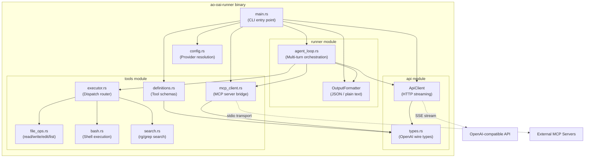
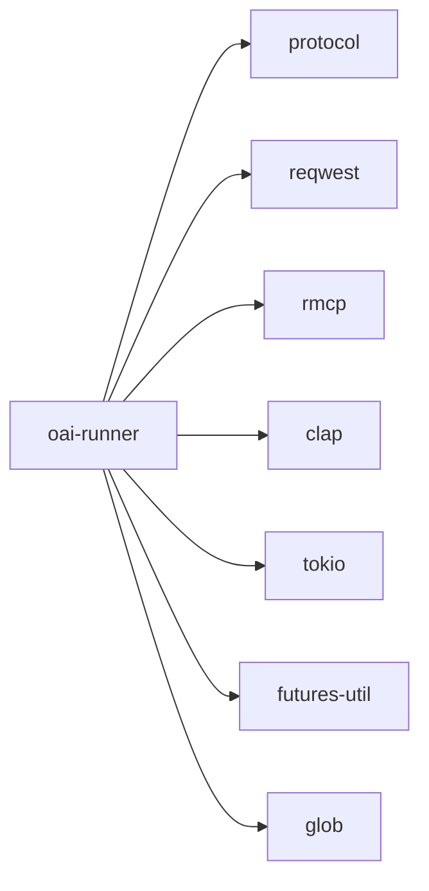

# oai-runner

Standalone OpenAI-compatible agent runner for AO, providing an agentic loop with built-in tool use over any OpenAI-compatible streaming API.

## Overview

The `oai-runner` crate is a self-contained binary (`ao-oai-runner`) within the AO workspace. It connects to any OpenAI-compatible chat/completions API, executes a multi-turn agent loop with tool calling, and streams structured output back to the caller. This enables AO to orchestrate LLM-driven tasks against providers like MiniMax, DeepSeek, ZhipuAI (GLM), and OpenRouter without requiring provider-specific SDKs.

The runner operates as a subprocess managed by AO's agent-runner or daemon. It accepts a prompt, executes turns against the model (up to a configurable limit), dispatches tool calls locally, and returns results via stdout in either plain text or structured JSON event streams.

## Architecture

## Key Components

### CLI Entry Point (`main.rs`)

The binary exposes a single `run` subcommand with the following options:

| Flag | Description |
|---|---|
| `--model` | Model identifier (e.g. `minimax/MiniMax-M2.1`, `deepseek/deepseek-chat`) |
| `--api-base` | Override the API base URL (auto-inferred from model prefix if omitted) |
| `--api-key` | Override the API key (resolved from env vars / credentials if omitted) |
| `--format json` | Emit structured JSONL events instead of plain text |
| `--system-prompt` | Path to a file containing the system prompt |
| `--working-dir` | Working directory for tool execution |
| `--max-turns` | Maximum agent loop iterations (default: 50) |
| `--idle-timeout` | HTTP request timeout in seconds (default: 600) |
| `--response-schema` | JSON schema string to validate the final response against |
| `--read-only` | Restrict tools to read-only operations (no write/edit/execute) |
| `--mcp-config` | JSON array of MCP server configs to connect to |
| `--session-id` | Resume or persist a named conversation session |

### Config Resolution (`config.rs`)

`ResolvedConfig` holds the final `api_base`, `api_key`, and `model_id` after resolution. The resolution cascade:

1. Explicit `--api-base` / `--api-key` flags (highest priority)
2. Provider inference from model prefix (`minimax/`, `deepseek/`, `zai`/`glm`, `openrouter/`)
3. Environment variables (`MINIMAX_API_KEY`, `ZAI_API_KEY`, `DEEPSEEK_API_KEY`, `OPENAI_API_KEY`)
4. AO global credentials (`protocol::credentials::Credentials::load_global()`)
5. OpenCode auth file (`~/.local/share/opencode/auth.json`)

Provider prefixes are stripped from the model ID before being sent to the API (e.g. `minimax/MiniMax-M2.1` becomes `MiniMax-M2.1`).

### API Client (`api/client.rs`)

`ApiClient` wraps `reqwest` and handles:

- **SSE streaming** of `POST /chat/completions` responses
- **Incremental assembly** of tool call deltas across streamed chunks
- **Automatic retry** with exponential backoff on 429 (rate limit) and 5xx errors (up to 3 attempts)
- **Text chunk callback** for real-time streaming output

### Wire Types (`api/types.rs`)

OpenAI-compatible request/response types:

| Type | Role |
|---|---|
| `ChatRequest` | Full request payload (model, messages, tools, response_format) |
| `ChatMessage` | Message in the conversation (system/user/assistant/tool roles) |
| `ToolCall` / `FunctionCall` | Structured tool invocation from the model |
| `ToolDefinition` / `FunctionSchema` | Tool schema sent to the model |
| `StreamChunk` / `StreamDelta` | SSE chunk deserialization types |
| `ResponseFormat` / `JsonSchemaSpec` | Structured output format specification |
| `UsageInfo` | Token usage counters |

### Agent Loop (`runner/agent_loop.rs`)

`run_agent_loop` drives the core agentic cycle:

1. Optionally loads prior messages from a persisted session
2. Sends the conversation to the model via streaming
3. If the model returns tool calls, dispatches each one and appends results
4. Repeats until the model responds without tool calls or `max_turns` is reached
5. Optionally validates the final response against a JSON schema, retrying up to 3 times if validation fails
6. Persists session messages if `--session-id` was provided

Session state is stored at `~/.ao/sessions/<session_id>.json` (or `$AO_CONFIG_DIR/sessions/`).

### Output Formatter (`runner/output.rs`)

`OutputFormatter` supports two modes:

- **Plain text mode**: streams assistant text directly to stdout, tool results printed inline
- **JSON mode** (`--format json`): emits JSONL events on stdout:
  - `{"type": "text_chunk", "text": "..."}` for incremental text
  - `{"type": "result", "text": "..."}` for the complete response
  - `{"type": "tool_call", "tool_name": "...", "arguments": {...}}`
  - `{"type": "tool_result", "tool_name": "...", "output": "..."}`
  - `{"type": "tool_error", "tool_name": "...", "error": "..."}`
  - `{"type": "metadata", "tokens": {"input": N, "output": N}}`

### Built-in Tools (`tools/`)

Six native tools are exposed to the model:

| Tool | Module | Description |
|---|---|---|
| `read_file` | `file_ops.rs` | Read file contents with optional offset/limit, returns numbered lines |
| `write_file` | `file_ops.rs` | Create or overwrite a file, auto-creates parent directories |
| `edit_file` | `file_ops.rs` | Find-and-replace exact text in a file |
| `list_files` | `file_ops.rs` | Glob-based file listing (max 500 results) |
| `search_files` | `search.rs` | Regex search via `rg` (preferred) or `grep` fallback (max 200 results) |
| `execute_command` | `bash.rs` | Shell command execution with configurable timeout (default 120s, output capped at 50KB) |

All file operations use `resolve_path` which enforces path traversal protection -- paths with `..` components that escape the working directory are rejected.

In `--read-only` mode, only `read_file`, `list_files`, and `search_files` are available.

### Tool Executor (`tools/executor.rs`)

`execute_tool` is the central dispatch function that routes tool call names to their implementations, parses JSON arguments, and returns string results.

### MCP Client (`tools/mcp_client.rs`)

The runner can connect to external MCP (Model Context Protocol) servers via the `rmcp` crate:

- `McpServerConfig` specifies a command and args to spawn an MCP server process
- `connect_all` launches all configured MCP servers over stdio transport
- `fetch_all_tool_definitions` queries each server for its tools and converts them to OpenAI function-calling format
- `merge_tools` combines native and MCP tools, with native tools taking precedence on name conflicts
- `call_tool` dispatches a tool invocation to the appropriate MCP server and extracts text results

## Dependencies

**Workspace dependencies:**
- `protocol` -- used for credential resolution (`protocol::credentials::Credentials`)

**External dependencies:**
- `reqwest` (with `json` + `stream` features) -- HTTP client for API calls
- `rmcp` (with `client` + `transport-child-process` features) -- MCP protocol client
- `clap` -- CLI argument parsing
- `tokio` -- async runtime
- `futures-util` -- stream combinators for SSE parsing
- `serde` / `serde_json` -- serialization
- `glob` -- file pattern matching for `list_files` tool
- `anyhow` -- error handling

## Notes

- Provider-specific assumptions (API base URLs, auth env vars, model prefix stripping) are fully contained within this crate
- The binary is designed to be invoked as a subprocess by the AO daemon/runner, communicating via stdout/stderr
- Session persistence enables multi-invocation conversations across daemon ticks
- Schema validation with retry allows the runner to enforce structured output from models that do not natively support `response_format`
