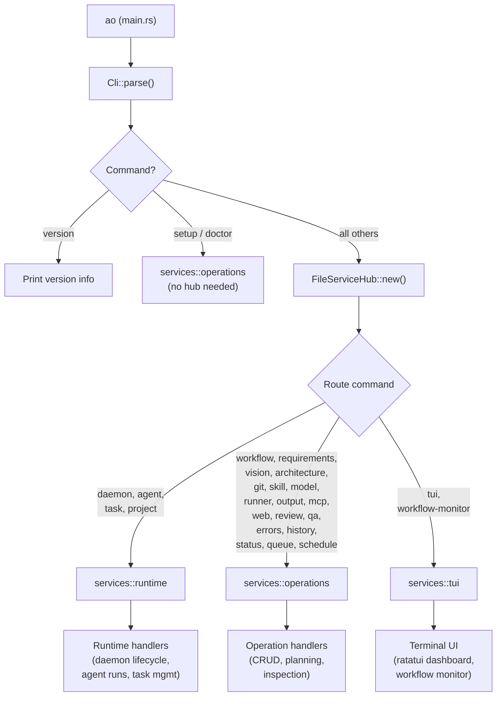
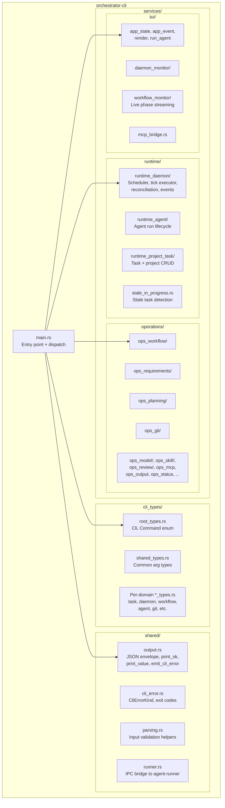
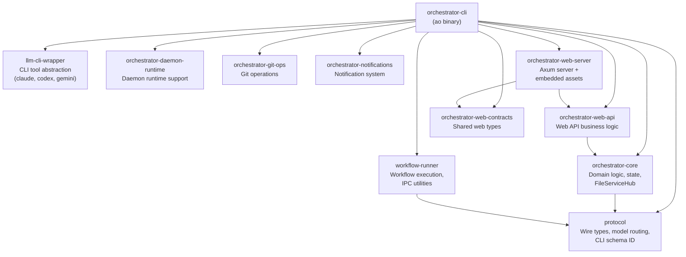

# orchestrator-cli

The main `ao` command-line binary — the primary user-facing surface for the AO agent orchestrator.

## Overview

`orchestrator-cli` is the top-level crate in the AO workspace. It compiles to the `ao` binary and is responsible for parsing CLI arguments, resolving project context, dispatching commands to the appropriate service handlers, and presenting results in both human-readable and machine-readable (`--json`) formats.

Every `ao` invocation flows through this crate: argument parsing via `clap`, project root resolution via `orchestrator-core`, construction of a `FileServiceHub` for dependency injection, and delegation to one of three service layers — **operations**, **runtime**, or **tui**.

## Architecture

### Command Dispatch Flow



### Internal Module Structure



## Key Components

### `cli_types/`

Clap derive definitions for the entire command tree. Each domain has its own `*_types.rs` file:

| File | Defines |
|------|---------|
| `root_types.rs` | `Cli` struct, top-level `Command` enum |
| `daemon_types.rs` | `DaemonCommand` — start, stop, run, status, config, events, etc. |
| `task_types.rs` | `TaskCommand` — create, list, status, assign, pause, resume, cancel, stats, etc. |
| `workflow_types.rs` | `WorkflowCommand` — execute, run, list, get, cancel, pause, phase, checkpoints, etc. |
| `agent_types.rs` | `AgentCommand` — run, status, control |
| `git_types.rs` | `GitCommand` — worktree, confirm, branch operations |
| `requirements_types.rs` | `RequirementsCommand` — create, list, get, update, delete, import, link |
| `shared_types.rs` | Common argument types reused across domains |

### `shared/`

Cross-cutting CLI infrastructure:

- **`output.rs`** — The `ao.cli.v1` JSON envelope contract. Provides `print_ok`, `print_value`, and `emit_cli_error` for consistent output formatting. All `--json` output uses `{ schema, ok, data/error }`.
- **`cli_error.rs`** — `CliErrorKind` enum mapping error classes to structured codes and exit codes (1=internal, 2=invalid\_input, 3=not\_found, 4=conflict, 5=unavailable).
- **`parsing.rs`** — Input validation and normalization helpers for task statuses, priority levels, IDs, and other user-supplied values.
- **`runner.rs`** — IPC bridge to the agent-runner process. Handles connecting to the runner socket, building runtime contracts, streaming agent output events, and managing runner scope environment state.

### `services/operations/`

Handlers for stateless or CRUD-oriented commands. Each `ops_*.rs` module (or subdirectory) maps to one command group:

| Module | Handles |
|--------|---------|
| `ops_workflow/` | Workflow execution, listing, inspection, phase approval, checkpoints |
| `ops_requirements/` | Requirement CRUD, import, linking |
| `ops_planning/` | Vision artifact management |
| `ops_git/` | Git worktree and confirmation operations |
| `ops_model/` | Model availability, validation, routing info |
| `ops_skill/` | Skill search, install, update, publish |
| `ops_review/` | Review decisions and handoff recording |
| `ops_qa.rs` | QA evaluation and approval inspection |
| `ops_mcp.rs` | MCP service endpoint (rmcp stdio transport) |
| `ops_web.rs` | Web UI server launch |
| `ops_output.rs` | Run output and artifact inspection |
| `ops_status.rs` | Unified project dashboard |
| `ops_queue.rs` | Daemon dispatch queue inspection and mutation |
| `ops_schedule.rs` | Workflow schedule management |
| `ops_setup.rs` | Guided onboarding wizard |
| `ops_doctor.rs` | Environment and configuration diagnostics |

### `services/runtime/`

Handlers for long-lived, stateful operations:

- **`runtime_daemon/`** — The daemon scheduler core. Contains the tick executor, project tick driver, task dispatch logic, reconciliation, and event streaming. This is where the autonomous daemon loop lives.
- **`runtime_agent/`** — Agent run lifecycle: launching CLI tool processes, streaming output, and managing run state.
- **`runtime_project_task/`** — Task and project CRUD operations that interact with the persistent state layer.
- **`stale_in_progress.rs`** — Detection and handling of tasks stuck in `in-progress` beyond a configurable threshold.

### `services/tui/`

Terminal user interface built on `ratatui` and `crossterm`:

- **`app_state.rs` / `app_event.rs`** — TUI application state machine and event loop.
- **`render.rs`** — Terminal rendering logic.
- **`daemon_monitor/`** — Live daemon status dashboard.
- **`workflow_monitor/`** — Real-time workflow phase monitor with agent output streaming.
- **`mcp_bridge.rs`** — MCP integration for the TUI.
- **`run_agent.rs`** — In-TUI agent execution.

## Command Groups

```
ao
├── version                  Show installed version
├── status                   Unified project status dashboard
├── setup                    Guided onboarding wizard
├── doctor                   Environment diagnostics
├── daemon                   Daemon lifecycle and automation
│   ├── start / stop / run / status / health
│   ├── config / config-set
│   ├── events / logs
│   ├── pause / resume
│   └── agents
├── agent                    Agent execution
│   ├── run / status / control
├── task                     Task management
│   ├── create / get / list / update / delete
│   ├── status / assign / pause / resume / cancel
│   ├── next / prioritized / stats
│   ├── checklist-add / checklist-update
│   ├── set-priority / set-deadline
│   ├── rebalance-priority
│   ├── bulk-status / bulk-update
│   └── history
├── workflow                 Workflow execution and control
│   ├── execute / run / run-multiple
│   ├── list / get / cancel / pause / resume
│   ├── config get / config validate
│   ├── phase list / phase get / phase approve
│   ├── checkpoints list / checkpoints prune
│   ├── pipelines list
│   └── decisions
├── queue                    Dispatch queue management
│   ├── enqueue / list / inspect / cancel / reorder
├── schedule                 Workflow scheduling
├── project                  Project registration
├── requirements             Requirements management
├── vision                   Vision artifact drafting
├── architecture             Architecture graph management
├── review                   Review decisions
├── qa                       QA evaluations
├── history                  Execution history
├── errors                   Operational error inspection
├── git                      Git worktree and branch ops
├── skill                    Skill lifecycle management
├── model                    Model inspection and routing
├── runner                   Runner health and orphan detection
├── output                   Run output and artifacts
├── mcp                      MCP service endpoint
├── web                      Web UI server
├── tui                      Terminal UI dashboard
└── workflow-monitor         Live phase monitor
```

## Dependencies

### Workspace Crate Graph



### Notable External Dependencies

| Crate | Purpose |
|-------|---------|
| `clap` | CLI argument parsing (derive macros) |
| `tokio` | Async runtime |
| `serde` / `serde_json` | Serialization and JSON envelope output |
| `anyhow` | Error propagation |
| `rmcp` | MCP service endpoint (stdio transport) |
| `ratatui` / `crossterm` | Terminal UI rendering |
| `reqwest` | HTTP client (runner health checks) |
| `axum` | Web server integration |
| `uuid` | Run ID generation |
| `chrono` | Timestamp handling |
| `sha2` | Content hashing |
| `fs2` | File locking |
| `webbrowser` | Opening web UI in browser |
| `termimad` | Markdown rendering in terminal |

## Testing

Tests are spread across unit tests within the crate and integration tests in the `tests/` directory:

- **Unit tests** — `cli_types/mod.rs` validates clap parsing and argument validation; `shared.rs` tests output formatting, error classification, and input parsing.
- **`tests/cli_e2e.rs`** — End-to-end CLI invocation tests.
- **`tests/cli_json_contract.rs`** — Validates the `ao.cli.v1` JSON envelope contract.
- **`tests/cli_smoke.rs`** — Smoke tests for basic command invocations.
- **`tests/cli_skill_lifecycle.rs`** — Skill install/update/publish lifecycle.
- **`tests/workflow_state_machine_e2e.rs`** — Workflow state transition tests.
- **`tests/setup_doctor_e2e.rs`** — Setup and doctor command tests.
- **`tests/session_continuation_e2e.rs`** — Session continuation scenarios.
- **`tests/rust_only_dependency_policy.rs`** — Enforces the Rust-only dependency policy.

```bash
cargo test -p orchestrator-cli           # Run all tests
cargo test -p orchestrator-cli cli_smoke # Run smoke tests only
```
