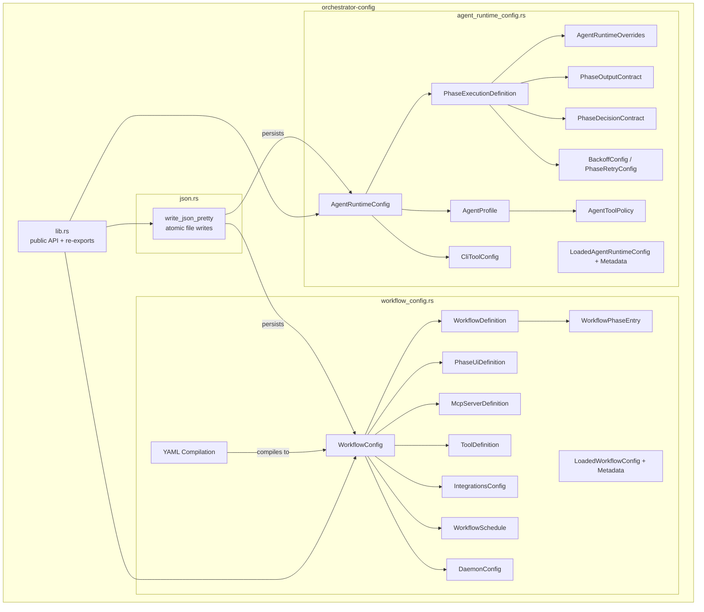
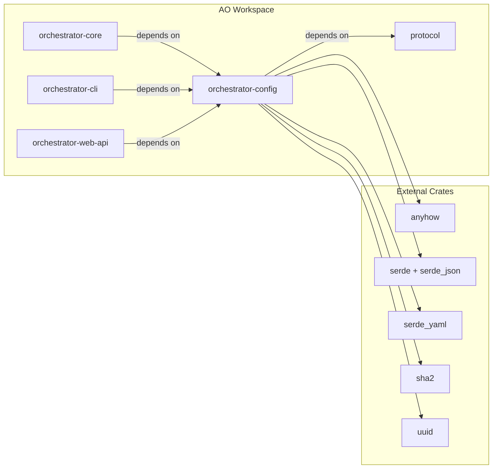

# orchestrator-config

Centralized configuration loading, validation, and precedence resolution for the AO agent orchestrator.

## Overview

`orchestrator-config` is the single source of truth for all configuration in the AO workspace. It defines, loads, validates, and persists two core configuration domains:

- **Agent Runtime Config** (`agent-runtime-config.v2.json`) -- agent profiles, phase execution definitions, CLI tool capabilities, and runtime overrides that control how AI agents execute workflow phases.
- **Workflow Config** (`workflow-config.v2.json`) -- workflow definitions, phase catalogs, sub-workflow composition, MCP server definitions, integrations, schedules, and daemon settings.

Both configs support a three-tier loading strategy: load from a project-scoped JSON file on disk, fall back to a compiled-in builtin default (parsed from a bundled JSON file or hardcoded in Rust), or return a `BuiltinFallback` when the file is missing or invalid. Configs are persisted atomically (write to temp file, then rename) to prevent corruption.

The crate also provides YAML-to-JSON compilation for workflow configs, allowing users to author workflows in `.ao/workflows.yaml` or `.ao/workflows/*.yaml` files that are compiled into `workflow-config.v2.json` on demand.

## Architecture



## Key Components

### Agent Runtime Config (`agent_runtime_config.rs`)

| Type | Purpose |
|------|---------|
| `AgentRuntimeConfig` | Top-level config holding agent profiles, phase definitions, CLI tool configs, and a tools allowlist. Defaults to the compiled builtin. |
| `AgentProfile` | Named agent persona (e.g. `swe`, `po`, `em`) with system prompt, role, tool/model overrides, MCP server bindings, tool policies, skills, and capabilities. |
| `PhaseExecutionDefinition` | Per-phase execution spec: mode (`Agent`, `Command`, `Manual`), agent binding, directive, runtime overrides, output/decision contracts, retry config, and command/manual blocks. |
| `AgentRuntimeOverrides` | Runtime tunables that can be set per-phase: tool, model, fallback models, reasoning effort, web search, timeout, max attempts, extra args, and max continuations. |
| `AgentToolPolicy` | Allow/deny glob lists controlling which MCP tools an agent may invoke. Uses a recursive glob matcher (`*` wildcard). |
| `PhaseOutputContract` | Declares expected output kind and required fields for structured output phases. |
| `PhaseDecisionContract` | Declares required evidence kinds, minimum confidence, maximum risk, and whether missing decisions are allowed. |
| `BackoffConfig` / `PhaseRetryConfig` | Exponential backoff and max-attempt configuration for phase retries. |
| `CliToolConfig` | Capability flags for CLI tools (e.g. supports file editing, streaming, tool use, vision, MCP). |
| `LoadedAgentRuntimeConfig` | Wrapper bundling a loaded config with its metadata (schema, version, SHA-256 hash, source). |

Key resolution pattern: `AgentRuntimeConfig` provides `phase_*` accessor methods (e.g. `phase_tool_override`, `phase_model_override`, `phase_system_prompt`) that resolve values with a two-level cascade: phase runtime override takes precedence, then falls back to the linked agent profile.

Built-in agent profiles: `default`, `swe` (software engineer), `implementation` (alias for swe), `em` (engineering manager), `po` (product owner).

### Workflow Config (`workflow_config.rs`)

| Type | Purpose |
|------|---------|
| `WorkflowConfig` | Top-level config holding workflow definitions, phase catalog, phase definitions, agent profiles, MCP servers, tools, integrations, schedules, and daemon settings. |
| `WorkflowDefinition` | Named workflow with an ordered list of phases, optional post-success merge config, and workflow variables. |
| `WorkflowPhaseEntry` | Enum with three variants: `Simple(String)`, `Rich(WorkflowPhaseConfig)` with verdict routing/skip guards/rework limits, and `SubWorkflow(SubWorkflowRef)` for composition. |
| `PhaseUiDefinition` | UI metadata for phases: label, description, category, icon, docs URL, tags, visibility. |
| `McpServerDefinition` | MCP server connection config: command, args, transport, tools, env vars. |
| `ToolDefinition` | External tool registration: executable path, MCP/write support, context window, base args. |
| `IntegrationsConfig` | Task tracker and git provider integration settings. |
| `WorkflowSchedule` | Cron-based schedule for automatic workflow execution. Supports 5-field cron and `@hourly`/`@daily`/`@weekly`/`@monthly` shortcuts. |
| `DaemonConfig` | Daemon runtime settings: tick interval, max concurrent agents, active hours, auto-run behavior. |
| `MergeConfig` / `PostSuccessConfig` | Post-workflow merge strategy (squash/merge/rebase), target branch, PR creation, auto-merge, worktree cleanup. |
| `LoadedWorkflowConfig` | Wrapper bundling a loaded config with its metadata. |

Key functions:

| Function | Purpose |
|----------|---------|
| `load_workflow_config` / `load_workflow_config_or_default` | Load from disk with validation, or fall back to builtin. |
| `compile_yaml_workflow_files` | Compile `.ao/workflows.yaml` and `.ao/workflows/*.yaml` into a `WorkflowConfig`. |
| `ensure_workflow_config_compiled` | Recompile YAML sources when they are newer than the JSON output. |
| `expand_workflow_phases` | Recursively expand sub-workflow references into a flat phase list, with circular reference detection. |
| `resolve_workflow_variables` | Resolve workflow variables from CLI input with defaults and required-field enforcement. |
| `resolve_workflow_phase_plan` | Resolve a workflow ref to an ordered list of phase IDs. |
| `resolve_workflow_verdict_routing` | Extract per-phase verdict-to-target transition maps. |
| `resolve_workflow_skip_guards` | Extract per-phase skip-if guard conditions. |
| `validate_workflow_config` | Comprehensive validation of schema, version, phase catalog, workflow integrity, sub-workflow references, schedule cron expressions, and more. |
| `validate_workflow_and_runtime_configs` | Cross-validate workflow config against agent runtime config to ensure all referenced phases exist. |

### Atomic JSON Persistence (`json.rs`)

`write_json_pretty` serializes any `Serialize` value to pretty-printed JSON and writes it atomically using a UUID-suffixed temp file and `rename`. Handles cross-filesystem rename failures with a fallback remove-then-rename strategy.

### Public Module Re-exports (`lib.rs`)

- `domain_state::write_json_pretty` -- atomic write helper
- `workflow::DEFAULT_CHECKPOINT_RETENTION_KEEP_LAST_PER_PHASE` -- default retention constant (3)
- `types::PhaseEvidenceKind`, `types::WorkflowDecisionRisk` -- re-exported from `protocol`

## Dependencies



`orchestrator-config` sits between `protocol` (wire types) and the higher-level crates (`orchestrator-core`, `orchestrator-cli`, `orchestrator-web-api`). It imports shared types like `PhaseCapabilities`, `PhaseEvidenceKind`, and `scoped_state_root` from `protocol`, and is consumed by the core, CLI, and web layers for all configuration needs.

## File Layout

```
crates/orchestrator-config/
├── Cargo.toml
├── README.md
├── config/
│   └── agent-runtime-config.v2.json   # Bundled default (included at compile time)
└── src/
    ├── lib.rs                          # Public API, module declarations, re-exports
    ├── agent_runtime_config.rs         # Agent profiles, phase execution, validation, load/save
    ├── workflow_config.rs              # Workflows, phases, YAML compilation, validation, load/save
    └── json.rs                         # Atomic JSON file persistence
```
