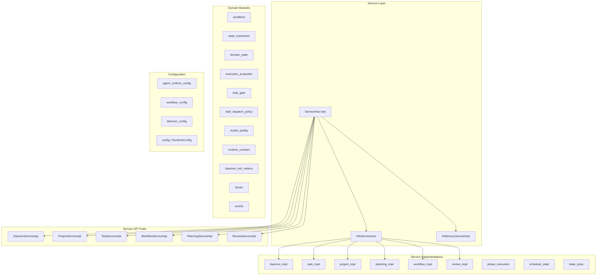
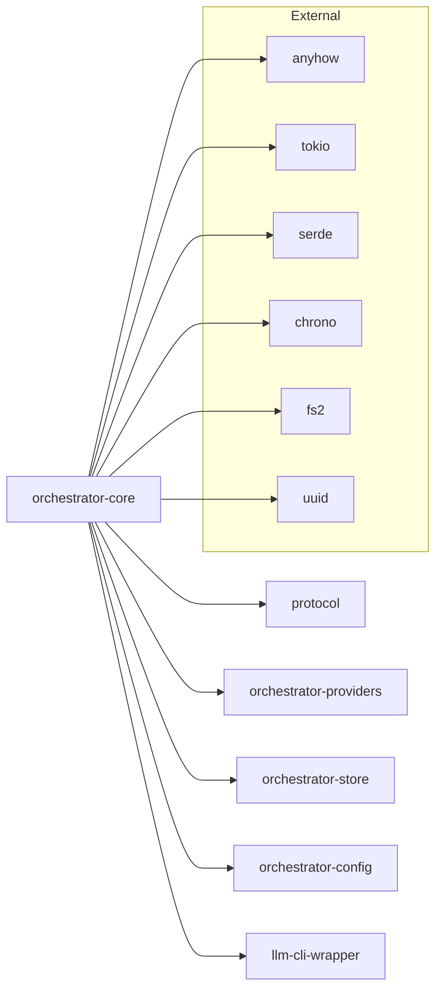

# orchestrator-core

Central domain logic, service abstractions, and state management for the AO agent orchestrator.

## Overview

`orchestrator-core` is the foundational crate in the AO workspace. It defines the core service traits that all higher-level crates depend on, manages persistent project state (tasks, workflows, requirements, reviews), and implements the business rules that govern task lifecycle, workflow execution, and agent coordination.

The crate provides two `ServiceHub` implementations:
- **`FileServiceHub`** — production implementation backed by JSON files on disk with file locking and atomic writes
- **`InMemoryServiceHub`** — in-memory implementation for unit and integration tests

## Architecture



## Key Components

### ServiceHub Trait

The central dependency injection point. All service consumers receive an `Arc<dyn ServiceHub>` and access domain APIs through it:

```rust
pub trait ServiceHub: Send + Sync {
    fn daemon(&self) -> Arc<dyn DaemonServiceApi>;
    fn projects(&self) -> Arc<dyn ProjectServiceApi>;
    fn tasks(&self) -> Arc<dyn TaskServiceApi>;
    fn task_provider(&self) -> Arc<dyn TaskProvider>;
    fn workflows(&self) -> Arc<dyn WorkflowServiceApi>;
    fn planning(&self) -> Arc<dyn PlanningServiceApi>;
    fn requirements_provider(&self) -> Arc<dyn RequirementsProvider>;
    fn review(&self) -> Arc<dyn ReviewServiceApi>;
}
```

### Service API Traits

| Trait | Purpose |
|---|---|
| `DaemonServiceApi` | Start, stop, pause, resume the daemon; query health and logs |
| `ProjectServiceApi` | CRUD for orchestrator projects (list, create, archive, rename) |
| `TaskServiceApi` | Full task lifecycle: create, update, assign, set status, manage checklists and dependencies |
| `WorkflowServiceApi` | Workflow execution: run, pause, cancel, resume, phase advancement, merge conflict handling |
| `PlanningServiceApi` | Vision drafting, requirements CRUD, requirements refinement and execution |
| `ReviewServiceApi` | Agent handoff requests for cross-role review |

### FileServiceHub

Production service hub backed by `~/.ao/<repo-scope>/core-state.json`. Key behaviors:

- **File locking**: Exclusive lock via `fs2` before any state mutation to prevent concurrent corruption
- **Atomic persistence**: Mutations go through `mutate_persistent_state` which reloads from disk, applies the change, and writes back under lock
- **Structured artifacts**: After each mutation, individual JSON files are written for tasks (`tasks/TASK-NNN.json`), requirements (`requirements/`), and index files for fast lookups
- **State migration**: Automatically migrates legacy `.ao/` state to scoped directories under `~/.ao/<repo-scope>/`
- **Bootstrap**: On first use, initializes git repository, core state, workflow config, agent runtime config, and state machine definitions

### Workflow Engine (`workflow/`)

Manages the full workflow lifecycle through several sub-modules:

| Module | Purpose |
|---|---|
| `WorkflowStateMachine` | State machine driving phase transitions with guard evaluation |
| `WorkflowLifecycleExecutor` | Orchestrates phase execution end-to-end |
| `WorkflowStateManager` | Persistent workflow state with checkpoint save/restore/pruning |
| `WorkflowResumeManager` | Session resumability detection and resume configuration |
| `phase_plan` | Resolves phase plans for workflow references (`standard`, `ui-ux`) |

### State Machines (`state_machines/`)

Data-driven state machine definitions for workflow and requirement lifecycle transitions. Supports three modes:

- **Builtin** — hardcoded default transitions
- **Json** — loaded from `state-machines.v1.json` with builtin fallback on parse failure
- **JsonStrict** — loaded from JSON, errors on any failure

Includes a compilation step (`compile_state_machines_document`) that validates transitions and guard expressions.

### Domain State (`domain_state`)

Persistent stores for ancillary domain data:

- `ReviewStore` — PO/EM/QA review decisions with dual-approval tracking
- `HandoffStore` — agent-to-role handoff records
- `QaResultsStore` / `QaReviewApprovalStore` — QA gate evaluation results and approvals
- `HistoryStore` — execution history records
- `ErrorStore` — categorized error records with recovery tracking

### Task Gates (`task_gate`)

Enforces preconditions before tasks can be dispatched:

- **Dependency gate**: Blocks tasks whose `blocked_by` dependencies are not yet `Done` or not merged
- **Merge gate**: Blocks tasks whose dependency branches are not merged into the default branch
- `promote_backlog_tasks_to_ready` — scans backlog tasks and promotes those with satisfied dependencies
- `retry_failed_task_workflows` — re-queues blocked tasks after a configurable cooldown

### Task Dispatch Policy (`task_dispatch_policy`)

Controls which tasks are eligible for daemon dispatch:

- Maps task complexity to model routing complexity
- Selects workflow reference based on task content (standard vs. ui-ux)
- Applies dispatch failure backoff with configurable retry limits and delays

### Runtime Contract (`runtime_contract`)

Builds CLI launch contracts for agent execution. Defines `CliCapabilities` per tool (claude, codex, gemini, opencode, aider) including support for file editing, streaming, MCP, vision, and context window sizes. Handles session resume planning.

### Model Quality Ledger (`model_quality`)

Tracks per-model, per-phase success/failure rates. Automatically suppresses models that exceed a 70% failure rate after a minimum number of attempts.

### Execution Projection (`execution_projection`)

Projects task and schedule execution outcomes from `SubjectExecutionFact` events back into task state (marking tasks as done or blocked) and schedule state.

### Daemon Tick Metrics (`daemon_tick_metrics`)

Collects per-tick observability metrics: task counts by status, workflow counts by status, and stale in-progress task detection.

### Doctor (`doctor`)

Health check framework that inspects project configuration, CLI tool availability, daemon state, and configuration validity. Produces a `DoctorReport` with check results and remediation suggestions.

### Phase Execution (`phase_execution`)

Defines the `PhaseExecutor` trait and associated types (`PhaseExecutionRequest`, `PhaseExecutionResult`, `PhaseVerdict`) for executing individual workflow phases. Verdicts include `Advance`, `Rework`, `Skip`, and `Failed`.

### Configuration Modules

| Module | Purpose |
|---|---|
| `config` / `RuntimeConfig` | Project root resolution (CLI arg, env var, git root, cwd) and runtime settings |
| `agent_runtime_config` | Agent profiles, phase execution definitions, backoff config, CLI tool bindings (re-exported from `orchestrator-config`) |
| `workflow_config` | Workflow definitions, phase plans, YAML compilation, variable expansion (re-exported from `orchestrator-config`) |
| `daemon_config` | Per-project daemon configuration (autonomous mode, concurrency limits) |

### Events and Runtime

- `OrchestratorEvent` — typed event envelope with variants: `DaemonStatusChanged`, `Log`, `ProjectChanged`, `TaskChanged`, `WorkflowChanged`
- `OrchestratorRuntime` — starts the runtime and returns a `RuntimeHandle` for status control and event subscription via `broadcast` channels
- `EventSink` trait — pluggable event consumers

### Providers (`providers/`)

Re-exports from `orchestrator-providers` for pluggable backends:

- `GitProvider` / `BuiltinGitProvider` / `GitHubProvider` — git operations, PR creation, branch merge checks
- `TaskProvider` / `BuiltinTaskProvider` — task data access abstraction (with optional Jira, Linear integrations)
- `RequirementsProvider` / `BuiltinRequirementsProvider` — requirements data access (with optional GitLab integration)

## Dependencies



### Workspace Crate Relationships

- **`protocol`** — wire types shared across all crates; `orchestrator-core` re-exports many `protocol::orchestrator` types through its `types` module
- **`orchestrator-providers`** — pluggable provider traits and implementations (git, task, requirements); feature-gated integrations for Jira, Linear, GitLab
- **`orchestrator-store`** — low-level JSON persistence utilities (`write_json_atomic`, `write_json_pretty`, `read_json_or_default`, `project_state_dir`)
- **`orchestrator-config`** — workflow and agent runtime configuration loading, compilation, and validation
- **`llm-cli-wrapper`** — CLI tool abstraction used by runtime contract building

### Feature Flags

| Feature | Effect |
|---|---|
| `jira` | Enables Jira task provider via `orchestrator-providers/jira` |
| `linear` | Enables Linear task provider via `orchestrator-providers/linear` |
| `gitlab` | Enables GitLab requirements provider via `orchestrator-providers/gitlab` |
