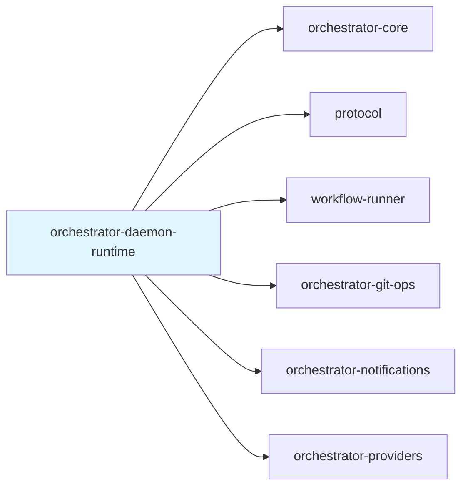

# orchestrator-daemon-runtime

Core runtime engine for the AO daemon's tick-based execution loop, process management, dispatch queue, and cron scheduling.

## Overview

`orchestrator-daemon-runtime` implements the long-lived daemon runtime that powers AO's autonomous agent orchestration. While one-off CLI commands handle individual actions, this crate provides the continuous execution loop that:

- Runs a periodic **tick loop** that evaluates project state and dispatches work
- Manages a **dispatch queue** for ordered, deduplicated workflow scheduling
- Spawns and monitors **workflow runner processes** as child OS processes
- Evaluates **cron-based schedules** to trigger workflows at configured times
- Handles daemon **lifecycle management** including startup guards, graceful shutdown, pause/resume, and signal handling

This crate sits between the CLI entry point (`orchestrator-cli`) and the core domain logic (`orchestrator-core`), providing the runtime machinery that keeps the daemon alive and responsive.

## Architecture

```mermaid
graph TB
    subgraph "Daemon Lifecycle (daemon/)"
        RD[run_daemon] --> DRG[DaemonRunGuard]
        RD --> DRS[DaemonRuntimeState]
        RD --> DRO[DaemonRuntimeOptions]
        RD --> DRH[DaemonRunHooks]
        RD --> DRE[DaemonRunEvent]
        RD --> DEL[DaemonEventLog]
        DEL --> DEPR[DaemonEventsPollResponse]
    end

    subgraph "Tick Engine (tick/)"
        RPT[run_project_tick] --> PTC[ProjectTickContext]
        RPT --> PTS[ProjectTickSnapshot]
        RPT --> PTP[ProjectTickPreparation]
        RPT --> PTEO[ProjectTickExecutionOutcome]
        RPT --> TSB[TickSummaryBuilder]
        PTC --> PTPL[ProjectTickPlan]
        PTP --> PTPL
        RPT --> PTH[ProjectTickHooks]
        RPT --> PTRM[ProjectTickRunMode]
        RPT --> PTT[ProjectTickTime]
        TSB --> PTSu[ProjectTickSummary]
    end

    subgraph "Dispatch (dispatch/)"
        PM[ProcessManager] --> CP[CompletedProcess]
        PM --> BRC[build_runner_command_from_dispatch]
        RCP[reconcile_completed_processes] --> CRP[CompletionReconciliationPlan]
        CRP --> CP
        RDP[plan_ready_dispatch] --> RDPL[ReadyDispatchPlan]
        RDPL --> PDS[PlannedDispatchStart]
        PDS --> DC[DispatchCandidate]
        DC --> DSS[DispatchSelectionSource]
        DWS[DispatchWorkflowStart] --> DWSS[DispatchWorkflowStartSummary]
    end

    subgraph "Queue (queue/)"
        QS[QueueService] --> DQS[DispatchQueueState]
        DQS --> DQE[DispatchQueueEntry]
        DQE --> DQES[DispatchQueueEntryStatus]
        QS --> QSn[QueueSnapshot]
        QSn --> QSt[QueueStats]
    end

    subgraph "Schedule (schedule/)"
        SD[ScheduleDispatch]
    end

    RD -->|each iteration| RPT
    RPT -->|schedule check| SD
    RPT -->|dispatch work| PM
    RPT -->|reconcile results| RCP
    RPT -->|queue candidates| QS
    PTPL -->|active hours gate| SD
```

## Key Components

### Daemon Lifecycle (`daemon/`)

| Type | Role |
|------|------|
| `run_daemon()` | Top-level async function that runs the daemon loop. Acquires a run guard, starts the daemon service, compiles YAML workflows, then enters a tick-sleep loop. Handles SIGTERM, Ctrl+C, external pause, and graceful shutdown requests. |
| `DaemonRunGuard` | RAII guard using `fs2` file locks to ensure only one daemon instance runs per project. Writes PID to the lock file and cleans up on drop. |
| `DaemonRuntimeState` | File-backed state at `.ao/daemon-state.json` tracking `runtime_paused`, `daemon_pid`, and `shutdown_requested`. Also manages a separate `.ao/daemon.pid` file. |
| `DaemonRuntimeOptions` | Configuration struct for the daemon: `pool_size`, `max_agents`, `interval_secs`, `auto_run_ready`, `auto_merge`, `auto_pr`, `startup_cleanup`, `resume_interrupted`, `reconcile_stale`, `stale_threshold_hours`, `max_tasks_per_tick`, `phase_timeout_secs`, `idle_timeout_secs`, and `once` mode. |
| `DaemonRunHooks` | Trait for daemon-level callbacks: `handle_event()`, `recover_orphaned_running_workflows_on_startup()`, and `flush_notifications()`. |
| `DaemonRunEvent` | Enum of daemon lifecycle events: `Startup`, `Status`, `StartupCleanup`, `OrphanDetection`, `YamlCompileSucceeded/Failed`, `TickSummary`, `TickError`, `GracefulShutdown`, `Draining`, `NotificationRuntimeError`, `Shutdown`. |
| `DaemonEventLog` | Append-only JSONL event log (`ao.daemon.event.v1` schema). Supports `append`, `read_records` with project-root filtering and limit, `poll` for structured responses, and fire-and-forget logging. |
| `DaemonEventsPollResponse` | Response type for the event poll API, wrapping event records with path and count metadata. |

### Tick Engine (`tick/`)

| Type | Role |
|------|------|
| `run_project_tick()` / `run_project_tick_at()` | Executes a single tick: loads context, processes due schedules, captures a snapshot of tasks/workflows/health, reconciles completed processes, dispatches ready work, and builds a summary. |
| `ProjectTickContext` | Loaded once per tick with active-hours configuration and an initial preparation plan. Ensures workflow config is compiled. |
| `ProjectTickSnapshot` | Point-in-time capture of requirements, tasks, daemon status, and health. Converts into `ProjectTickSummaryInput` after execution. |
| `ProjectTickPreparation` | Combines a schedule plan with a computed `ready_dispatch_limit` based on pool capacity and active process count. |
| `ProjectTickPlan` | Decides per-tick behavior: whether to process due schedules (gated by active hours), whether to prepare ready tasks (gated by pool draining and `auto_run_ready`), and the dispatch limit. |
| `ProjectTickRunMode` | Carries the current `active_process_count` and delegates context loading and preparation building. |
| `ProjectTickTime` | Wraps a UTC timestamp with a derived local time, used for schedule evaluation and active-hours checks. |
| `ProjectTickExecutionOutcome` | Accumulates tick results: stale cleanup counts, resumed workflows, reconciled tasks, workflow starts, executed/failed phases, and phase execution events. |
| `TickSummaryBuilder` | Collects `DaemonTickMetrics` from the service hub and merges with execution input to produce the final `ProjectTickSummary`. |
| `ProjectTickSummary` | Serializable summary of a tick: task counts by status, workflow counts, stale detection, started/executed/failed workflow phases, and health. |
| `ProjectTickHooks` | Trait for tick-level callbacks: `process_due_schedules()`, `reconcile_completed_processes()`, `dispatch_ready_tasks()`. |

### Dispatch (`dispatch/`)

| Type | Role |
|------|------|
| `ProcessManager` | Manages a pool of spawned `ao-workflow-runner` child processes. Spawns via `build_runner_command_from_dispatch()`, polls with `check_running()` (non-blocking `try_wait`), collects stderr as `RunnerEvent` JSON lines, and tracks active subject IDs. |
| `CompletedProcess` | Result of a finished runner process: subject/task/workflow IDs, exit code, success flag, failure reason, and parsed runner events. |
| `CompletionReconciliationPlan` | Built from completed processes; tallies executed vs. failed phases and produces `SubjectExecutionFact` entries for downstream reconciliation. |
| `reconcile_completed_processes()` | Orchestrates post-completion: builds reconciliation plan, removes terminal queue entries, and delegates to `project_task_execution_fact()` or `project_schedule_execution_fact()`. |
| `build_runner_command_from_dispatch()` | Constructs the `ao-workflow-runner execute` command with appropriate flags for task, requirement, or custom subjects. |
| `plan_ready_dispatch()` | Merges queued and fallback dispatch candidates (queue takes priority), deduplicates by subject ID, and produces an ordered `ReadyDispatchPlan`. |
| `ReadyDispatchPlan` | Ordered list of `PlannedDispatchStart` entries plus completed subject IDs. |
| `DispatchCandidate` / `PlannedDispatchStart` | Pairs a `SubjectDispatch` with its `DispatchSelectionSource` (queue or fallback picker). |
| `DispatchWorkflowStart` / `DispatchWorkflowStartSummary` | Records of workflows that were actually started during a tick, including the assigned workflow ID. |
| `DispatchSelectionSource` | Enum distinguishing `DispatchQueue` vs. `FallbackPicker` origins. |
| `ready_dispatch_limit()` / `ready_dispatch_limit_for_options()` | Computes how many new workflows can be dispatched based on `max_tasks_per_tick`, active agents, and the smallest capacity limit across pool size and max agents. |

### Queue (`queue/`)

| Type | Role |
|------|------|
| `DispatchQueueState` | Persisted ordered list of `DispatchQueueEntry` items, stored at `<scoped-state-root>/scheduler/dispatch-queue.json`. Uses atomic writes (temp file + rename). |
| `DispatchQueueEntry` | A queue entry with a `SubjectDispatch`, status (`Pending`, `Assigned`, `Held`), optional workflow ID, and timestamps. |
| `enqueue_subject_dispatch()` | Adds a dispatch to the queue with idempotency (same subject + workflow ref is a no-op). |
| `hold_subject()` / `release_subject()` | Pauses/unpauses a pending queue entry by subject ID. |
| `reorder_subjects()` | Reorders queue entries to match a provided subject ID ordering, preserving entries not in the list at the end. |
| `mark_dispatch_queue_entry_assigned()` | Transitions a pending entry to assigned when a workflow starts. |
| `remove_terminal_dispatch_queue_entry_non_fatal()` | Removes assigned entries after workflow completion (non-fatal on error). |
| `queue_snapshot()` / `queue_stats()` | Read-only views of the queue with computed stats (total, pending, assigned, held). |

### Schedule (`schedule/`)

| Type | Role |
|------|------|
| `ScheduleDispatch` | Evaluates cron-based workflow schedules. `process_due_schedules()` checks all enabled schedules against the current time, skipping any that already ran this minute. `fire_schedule()` manually triggers a specific schedule. `allows_proactive_dispatch()` gates dispatch on active-hours windows (supports wrap-around, e.g., `22:00-06:00`). Uses the `croner` crate for 5-field cron parsing. |

## Dependencies

| Dependency | Usage |
|------------|-------|
| `orchestrator-core` | `ServiceHub` trait, `FileServiceHub`, task/workflow domain types, workflow config compilation, schedule state persistence, daemon tick metrics |
| `protocol` | Wire types (`SubjectDispatch`, `SubjectExecutionFact`, `RunnerEvent`, `DaemonEventRecord`), scoped state paths, process-alive checks, actor constants |
| `workflow-runner` | `PhaseExecutionEvent` type used in tick summaries and execution outcomes |
| `orchestrator-git-ops` | Git operations support (transitive through core workflows) |
| `orchestrator-notifications` | Notification flushing during the daemon loop |
| `orchestrator-providers` | Provider abstractions (transitive dependency) |

### External Crates

| Crate | Purpose |
|-------|---------|
| `tokio` | Async runtime, signal handling (SIGTERM, Ctrl+C), timed sleep between ticks, child process management |
| `fs2` | Cross-platform exclusive file locking for the daemon run guard |
| `croner` | Cron expression parsing and matching (5-field standard format plus shortcuts like `@daily`, `@weekly`) |
| `chrono` | Timestamps, local time conversion, active-hours window evaluation |
| `serde` / `serde_json` | Serialization of queue state, event logs, runtime state, and tick summaries |
| `uuid` | Unique IDs for event records and atomic file write temporaries |
| `anyhow` | Error propagation throughout the runtime |
| `async-trait` | Async trait support for `DaemonRunHooks` and `ProjectTickHooks` |
