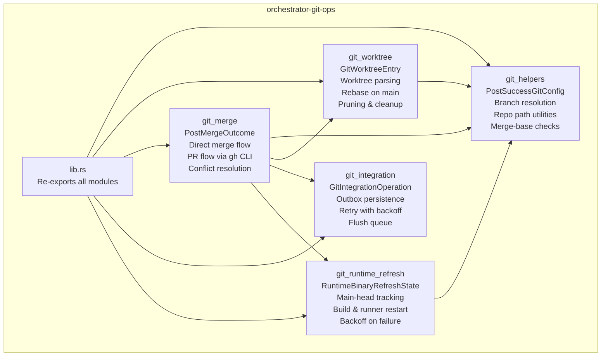
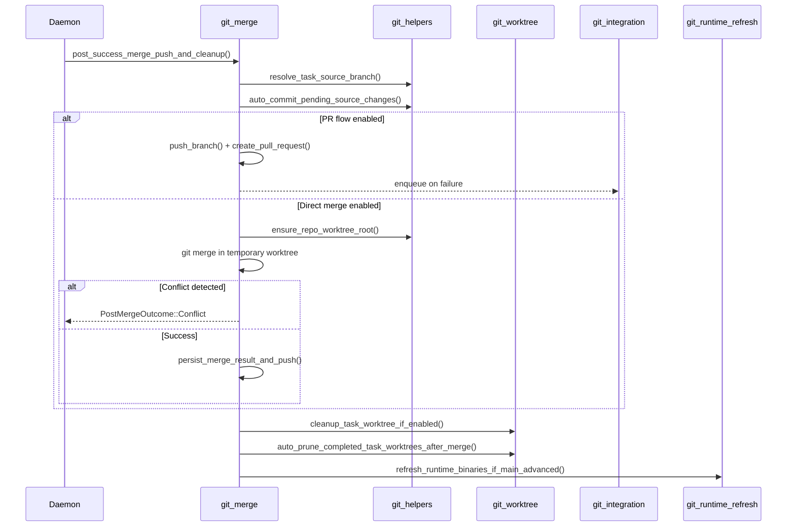
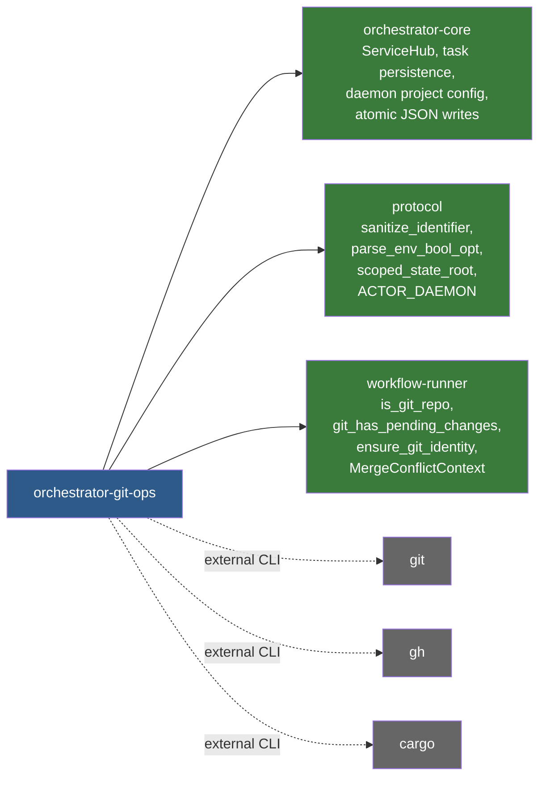

# orchestrator-git-ops

Safe, reusable Git operations for AO daemon runtime workflows.

## Overview

`orchestrator-git-ops` encapsulates all Git interactions required by the AO daemon during task lifecycle management. Rather than scattering shell-level Git commands across the orchestrator, this crate provides a structured API for worktree management, branch merging, PR creation, integration queue processing, and runtime binary refresh after main-branch updates.

The crate is consumed primarily by the daemon scheduler and post-success hooks. It coordinates with `orchestrator-core` for task/state persistence, `protocol` for identifier sanitization and environment parsing, and `workflow-runner` for low-level Git utilities (identity setup, pending-change detection, merge conflict types).

## Architecture

### Data flow: post-success merge

## Key Components

### `git_helpers` — Configuration and repository utilities

| Item | Description |
|------|-------------|
| `PostSuccessGitConfig` | Struct holding all post-success Git behavior flags (auto-merge, auto-PR, auto-commit, auto-prune, target branch, remote). Loaded from daemon project config with env-var overrides. |
| `load_post_success_git_config()` | Reads config from `.ao/` project config, then applies `AO_AUTO_MERGE_ENABLED`, `AO_AUTO_PR_ENABLED`, `AO_AUTO_COMMIT_BEFORE_MERGE`, and `AO_AUTO_PRUNE_WORKTREES_AFTER_MERGE` environment overrides. |
| `resolve_task_source_branch()` | Resolves a task's source branch from its `branch_name` field, falling back to `git branch --show-current` in the task worktree. |
| `repo_ao_root()` / `repo_worktrees_root()` / `ensure_repo_worktree_root()` | Resolve and create the `~/.ao/<scope>/` and `~/.ao/<scope>/worktrees/` directories. Writes a `.project-root` marker and symlink. |
| `is_branch_merged()` | Checks whether a branch has been merged into any of the default target refs (main, origin/main, HEAD) using `git merge-base --is-ancestor`. |
| `auto_commit_pending_source_changes()` | Stages and commits all pending changes in a worktree with a `chore(ao):` message before merge. |
| `git_status()` / `run_external_command()` | Thin wrappers around `std::process::Command` with context-rich error messages. |
| `default_task_branch_name()` / `default_task_worktree_name()` | Naming conventions: `ao/<sanitized-id>` for branches, `task-<sanitized-id>` for worktree directories. |

### `git_worktree` — Worktree lifecycle management

| Item | Description |
|------|-------------|
| `GitWorktreeEntry` | Parsed representation of a single entry from `git worktree list --porcelain`. |
| `parse_git_worktree_list_porcelain()` | Parses porcelain output into structured `GitWorktreeEntry` values. |
| `infer_task_id_from_worktree()` | Derives a `TASK-XXX` identifier from a branch name (`ao/task-xxx`) or worktree directory name (`task-xxx`). |
| `rebase_worktree_on_main()` | Attempts `git rebase origin/main` in a worktree; aborts the rebase on failure. |
| `auto_prune_completed_task_worktrees_after_merge()` | Scans all worktrees, matches them to tasks, and removes worktrees belonging to tasks in terminal status (Done/Cancelled). Only prunes paths inside the managed worktree root. |
| `cleanup_task_worktree_if_enabled()` | Removes a single task's worktree via `git worktree remove --force` and clears the task's `worktree_path` metadata. |
| `is_branch_checked_out_in_any_worktree()` | Checks if a branch is currently checked out in any existing worktree. |

### `git_merge` — Merge and PR orchestration

| Item | Description |
|------|-------------|
| `PostMergeOutcome` | Tagged enum: `Skipped`, `Completed`, or `Conflict { context }`. |
| `MergeConflictContext` | Re-exported from `workflow-runner`. Contains source/target branches, merge worktree path, conflicted files, merge-queue branch, and push remote. |
| `post_success_merge_push_and_cleanup()` | Main entry point. Handles both the PR flow (push, `gh pr create`, optional auto-merge) and the direct merge flow (temporary worktree, `git merge --no-ff`, push result). Falls back to the integration outbox on network failures. |
| `finalize_merge_conflict_resolution()` | Validates that a conflict has been fully resolved (no unresolved files, MERGE_HEAD cleared, source branch integrated, merge commit present), then pushes and cleans up. |
| `push_branch()` / `push_ref()` | Push a branch or arbitrary refspec to a remote. |
| `create_pull_request()` / `enable_pull_request_auto_merge()` | Invoke the `gh` CLI to create PRs and enable auto-merge. Idempotent (silently succeeds if PR already exists or auto-merge already enabled). |

### `git_integration` — Persistent retry outbox

| Item | Description |
|------|-------------|
| `GitIntegrationOperation` | Enum of retryable operations: `PushBranch`, `PushRef`, `OpenPullRequest`, `EnablePullRequestAutoMerge`. |
| `enqueue_git_integration_operation()` | Appends an operation to the JSONL outbox at `~/.ao/<scope>/sync/outbox.jsonl`. Deduplicates by operation key. |
| `flush_git_integration_outbox()` | Processes all ready entries, retrying failed ones with exponential backoff (2s to 300s). Removes entries on success. |

### `git_runtime_refresh` — Auto-rebuild on main updates

| Item | Description |
|------|-------------|
| `RuntimeBinaryRefreshTrigger` | `Tick` (periodic daemon check) or `PostMerge` (immediately after a successful merge). |
| `RuntimeBinaryRefreshOutcome` | Detailed result enum: `Disabled`, `NotGitRepo`, `NotSupported`, `MainHeadUnavailable`, `Unchanged`, `DeferredActiveAgents`, `DeferredBackoff`, `BuildFailed`, `RunnerRefreshFailed`, `Refreshed`. |
| `RuntimeBinaryRefreshState` | Persisted state tracking `last_successful_main_head`, `last_attempt_main_head`, timestamp, and error. Stored at `~/.ao/<scope>/sync/runtime-binary-refresh.json`. |
| `refresh_runtime_binaries_if_main_advanced()` | Checks if main HEAD has advanced, defers if agents are active, applies backoff after failures (bypassed by `PostMerge` trigger), runs `cargo ao-bin-build`, and restarts the runner. |
| `resolve_main_head_commit()` | Resolves the current main branch HEAD SHA by trying `refs/heads/main`, `refs/remotes/origin/main`, and fallbacks. |

## Dependencies

### Workspace crates

- **orchestrator-core** — `ServiceHub` trait for task CRUD, daemon status, and config loading. `write_json_pretty` for state persistence.
- **protocol** — Identifier sanitization, environment variable parsing, scoped state root resolution, and shared constants (`ACTOR_DAEMON`).
- **workflow-runner** — Low-level Git helpers (`is_git_repo`, `git_has_pending_changes`, `ensure_git_identity`) and the `MergeConflictContext` type.

### External CLIs

- **git** — All repository operations (worktree, merge, rebase, push, rev-parse, merge-base).
- **gh** — GitHub CLI for pull request creation and auto-merge enablement.
- **cargo** — `cargo ao-bin-build` for runtime binary rebuilds after main advances.
