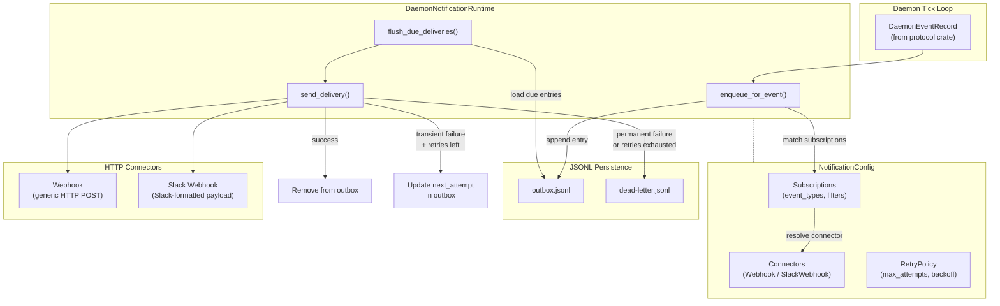
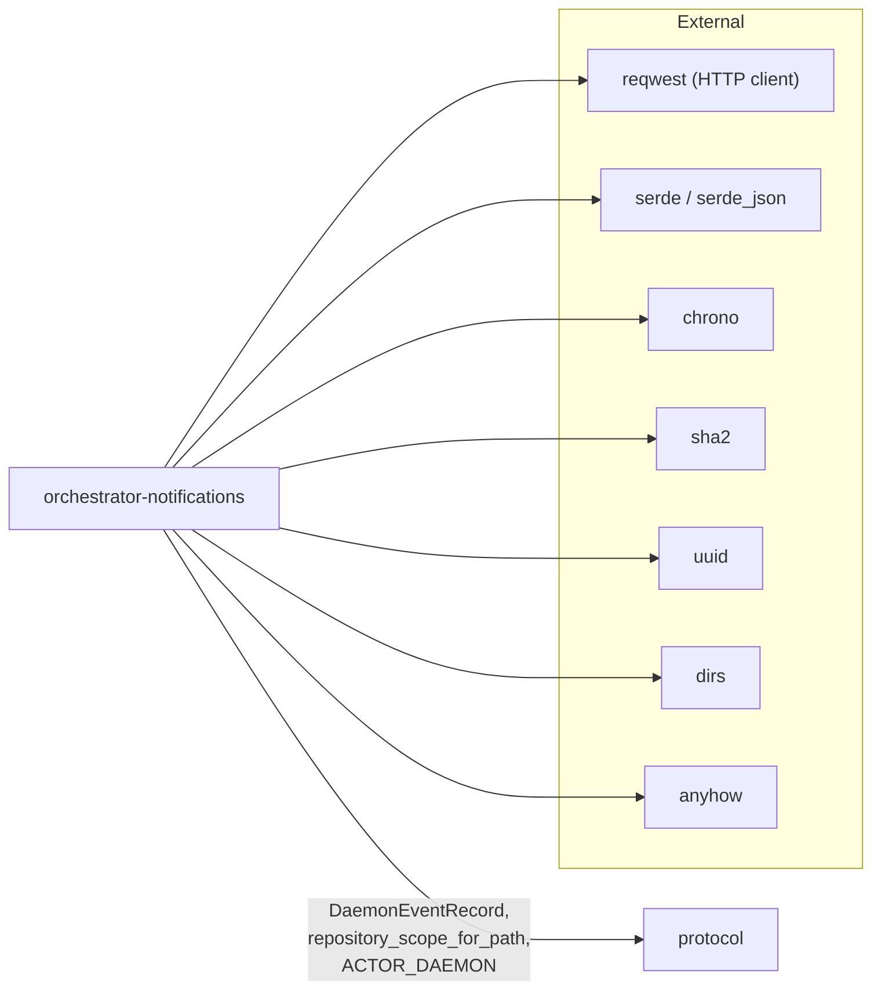

# orchestrator-notifications

Notification delivery subsystem for the AO daemon, providing event-driven webhook and Slack integrations with reliable outbox-based delivery.

## Overview

The `orchestrator-notifications` crate implements a persistent, retry-aware notification pipeline for the AO daemon. When the daemon emits lifecycle events (workflow phase changes, task status updates, etc.), this crate evaluates configured subscriptions, enqueues matching deliveries into a JSONL-based outbox, and flushes them to external endpoints via HTTP connectors.

The crate is designed to operate within the daemon's tick loop: each tick calls `enqueue_for_event` for new events and `flush_due_deliveries` to send pending notifications. Failed deliveries are retried with exponential backoff, and permanently failed deliveries are moved to a dead-letter store for later inspection.

Key design principles:
- **Secrets never touch disk** -- connector URLs and auth tokens are resolved from environment variables at delivery time, referenced by name in configuration.
- **Idempotent enqueue** -- each delivery is keyed by a SHA-256 hash of (event_id, connector_id, subscription_id), preventing duplicate outbox entries.
- **Atomic persistence** -- outbox and dead-letter files are written via temp-file-then-rename to prevent corruption on crash.
- **Credential redaction** -- error messages are scrubbed of any resolved secret values before being persisted or emitted as lifecycle events.

## Architecture



## Key Components

### `DaemonNotificationRuntime`

The main public struct that owns the notification lifecycle. Constructed with a project root path, it loads configuration from `.ao/pm-config.json` and creates an HTTP client.

| Method | Description |
|---|---|
| `new(project_root)` | Load config, build HTTP client, return runtime |
| `enqueue_for_event(event)` | Match event against subscriptions, write new outbox entries, return lifecycle events |
| `flush_due_deliveries()` | Process due outbox entries up to `max_deliveries_per_tick`, send via connectors, handle retries and dead-lettering |

### `NotificationConfig`

Top-level configuration (schema `ao.daemon-notification-config.v1`) read from the `notification_config` key inside `.ao/pm-config.json`. Contains:

- **`connectors`** -- a list of `NotificationConnectorConfig` variants:
  - `Webhook` -- generic HTTP POST with configurable URL (env var), custom headers (env vars), and timeout.
  - `SlackWebhook` -- Slack incoming webhook with optional `username`, `channel`, and `icon_emoji` fields.
- **`subscriptions`** -- rules that bind events to connectors. Each subscription specifies:
  - `event_types` -- wildcard-capable patterns (e.g., `workflow-phase-*`). Defaults to `*`.
  - Optional filters: `project_root`, `workflow_id`, `task_id`.
  - Built-in loop prevention: delivery lifecycle events (`notification-delivery-*`) are not re-enqueued to the same connector that produced them.
- **`retry_policy`** -- controls `max_attempts` (1--20), `base_delay_secs`, and `max_delay_secs` for exponential backoff.
- **`max_deliveries_per_tick`** -- caps how many outbox entries are processed per flush (1--128, default 8).

### Delivery Pipeline Types

| Type | Role |
|---|---|
| `NotificationOutboxEntry` | Pending delivery stored in `outbox.jsonl`. Tracks attempt count, next retry time, and the full payload. |
| `NotificationDeadLetterEntry` | Permanently failed delivery stored in `dead-letter.jsonl`. Includes `failed_at` timestamp and `last_error`. |
| `NotificationLifecycleEvent` | Returned to the caller (daemon) for each enqueue, send, failure, or dead-letter action. These are re-emitted as daemon events. |
| `DeliveryFailure` | Internal error type classified as `Transient`, `Permanent`, or `Misconfigured`. Classification determines retry behavior. |

### Configuration Helpers (Public API)

| Function | Description |
|---|---|
| `read_notification_config_from_pm_config(value)` | Extract and parse `notification_config` from a pm-config JSON value |
| `parse_notification_config_value(value)` | Parse and normalize a raw notification config value |
| `serialize_notification_config(config)` | Serialize a `NotificationConfig` back to JSON |
| `clear_notification_config(pm_config)` | Remove the `notification_config` key from a pm-config JSON object |

### Internal Mechanisms

- **Wildcard matching** -- `event_type_matches` uses a DP-based wildcard matcher supporting `*` globs against event type strings.
- **Delivery key deduplication** -- SHA-256 hash of `(event_id, connector_id, subscription_id)` prevents the same event from being enqueued twice for the same subscription.
- **Exponential backoff** -- `retry_delay_secs` computes `base * 2^(attempt-1)` clamped to `max_delay_secs`.
- **HTTP status classification** -- 408/425/429 and 5xx are transient (retriable); other 4xx are permanent; all others are permanent.
- **Secret redaction** -- before persisting any error message, all resolved env var values for the connector are replaced with `<redacted>`.

## Dependencies



The only workspace dependency is `protocol`, from which this crate uses:

- `DaemonEventRecord` -- the event payload type that drives subscription matching.
- `repository_scope_for_path` -- computes the repo-scoped directory name under `~/.ao/`.
- `ACTOR_DAEMON` -- used in the HTTP client user-agent string.

## File Layout

```
crates/orchestrator-notifications/
├── Cargo.toml
├── README.md
└── src/
    └── lib.rs          # All types, runtime, config, persistence, and tests
```

## Runtime State Paths

All notification state is stored under the repo-scoped directory:

```
~/.ao/<repo-scope>/notifications/
├── outbox.jsonl        # Pending deliveries (JSONL, one entry per line)
└── dead-letter.jsonl   # Permanently failed deliveries
```

Configuration is read from the project's daemon config:

```
<project-root>/.ao/pm-config.json  ->  $.notification_config
```
