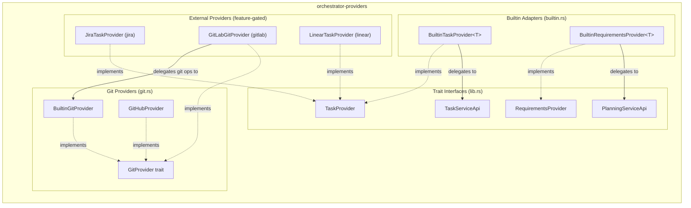
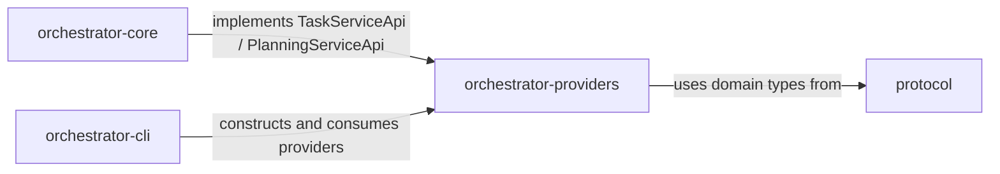

# orchestrator-providers

External provider adapters for task management, requirements planning, and git operations in the AO workspace.

## Overview

`orchestrator-providers` defines the trait interfaces that decouple AO's core orchestration logic from external services. It ships four trait abstractions — `TaskProvider`, `RequirementsProvider`, `TaskServiceApi`, and `PlanningServiceApi` — along with concrete implementations for the builtin file-backed store, local git/GitHub CLI operations, and three optional third-party integrations (Jira, Linear, GitLab).

This crate sits between the `protocol` crate (which defines the shared domain types like `OrchestratorTask`, `TaskStatus`, `Priority`) and the higher-level CLI/daemon crates that consume providers at runtime.

## Architecture

### Data Flow

The builtin providers (`BuiltinTaskProvider`, `BuiltinRequirementsProvider`) use a generic hub parameter constrained by `TaskServiceApi` or `PlanningServiceApi`. At runtime the hub is typically `FileServiceHub` from `orchestrator-core`, which persists state to the `.ao/` directory. External providers (Jira, Linear, GitLab) bypass the local store entirely and communicate with their respective APIs over HTTP.

## Key Components

### Trait Interfaces

| Trait | Purpose |
|---|---|
| `TaskProvider` | Full CRUD + status transitions, checklists, dependencies, filtering, prioritization, and statistics for tasks |
| `RequirementsProvider` | Draft, list, get, refine, upsert, delete, and execute requirements |
| `TaskServiceApi` | Hub-side contract mirroring `TaskProvider` — implemented by the core service layer |
| `PlanningServiceApi` | Hub-side contract mirroring `RequirementsProvider` — implemented by the core service layer |
| `GitProvider` | Worktree management, branch push/merge, pull request creation, and auto-merge enablement |

### Builtin Adapters (`builtin.rs`)

| Struct | Description |
|---|---|
| `BuiltinTaskProvider<T: TaskServiceApi>` | Wraps an `Arc<T>` hub and delegates every `TaskProvider` method directly to the hub |
| `BuiltinRequirementsProvider<T: PlanningServiceApi>` | Wraps an `Arc<T>` hub and delegates every `RequirementsProvider` method directly to the hub |

### Git Providers (`git.rs`)

| Struct | Description |
|---|---|
| `BuiltinGitProvider` | Executes `git` and `gh` CLI commands via `tokio::process::Command`. Supports worktree add/remove, branch push, merge-check, merge, PR creation (`gh pr create`), and auto-merge (`gh pr merge --auto`). |
| `GitHubProvider` | Placeholder implementation (all methods currently `todo!()`). |

**Supporting types:** `WorktreeInfo`, `MergeResult`, `CreatePrInput`, `PullRequestInfo`

### Jira Provider (`jira.rs`, feature = `jira`)

| Struct | Description |
|---|---|
| `JiraConfig` | Connection settings: base URL, project key, API token env var, email, and a status-name mapping table |
| `JiraTaskProvider` | Full `TaskProvider` implementation using the Jira REST API v3. Maps Jira issues to `OrchestratorTask`, handles status transitions via the Jira transitions API, and converts between Jira's Atlassian Document Format and plain text. |

Supported operations: list, get, create, update, delete, assign, set status (via transitions), filtered list, prioritized list, next task, statistics.
Unsupported operations (returns error): replace, add/update checklist items, add/remove dependencies.

### Linear Provider (`linear.rs`, feature = `linear`)

| Struct | Description |
|---|---|
| `LinearConfig` | API key env var, team ID, and a status-to-state-ID mapping table |
| `LinearTaskProvider` | `TaskProvider` implementation using Linear's GraphQL API. Supports list, get, create, update, assign, and set status. |

Unsupported operations (returns error): filtered list, prioritized list, next task, statistics, replace, delete, checklist items, dependencies.

### GitLab Provider (`gitlab.rs`, feature = `gitlab`)

| Struct | Description |
|---|---|
| `GitLabConfig` | Base URL, project ID (supports slash-separated paths), and token env var |
| `GitLabGitProvider` | `GitProvider` implementation that delegates local git operations (worktree, push, merge) to `BuiltinGitProvider` and uses the GitLab REST API v4 for merge request creation and auto-merge enablement. |

## Features

| Feature | Enables | Adds dependency |
|---|---|---|
| `jira` | `JiraTaskProvider`, `JiraConfig` | `reqwest` |
| `linear` | `LinearTaskProvider`, `LinearConfig` | `reqwest` |
| `gitlab` | `GitLabGitProvider`, `GitLabConfig` | `reqwest` |

All three features are opt-in. The builtin and git providers have no HTTP dependency and are always available.

## Dependencies

### Workspace Crate Relationships

- **`protocol`** — `orchestrator-providers` depends on `protocol` for all shared domain types (`OrchestratorTask`, `TaskStatus`, `Priority`, `TaskFilter`, `RequirementItem`, etc.)
- **`orchestrator-core`** — implements `TaskServiceApi` and `PlanningServiceApi` (the hub-side contracts defined here), enabling `BuiltinTaskProvider` and `BuiltinRequirementsProvider` to bridge into the file-backed store
- **`orchestrator-cli`** — wires providers together at startup, selecting the appropriate implementation based on configuration

### External Dependencies

| Crate | Usage |
|---|---|
| `anyhow` | Error propagation |
| `async-trait` | Async trait definitions |
| `chrono` | Timestamp parsing and generation |
| `reqwest` (optional) | HTTP client for Jira, Linear, and GitLab APIs |
| `serde` / `serde_json` | JSON serialization for API payloads |
| `tokio` | Async process spawning for git/gh CLI commands |
