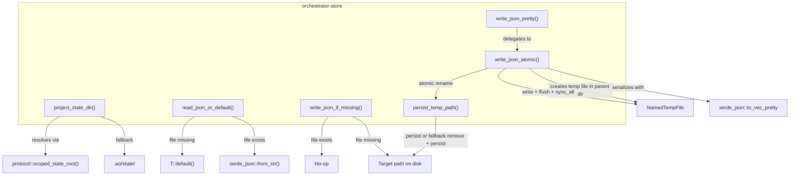
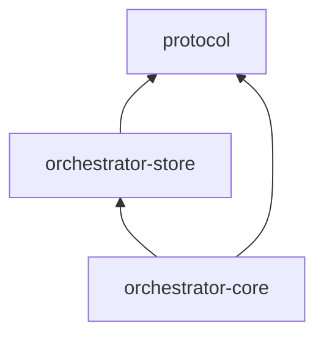

# orchestrator-store

Atomic, file-backed JSON persistence layer for the AO workspace.

## Overview

`orchestrator-store` provides the low-level storage primitives that underpin all `.ao` state operations in the AO CLI. It handles reading, writing, and safely persisting JSON-serialized domain records to disk using atomic file operations (temp file + rename) to prevent data corruption during concurrent access or unexpected process termination.

This crate sits between the `protocol` crate (which defines scoped directory layout) and `orchestrator-core` (which uses these primitives to implement higher-level domain services like task and requirement management).

## Architecture

## Key Components

### Functions

| Function | Signature | Description |
|---|---|---|
| `project_state_dir` | `(project_root: &str) -> PathBuf` | Resolves the state directory for a project. Uses `protocol::scoped_state_root` to map to `~/.ao/<scope>/state/`, falling back to `<project_root>/.ao/state/` if scoping is unavailable. |
| `read_json_or_default` | `<T: Default + DeserializeOwned>(path: &Path) -> Result<T>` | Reads and deserializes a JSON file, returning `T::default()` if the file does not exist. |
| `write_json_atomic` | `<T: Serialize>(path: &Path, value: &T) -> Result<()>` | Serializes a value to pretty-printed JSON and writes it atomically via a temp file in the same directory, followed by `flush`, `sync_all`, and an atomic rename. |
| `write_json_pretty` | `<T: Serialize>(path: &Path, value: &T) -> Result<()>` | Alias for `write_json_atomic`. |
| `write_json_if_missing` | `<T: Serialize>(path: &Path, value: &T) -> Result<()>` | Writes a JSON file only if the target path does not already exist. Used for initializing default state without overwriting user modifications. |
| `persist_temp_path` | (internal) | Handles the atomic rename with a fallback strategy: if `persist` fails because the target already exists, it removes the target and retries. |

### Atomic Write Strategy

The `write_json_atomic` function guarantees crash-safe writes through this sequence:

1. Create a `NamedTempFile` in the same directory as the target (ensures same filesystem for rename).
2. Write the pretty-printed JSON payload.
3. `flush()` the userspace buffer to the OS.
4. `sync_all()` to ensure data reaches durable storage.
5. Atomically rename the temp file to the target path via `persist_temp_path`.
6. If rename fails (e.g., cross-device or permission issues), fall back to remove + rename.

## Dependencies

### Workspace Dependencies

- **`protocol`** (upstream) — provides `scoped_state_root()` for resolving repository-scoped state directories under `~/.ao/`.
- **`orchestrator-core`** (downstream) — re-exports `project_state_dir`, `read_json_or_default`, and `write_json_atomic` via `domain_state.rs`, and uses `write_json_pretty` and `write_json_if_missing` in its service layer.

### External Dependencies

| Crate | Purpose |
|---|---|
| `anyhow` | Contextual error propagation |
| `serde` + `serde_json` | JSON serialization and deserialization |
| `tempfile` | Temporary file creation for atomic writes |
