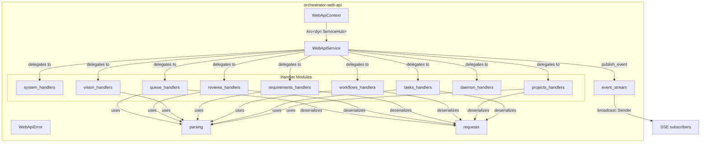
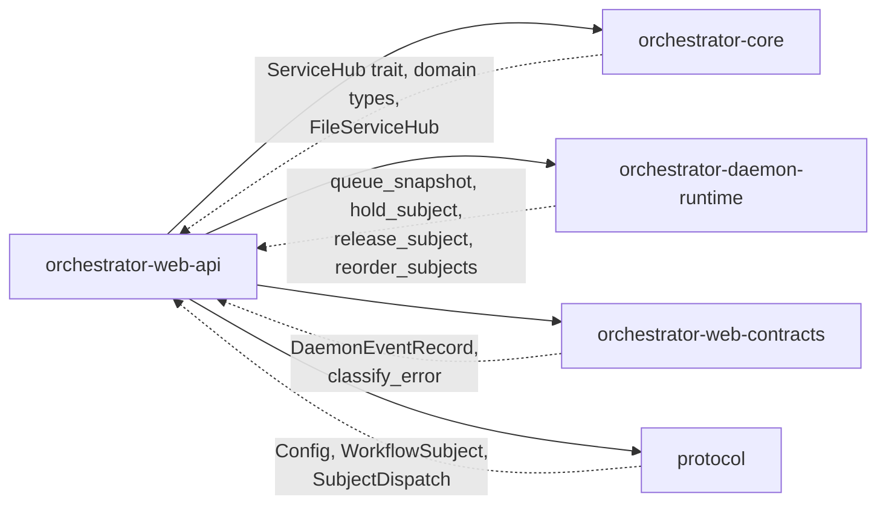

# orchestrator-web-api

Web API business logic and service layer for the AO agent orchestrator.

## Overview

`orchestrator-web-api` is a transport-agnostic service crate that implements all business operations exposed by the AO web interface. It sits between the HTTP server (`orchestrator-web-server`) and the core domain layer (`orchestrator-core`), translating incoming JSON request bodies into validated domain inputs, delegating to `ServiceHub` trait methods, and returning JSON responses. The crate also owns an in-process event bus that broadcasts every mutating operation as a sequenced `DaemonEventRecord`, enabling real-time Server-Sent Events in the web UI.

## Architecture

### Data Flow

1. The web server constructs a `WebApiContext` holding an `Arc<dyn ServiceHub>`, the project root path, and the app version string.
2. `WebApiService::new()` wraps that context, creates a `broadcast` channel for real-time events, and reads the current max event sequence number from the JSONL event log on disk.
3. Each handler method receives typed parameters (path segments, query filters) or a raw `serde_json::Value` body. The `parsing` module validates and normalizes the body into domain types. The `requests` module defines the deserialization structs.
4. The handler calls through `ServiceHub` trait methods (tasks, workflows, planning, daemon, projects, review) to perform the operation.
5. On success, the handler calls `publish_event()` which atomically increments the sequence counter, builds a `DaemonEventRecord`, and sends it on the broadcast channel.
6. The caller receives a `Result<Value, WebApiError>`. Errors carry a classified code, human message, and exit code derived from `orchestrator-web-contracts::classify_error`.

## Key Components

### `WebApiContext`

Shared application state injected into the service. Contains:

| Field | Type | Purpose |
|---|---|---|
| `hub` | `Arc<dyn ServiceHub>` | Dependency-injected access to all domain services |
| `project_root` | `String` | Filesystem path of the active AO project |
| `app_version` | `String` | Running binary version for system info responses |

### `WebApiService`

The central service facade. Constructed with `WebApiService::new(context)`. Holds:

- An `Arc<WebApiContext>` for shared state.
- A `broadcast::Sender<DaemonEventRecord>` for real-time event push.
- An `AtomicU64` sequence counter for monotonically ordered events.

Public methods are organized into handler groups:

| Group | Methods | Domain |
|---|---|---|
| **System** | `system_info` | Platform, version, daemon status |
| **Projects** | `projects_list`, `projects_active`, `projects_get`, `projects_create`, `projects_load`, `projects_patch`, `projects_archive`, `projects_delete`, `projects_requirements`, `projects_requirements_by_id` | Multi-project registry and cross-project requirement snapshots |
| **Tasks** | `tasks_list`, `tasks_prioritized`, `tasks_next`, `tasks_stats`, `tasks_get`, `tasks_create`, `tasks_patch`, `tasks_delete`, `tasks_status`, `tasks_assign_agent`, `tasks_assign_human`, `tasks_checklist_add`, `tasks_checklist_update`, `tasks_dependency_add`, `tasks_dependency_remove`, `project_tasks` | Full task lifecycle including assignment, checklists, dependencies |
| **Workflows** | `workflows_list`, `workflows_get`, `workflows_decisions`, `workflows_checkpoints`, `workflows_get_checkpoint`, `workflows_run`, `workflows_resume`, `workflows_pause`, `workflows_cancel`, `project_workflows` | Workflow execution and inspection |
| **Requirements** | `requirements_list`, `requirements_get`, `requirements_create`, `requirements_patch`, `requirements_delete`, `requirements_draft`, `requirements_refine`, `project_requirement_get` | Requirement CRUD, AI-assisted drafting and refinement |
| **Vision** | `vision_get`, `vision_save`, `vision_refine` | Project vision document with heuristic refinement |
| **Reviews** | `reviews_handoff` | Agent-to-human handoff requests |
| **Daemon** | `daemon_status`, `daemon_health`, `daemon_logs`, `daemon_start`, `daemon_stop`, `daemon_pause`, `daemon_resume`, `daemon_clear_logs`, `daemon_agents` | Daemon lifecycle and active agent introspection |
| **Queue** | `queue_list`, `queue_stats`, `queue_reorder`, `queue_hold`, `queue_release` | Dispatch queue management with hold/release and reorder |

### `WebApiError`

Structured error type with `code`, `message`, and `exit_code` fields. Implements `From<anyhow::Error>` using `classify_error` from `orchestrator-web-contracts` for consistent error classification across the API surface.

### Event System

`WebApiService` maintains a `broadcast::Sender<DaemonEventRecord>` channel (capacity 1024). Every mutating handler calls `publish_event(event_type, data)` which:

- Atomically increments a sequence counter.
- Constructs a `DaemonEventRecord` with UUID, timestamp, schema `ao.daemon.event.v1`, and the project root.
- Sends the record to all active subscribers.

Consumers call `subscribe_events()` for a live receiver or `read_events_since(after_seq)` to replay from the JSONL log on disk.

### Parsing and Validation

The `parsing` module provides:

- `parse_json_body<T>()` for typed deserialization with user-friendly error messages.
- Enum parsers (`parse_task_status`, `parse_priority_opt`, `parse_requirement_priority`, etc.) that accept mixed-case, underscore, and hyphen variants.
- `build_task_filter()` for constructing composite filter objects from query parameters.
- `normalize_optional_string()` and `normalize_string_list()` for whitespace trimming and deduplication.
- `refine_vision_heuristically()` which adds measurable success metrics and traceability constraints when missing.

### Request Types

The `requests` module defines serde `Deserialize` structs for every mutating endpoint, including `TaskCreateRequest`, `WorkflowRunRequest`, `RequirementCreateRequest`, `QueueReorderRequest`, `ReviewHandoffRequest`, and others. All use `#[serde(default)]` for optional fields so partial JSON bodies are accepted.

## Dependencies

| Crate | Role |
|---|---|
| `orchestrator-core` | Domain types (`TaskFilter`, `RequirementItem`, `VisionDraftInput`, etc.), `ServiceHub` trait for dependency injection, `FileServiceHub` for per-project service instantiation |
| `orchestrator-daemon-runtime` | Dispatch queue operations (`queue_snapshot`, `hold_subject`, `release_subject`, `reorder_subjects`) and queue snapshot types |
| `orchestrator-web-contracts` | Shared web types (`DaemonEventRecord`) and error classification (`classify_error`) |
| `protocol` | Wire protocol types (`Config` for global config paths, `WorkflowSubject`, `SubjectDispatch`, `OrchestratorTask`) |

External dependencies: `anyhow`, `chrono`, `dirs`, `serde`/`serde_json`, `tokio` (broadcast channel), `uuid`.
