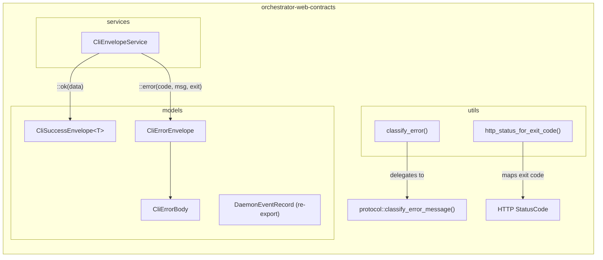
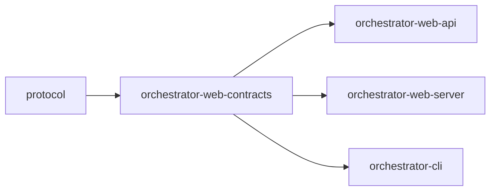

# orchestrator-web-contracts

Shared request/response contracts and error-handling utilities for the AO web layer.

## Overview

`orchestrator-web-contracts` defines the canonical JSON envelope types and error classification logic shared across the AO web stack. It sits between the `protocol` crate (wire-level types and constants) and the higher-level `orchestrator-web-api` / `orchestrator-web-server` crates, ensuring that every HTTP endpoint produces responses conforming to the `ao.cli.v1` schema contract.

The crate is intentionally small and dependency-light so that both the API business-logic layer and the Axum server layer can depend on it without pulling in heavy frameworks.

## Architecture

### Data Flow

1. A web handler receives a request and invokes CLI/core logic.
2. On success, the handler calls `CliEnvelopeService::ok(data)` to wrap the result in a `CliSuccessEnvelope` with `schema: "ao.cli.v1"` and `ok: true`.
3. On failure, the handler calls `classify_error(message)` to obtain an error code and exit code, then `CliEnvelopeService::error(code, message, exit_code)` to build a `CliErrorEnvelope`.
4. The server layer uses `http_status_for_exit_code(exit_code)` to translate the exit code into the appropriate HTTP status before sending the response.

## Key Components

### Models

| Type | Description |
|------|-------------|
| `CliSuccessEnvelope<T>` | Generic success wrapper with `schema`, `ok: true`, and a `data: T` payload. `T` must implement `Serialize`. |
| `CliErrorEnvelope` | Error wrapper with `schema`, `ok: false`, and an `error: CliErrorBody` payload. |
| `CliErrorBody` | Structured error detail containing a `code` (e.g. `"not_found"`), human-readable `message`, and numeric `exit_code`. |
| `DaemonEventRecord` | Re-exported from `protocol` -- represents a timestamped daemon event used for event-stream endpoints. |

### Services

| Type | Description |
|------|-------------|
| `CliEnvelopeService` | Stateless factory for building envelopes. Exposes `CLI_SCHEMA` (the `"ao.cli.v1"` constant from `protocol`) and two constructors: `ok()` and `error()`. |

### Utilities

| Function | Signature | Description |
|----------|-----------|-------------|
| `classify_error` | `fn(message: &str) -> (&'static str, i32)` | Delegates to `protocol::classify_error_message` to pattern-match an error message into an error code and exit code. Exit codes: `1` internal, `2` invalid_input, `3` not_found, `4` conflict, `5` unavailable. |
| `http_status_for_exit_code` | `fn(exit_code: i32) -> StatusCode` | Maps CLI exit codes to HTTP status codes: `2 -> 400`, `3 -> 404`, `4 -> 409`, `5 -> 503`, anything else -> `500`. |

## Dependencies

| Dependency | Role |
|------------|------|
| `protocol` | Provides `CLI_SCHEMA_ID`, `classify_error_message()`, and `DaemonEventRecord` |
| `serde` / `serde_json` | JSON serialization for all envelope types |
| `http` | `StatusCode` type used by `http_status_for_exit_code` |

### Downstream Consumers

- **`orchestrator-web-api`** -- uses envelopes and error classification to build API responses.
- **`orchestrator-web-server`** -- uses `http_status_for_exit_code` to set HTTP status codes on Axum responses.
- **`orchestrator-cli`** -- uses the same envelope types for `--json` CLI output parity with the web layer.
