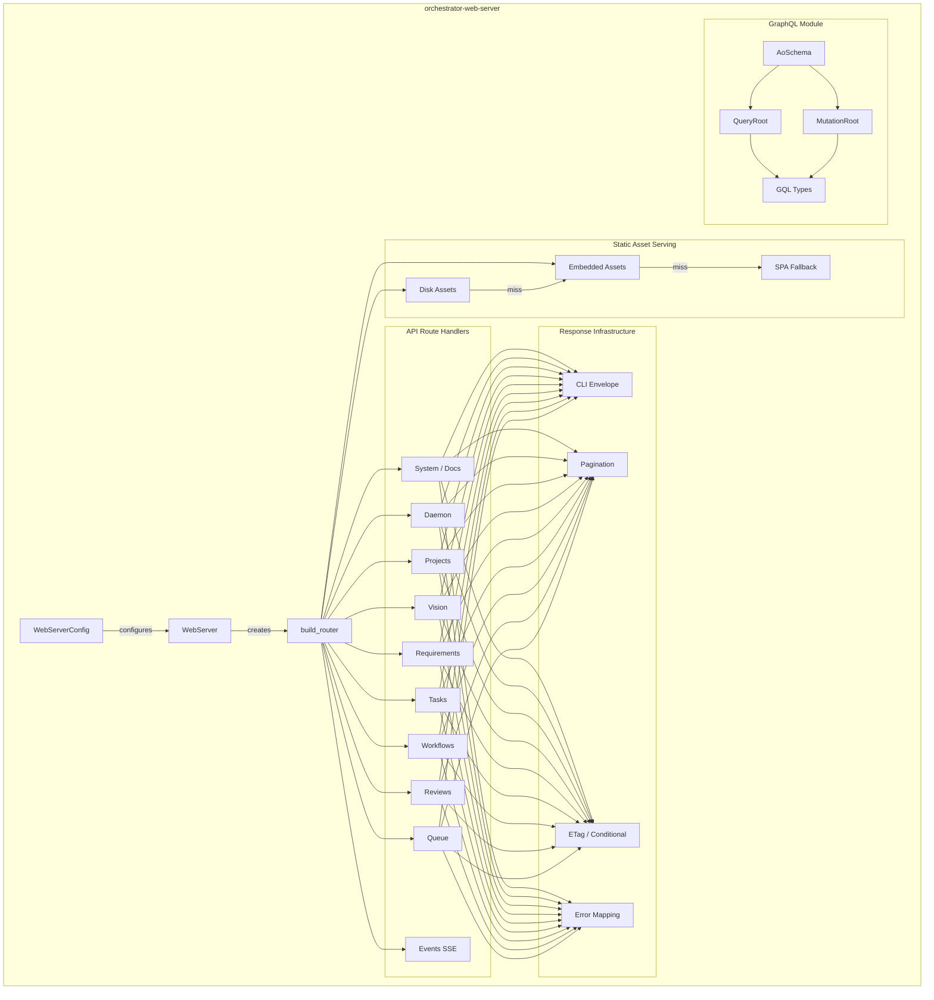
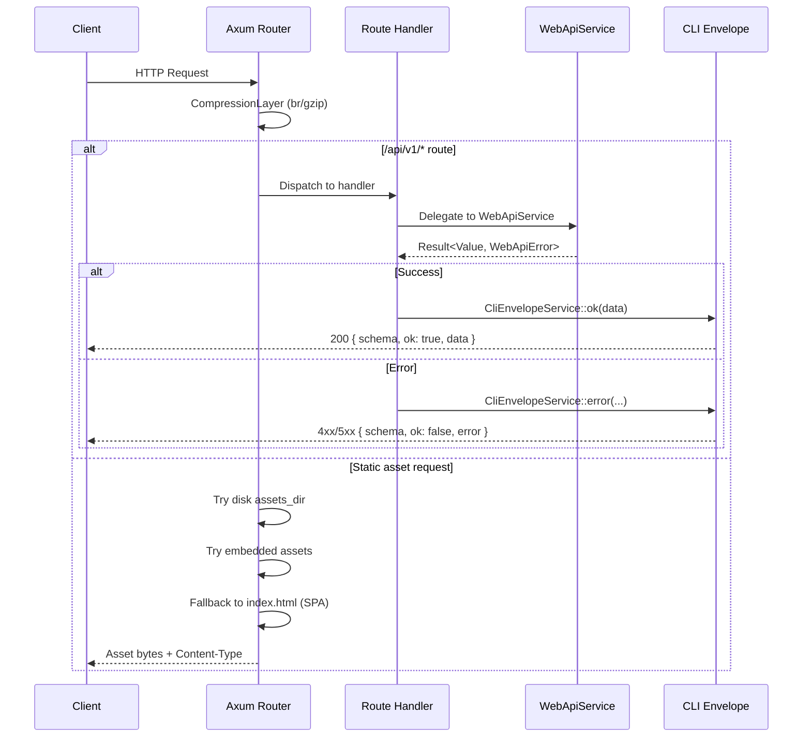
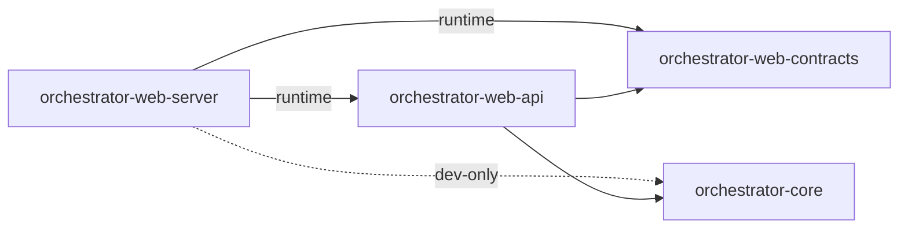

# orchestrator-web-server

Axum-based HTTP server that exposes the AO orchestrator as a REST API with embedded frontend assets and optional GraphQL support.

## Overview

`orchestrator-web-server` is the transport layer for the AO web interface. It binds an HTTP server, mounts a comprehensive REST API under `/api/v1`, serves an embedded single-page application (SPA) for the web UI, and provides real-time daemon events via Server-Sent Events (SSE). All business logic is delegated to `orchestrator-web-api`; this crate is strictly responsible for HTTP routing, request/response plumbing, static asset serving, pagination, ETag-based caching, and response envelope formatting.

An optional `graphql` feature adds a GraphQL schema (queries and mutations) backed by `async-graphql`, providing an alternative query interface alongside REST.

## Architecture



### Request Flow



## Key Components

### `WebServer`

The main entry point. Constructed with a `WebServerConfig` and a `WebApiService`, it binds a TCP listener and serves the Axum router.

```rust
pub struct WebServer {
    config: WebServerConfig,
    api: WebApiService,
}
```

- `WebServer::new(config, api)` -- creates the server instance.
- `WebServer::run(self)` -- starts listening and serving. Returns when the server shuts down.

### `WebServerConfig`

Configuration for the HTTP server with sensible defaults.

| Field | Type | Default | Description |
|---|---|---|---|
| `host` | `String` | `127.0.0.1` | Bind address |
| `port` | `u16` | `4173` | Bind port |
| `assets_dir` | `Option<String>` | `None` | Filesystem directory for development asset overrides |
| `api_only` | `bool` | `false` | When true, disables static asset serving |
| `default_page_size` | `usize` | `50` | Default page size for paginated list endpoints |
| `max_page_size` | `usize` | `200` | Maximum allowed page size |

### `AppState`

Internal shared state passed to all Axum handlers via `State` extractor. Holds the `WebApiService`, asset directory configuration, and pagination limits.

### Response Helpers

- **`success_response`** -- wraps data in a `CliEnvelopeService::ok` JSON envelope with HTTP 200.
- **`success_response_with_etag`** -- same as above but computes a SHA-256 ETag and supports `If-None-Match` / 304 responses.
- **`paginated_success_response`** -- slices array data by cursor/page_size, attaches pagination headers, and optionally supports conditional caching.
- **`error_response`** -- maps `WebApiError` exit codes to HTTP status codes via `http_status_for_exit_code` and wraps in a `CliEnvelopeService::error` envelope.

### Static Asset Serving

Assets are resolved in priority order:

1. **Disk** (`assets_dir`) -- for development hot-reload of the frontend build.
2. **Embedded** (`include_dir!`) -- pre-built SPA assets compiled into the binary from the `embedded/` directory.
3. **SPA fallback** -- unmatched paths fall through to `index.html` for client-side routing.

All paths are sanitized to prevent directory traversal (`..`, absolute paths, etc.).

### GraphQL (Feature-Gated)

Enabled with `--features graphql`. Provides a full `async-graphql` schema.

**Queries:** `tasks`, `task`, `requirements`, `requirement`, `workflows`, `workflow`, `daemonHealth`, `agentRuns`

**Mutations:** `createTask`, `updateTaskStatus`, `runWorkflow`, `pauseWorkflow`, `resumeWorkflow`, `cancelWorkflow`

**Types:** `GqlTask`, `GqlRequirement`, `GqlWorkflow`, `GqlDaemonHealth`, `GqlAgentRun`, `GqlPhaseExecution`, `GqlDecision`

Relationship resolvers allow traversing from tasks to their linked requirements and from workflows to their phase executions and decision history.

## API Endpoints

All REST endpoints are nested under `/api/v1`.

### System

| Method | Path | Description |
|---|---|---|
| GET | `/system/info` | Server and version information |
| GET | `/openapi.json` | OpenAPI 3.x specification |
| GET | `/docs` | Swagger UI documentation page |

### Events

| Method | Path | Description |
|---|---|---|
| GET | `/events` | SSE stream of daemon events (supports `Last-Event-ID` for replay) |

### Daemon

| Method | Path | Description |
|---|---|---|
| GET | `/daemon/status` | Daemon status (ETag-cached) |
| GET | `/daemon/health` | Daemon health check |
| GET | `/daemon/logs` | Daemon log entries (`?limit=N`) |
| DELETE | `/daemon/logs` | Clear daemon logs |
| POST | `/daemon/start` | Start the daemon |
| POST | `/daemon/stop` | Stop the daemon |
| POST | `/daemon/pause` | Pause the daemon |
| POST | `/daemon/resume` | Resume the daemon |
| GET | `/daemon/agents` | List active agents |

### Projects

| Method | Path | Description |
|---|---|---|
| GET | `/projects` | List all projects |
| POST | `/projects` | Create a project |
| GET | `/projects/active` | Get active project |
| GET | `/projects/{id}` | Get project by ID |
| PATCH | `/projects/{id}` | Update project |
| DELETE | `/projects/{id}` | Delete project |
| GET | `/projects/{id}/tasks` | List tasks for project (filterable) |
| GET | `/projects/{id}/workflows` | List workflows for project |
| POST | `/projects/{id}/load` | Load/activate a project |
| POST | `/projects/{id}/archive` | Archive a project |
| GET | `/project-requirements` | List all project requirements |
| GET | `/project-requirements/{id}` | Requirements by project ID |
| GET | `/project-requirements/{project_id}/{requirement_id}` | Specific requirement |

### Vision

| Method | Path | Description |
|---|---|---|
| GET | `/vision` | Get project vision |
| POST | `/vision` | Save project vision |
| POST | `/vision/refine` | Refine project vision |

### Requirements

| Method | Path | Description |
|---|---|---|
| GET | `/requirements` | List requirements (paginated) |
| POST | `/requirements` | Create a requirement |
| POST | `/requirements/draft` | Draft a requirement |
| POST | `/requirements/refine` | Refine a requirement |
| GET | `/requirements/{id}` | Get requirement by ID |
| PATCH | `/requirements/{id}` | Update requirement |
| DELETE | `/requirements/{id}` | Delete requirement |

### Tasks

| Method | Path | Description |
|---|---|---|
| GET | `/tasks` | List tasks (paginated, filterable, ETag-cached) |
| POST | `/tasks` | Create a task |
| GET | `/tasks/prioritized` | Get prioritized task list |
| GET | `/tasks/next` | Get next task to work on |
| GET | `/tasks/stats` | Task statistics |
| GET | `/tasks/{id}` | Get task by ID |
| PATCH | `/tasks/{id}` | Update task |
| DELETE | `/tasks/{id}` | Delete task |
| POST | `/tasks/{id}/status` | Update task status |
| POST | `/tasks/{id}/assign-agent` | Assign agent to task |
| POST | `/tasks/{id}/assign-human` | Assign human to task |
| POST | `/tasks/{id}/checklist` | Add checklist item |
| PATCH | `/tasks/{id}/checklist/{item_id}` | Update checklist item |
| POST | `/tasks/{id}/dependencies` | Add task dependency |
| DELETE | `/tasks/{id}/dependencies/{dependency_id}` | Remove task dependency |

### Workflows

| Method | Path | Description |
|---|---|---|
| GET | `/workflows` | List workflows (paginated) |
| POST | `/workflows/run` | Run a workflow |
| GET | `/workflows/{id}` | Get workflow by ID |
| GET | `/workflows/{id}/decisions` | Get workflow decisions |
| GET | `/workflows/{id}/checkpoints` | List workflow checkpoints |
| GET | `/workflows/{id}/checkpoints/{checkpoint}` | Get specific checkpoint |
| POST | `/workflows/{id}/resume` | Resume workflow |
| POST | `/workflows/{id}/pause` | Pause workflow |
| POST | `/workflows/{id}/cancel` | Cancel workflow |

### Reviews

| Method | Path | Description |
|---|---|---|
| POST | `/reviews/handoff` | Create a review handoff |

### Queue

| Method | Path | Description |
|---|---|---|
| GET | `/queue` | List queue items |
| GET | `/queue/stats` | Queue statistics |
| POST | `/queue/reorder` | Reorder queue |
| POST | `/queue/hold/{id}` | Hold a queue item |
| POST | `/queue/release/{id}` | Release a queue item |

### Pagination

List endpoints that support pagination accept these query parameters:

- `cursor` -- offset into the result set (unsigned integer)
- `page_size` -- number of items per page (1 to `max_page_size`)

Pagination metadata is returned in response headers:

| Header | Description |
|---|---|
| `x-ao-page-size` | Actual page size used |
| `x-ao-total-count` | Total number of items |
| `x-ao-has-more` | `true` or `false` |
| `x-ao-next-cursor` | Cursor value for the next page (absent when no more pages) |

## Dependencies



### Workspace Crates

| Crate | Relationship | Purpose |
|---|---|---|
| `orchestrator-web-api` | Runtime dependency | Business logic service (`WebApiService`) that all handlers delegate to |
| `orchestrator-web-contracts` | Runtime dependency | Shared types (`CliEnvelopeService`, `DaemonEventRecord`, `http_status_for_exit_code`) |
| `orchestrator-core` | Dev dependency | `InMemoryServiceHub` and `ServiceHub` trait used in integration tests |

### External Crates

| Crate | Purpose |
|---|---|
| `axum` | HTTP framework (routing, extractors, responses) |
| `tokio` | Async runtime |
| `tower-http` | Compression middleware (brotli, gzip) |
| `serde` / `serde_json` | Request/response serialization |
| `include_dir` | Compile-time embedding of frontend assets |
| `mime_guess` | Content-Type detection for static files |
| `sha2` | ETag computation (SHA-256 digest) |
| `async-stream` | SSE event stream construction |
| `async-graphql` | GraphQL schema (optional, behind `graphql` feature) |
| `async-graphql-axum` | Axum integration for GraphQL (optional) |
