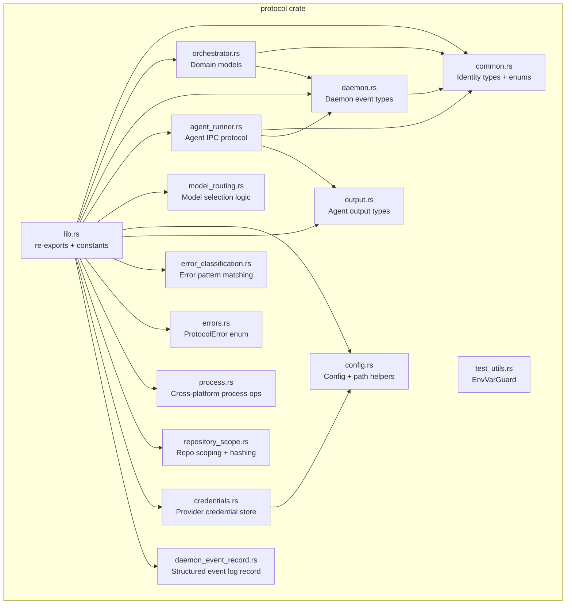
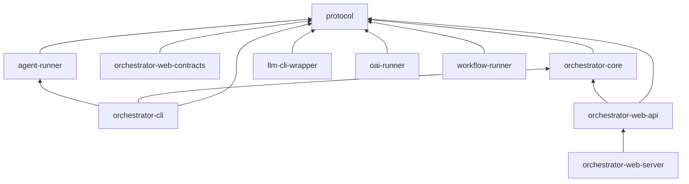

# protocol

Shared wire protocol types and contracts used across all AO workspace crates.

## Overview

The `protocol` crate is the foundational type library for the AO agent orchestrator. It defines every serializable data structure that crosses a crate boundary -- from CLI JSON output envelopes to IPC messages between the daemon and the agent runner, to the domain models for tasks, workflows, requirements, and projects.

By concentrating these types in a single crate, AO guarantees that all producers and consumers share identical wire formats. Serde field names and enum tags are treated as a stable contract; the `PROTOCOL_VERSION` constant (`1.0.0`) tracks compatibility and must only change during a coordinated migration.

## Architecture

## Key Components

### Identity Types (`common.rs`)

Newtype wrappers that give compile-time distinction to string identifiers:

| Type | Purpose |
|------|---------|
| `ProjectId` | Unique project identifier |
| `RequirementId` | Requirement identifier |
| `TaskId` | Task identifier |
| `RunId` | Agent run identifier |
| `ModelId` | LLM model identifier |
| `AgentId` | Agent instance identifier |
| `WorkflowId` | Workflow identifier |
| `Timestamp` | `DateTime<Utc>` wrapper with `now()` constructor |

Also defines `RequirementPriority` (MoSCoW: Must/Should/Could/Wont), `Status`, `WorkflowPhase`, and `TokenUsage`.

### Domain Models (`orchestrator.rs`)

The largest module, containing the full orchestrator domain:

- **Task types** -- `OrchestratorTask`, `TaskStatus` (Backlog through Cancelled), `TaskType` (Feature, Bugfix, Hotfix, Refactor, Docs, Test, Chore, Experiment), `Priority` (Critical/High/Medium/Low), `TaskCreateInput`, `TaskUpdateInput`, `TaskFilter`, `TaskStatistics`, `TaskDependency`, `ChecklistItem`
- **Workflow types** -- `OrchestratorWorkflow`, `WorkflowStatus`, `WorkflowMachineState` (a 10-state state machine: Idle, EvaluateTransition, RunPhase, EvaluateGates, ApplyTransition, Paused, Completed, MergeConflict, Failed, HumanEscalated), `WorkflowMachineEvent`, `WorkflowSubject` (Task, Requirement, or Custom), `SubjectDispatch`, `SubjectExecutionFact`, `WorkflowRunInput`
- **Phase decision types** -- `PhaseDecision`, `PhaseDecisionVerdict`, `PhaseEvidence`, `PhaseEvidenceKind`, `WorkflowDecisionRecord`, `WorkflowCheckpoint`
- **Requirement types** -- `RequirementItem`, `RequirementStatus` (11 states from Draft to Deprecated), `RequirementLinks`, `RequirementComment`, `RequirementsDraftInput/Result`, `RequirementsRefineInput`, `RequirementsExecutionInput/Result`
- **Project types** -- `OrchestratorProject`, `ProjectConfig`, `ProjectType`, `ProjectMetadata`, `ProjectModelPreferences`, `ProjectConcurrencyLimits`, `ComplexityAssessment`, `ComplexityTier`, `VisionDocument`, `VisionDraftInput`
- **Architecture types** -- `ArchitectureGraph`, `ArchitectureEntity`, `ArchitectureEdge`
- **Handoff types** -- `AgentHandoffRequestInput`, `AgentHandoffResult`, `HandoffTargetRole` (Em/Po)
- **Priority policy** -- `TaskPriorityDistribution`, `TaskPriorityPolicyReport`, `TaskPriorityRebalancePlan`

### Daemon Events (`daemon.rs`)

Types for real-time daemon event streaming:

- `DaemonEvent` -- tagged enum with variants: `AiStreamChunk`, `AiStreamComplete`, `RequirementUpdated`, `WorkflowPhaseChanged`, `AgentStatusChanged`, `AgentOutputChunk`, `ActivityUpdate`, `StatsUpdate`
- `AgentStatus` -- Starting, Running, Paused, Completed, Failed, Timeout, Terminated
- `RequirementNode`, `RequirementType`, `ProjectStats`, `ActivityEntry`, `ActivityType`
- `DaemonEventRecord` -- structured JSONL log record with schema, sequence number, and event data

### Agent Runner IPC (`agent_runner.rs`)

The wire protocol for communication between the daemon and the standalone agent runner process:

- `AgentRunRequest` / `AgentRunEvent` -- request to start an agent run and the stream of events it produces (Started, OutputChunk, Metadata, Error, Finished, ToolCall, ToolResult, Artifact, Thinking)
- `AgentControlRequest` / `AgentControlAction` -- Pause, Resume, Terminate a running agent
- `AgentStatusRequest` / `AgentStatusResponse` / `AgentStatusQueryResponse`
- `RunnerStatusRequest` / `RunnerStatusResponse` -- health check with protocol version and build ID
- `IpcAuthRequest` / `IpcAuthResult` -- token-based authentication handshake with failure codes
- `ModelStatusRequest` / `ModelStatusResponse` / `ModelAvailability`
- `ProjectModelConfig` / `WorkflowPhaseModelDefaults`

### Agent Output (`output.rs`)

Structured agent output records:

- `AgentOutput` -- individual output event with `AgentEventType` (Output, ToolCall, ToolResult, Artifact, Thinking, Completion, Error)
- `ToolCallInfo` / `ToolResultInfo` -- tool invocation and result metadata
- `ArtifactInfo` / `ArtifactType` -- file, code, image, document, or data artifacts
- `CompletionInfo` / `ErrorInfo`

### Model Routing (`model_routing.rs`)

Intelligent model selection and normalization logic:

- `canonical_model_id()` -- normalizes model name aliases to canonical IDs (e.g., `"sonnet"` to `"claude-sonnet-4-6"`, `"gemini-pro"` to `"gemini-2.5-pro"`)
- `tool_for_model_id()` -- maps a model ID to its CLI tool (`claude`, `codex`, `gemini`, `opencode`, `oai-runner`)
- `normalize_tool_id()` -- collapses tool aliases
- `default_primary_model_for_phase()` -- selects the primary model based on `PhaseCapabilities` and `ModelRoutingComplexity` (Low/Medium/High)
- `default_fallback_models_for_phase()` -- ordered fallback chains per phase and complexity
- `PhaseCapabilities` -- capability flags (`writes_files`, `requires_commit`, `is_research`, `is_ui_ux`, `is_review`, `is_testing`, `is_requirements`) with phase-aware defaults
- `tool_supports_repository_writes()`, `required_api_keys_for_tool()`, `default_model_specs()`, `default_model_for_tool()`

### Configuration (`config.rs`)

Project and global configuration management:

- `Config` -- agent runner token and MCP server entries, with load/save from `~/.ao/` or project `.ao/config.json`
- `ProjectMcpServerEntry` -- MCP server definition with command, args, env, and agent assignment
- `cli_tracker_path()`, `daemon_events_log_path()` -- well-known file path helpers
- `default_allowed_tool_prefixes()` -- MCP tool prefix whitelist for agent sandboxing
- `parse_env_bool()` / `parse_env_bool_opt()` -- environment variable boolean parsing

### Error Classification (`error_classification.rs`)

Pattern-based error categorization for consistent CLI exit codes:

- `classify_error_message()` returns an error category and exit code by matching against known patterns
- Categories: `invalid_input` (exit 2), `not_found` (exit 3), `conflict` (exit 4), `unavailable` (exit 5), `internal` (exit 1)

### Repository Scoping (`repository_scope.rs`)

Deterministic, collision-resistant directory naming for per-repo state:

- `repository_scope_for_path()` -- produces `<sanitized-repo-name>-<12-hex-sha256-suffix>` from the canonical path
- `scoped_state_root()` -- returns `~/.ao/<scope>/` for a given project root
- `sanitize_identifier()` -- normalizes arbitrary strings to lowercase kebab-case slugs

### Process Management (`process.rs`)

Cross-platform (Unix + Windows) process lifecycle utilities:

- `process_exists()`, `is_process_alive()` -- liveness checks (with zombie detection on Unix)
- `kill_process()` -- SIGKILL / TerminateJobObject
- `terminate_process()` -- graceful SIGTERM with 2-second escalation to SIGKILL

### Credentials (`credentials.rs`)

Provider API key storage and resolution:

- `Credentials` -- loads from `credentials.json`, resolves API keys by matching provider name against model ID or API base URL

### Protocol Errors (`errors.rs`)

- `ProtocolError` -- `VersionMismatch`, `InvalidMessage`, `Serialization`

### Constants (`lib.rs`)

| Constant | Value | Purpose |
|----------|-------|---------|
| `PROTOCOL_VERSION` | `"1.0.0"` | Wire compatibility version |
| `CLI_SCHEMA_ID` | `"ao.cli.v1"` | JSON envelope schema identifier |
| `MAX_UNIX_SOCKET_PATH_LEN` | `100` | Max IPC socket path length |
| `ACTOR_CLI` | `"ao-cli"` | Actor identifier for CLI |
| `ACTOR_DAEMON` | `"ao-daemon"` | Actor identifier for daemon |
| `ACTOR_CORE` | `"ao-core"` | Actor identifier for core |

## Dependencies

The `protocol` crate sits at the bottom of the workspace dependency graph. Every runtime crate depends on it, but it depends on no other workspace crate.

### External Dependencies

| Crate | Purpose |
|-------|---------|
| `serde` + `serde_json` | Serialization for all wire types |
| `chrono` | Timestamps with serde support |
| `uuid` | V4 UUID generation for tokens |
| `anyhow` | Error propagation |
| `thiserror` | Typed protocol errors |
| `sha2` | SHA-256 hashing for repository scoping |
| `dirs` | Platform config directory resolution |
| `once_cell` | Lazy static initialization (Windows) |
| `nix` | Unix signal handling |
| `windows` | Windows process/job management |
