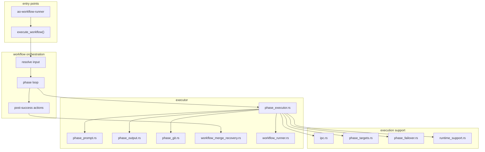
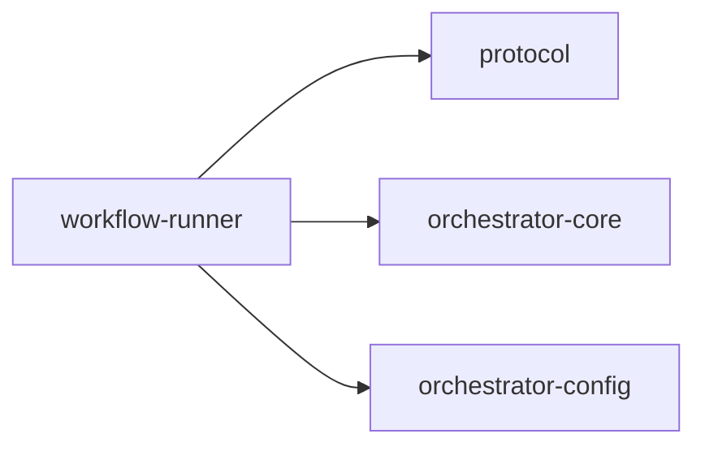

# workflow-runner

Workflow execution engine for AO, exposed as both a library and a standalone helper binary.

## Overview

`workflow-runner` executes workflow pipelines against tasks, requirements, or ad hoc custom subjects. It resolves the execution working directory, builds phase prompts and runtime contracts, calls `agent-runner` over IPC, persists per-phase output, and handles failover, rework, and recovery paths.

## Targets

- Library: `workflow_runner`
- Binary: `ao-workflow-runner`

## Architecture

## Binary command shape

The standalone binary currently exposes `execute` with:

- subject selection via `--task-id`, `--requirement-id`, or title/description
- required `--project-root`
- optional `--workflow-ref`
- optional `--tool` and `--model`
- optional `--phase-timeout-secs`

It emits `runner_start` and `runner_complete` JSON events on stderr for supervision.

## Key components

### Workflow orchestration

- `src/workflow_execute.rs` owns the top-level execution entry point and phase loop.
- `WorkflowExecuteParams` carries subject selection, runtime overrides, callbacks, and project root context.

### Phase execution

- `src/executor/phase_executor.rs` drives individual phase attempts and parses phase results.
- `src/executor/phase_prompt.rs` builds the phase prompt payload.
- `src/executor/phase_output.rs` persists structured per-phase output.
- `src/executor/phase_git.rs` handles commit and execution-CWD git helpers.

### Runner IPC and runtime support

- `src/ipc.rs` authenticates to `agent-runner`, builds runtime contracts, and captures transcripts.
- `src/runtime_support.rs` applies per-phase runtime settings and launch overrides.
- `src/phase_targets.rs` chooses tool/model targets.
- `src/phase_failover.rs` classifies failures for fallback decisions.

### Recovery helpers

- `src/executor/workflow_runner.rs` contains AI-assisted failure recovery support.
- `src/executor/workflow_merge_recovery.rs` contains merge-conflict recovery support.

## Workspace dependencies

## Notes

- The crate is used directly by both `orchestrator-cli` and `orchestrator-daemon-runtime`.
- It is the bridge between workflow configuration and actual agent phase execution.
