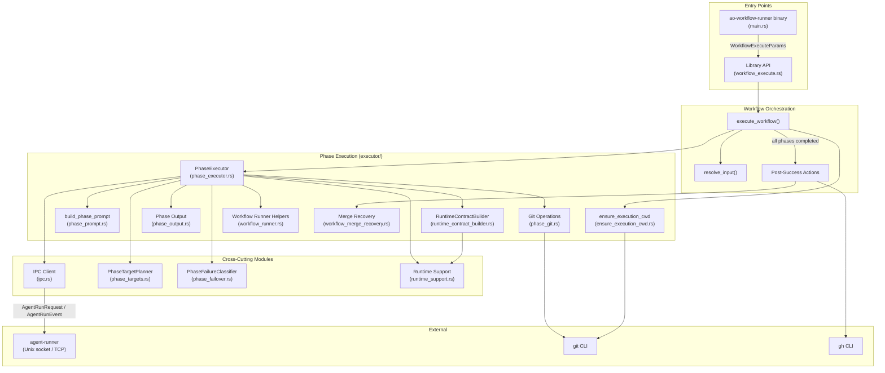
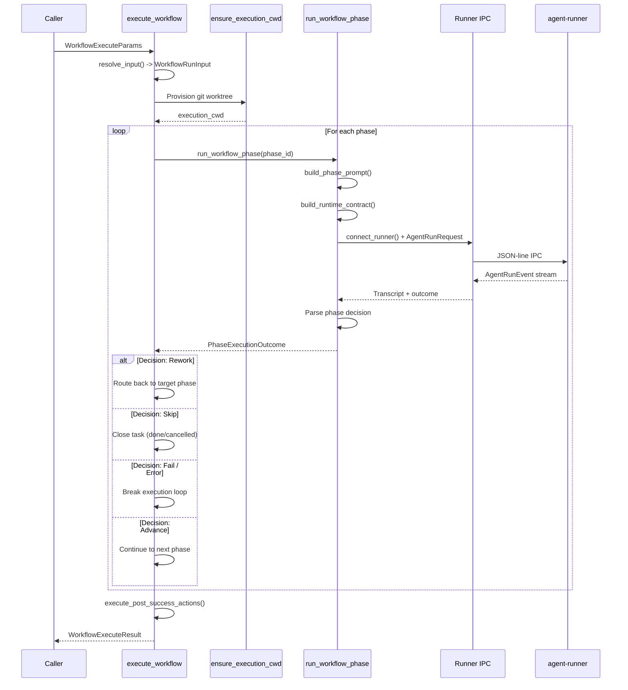
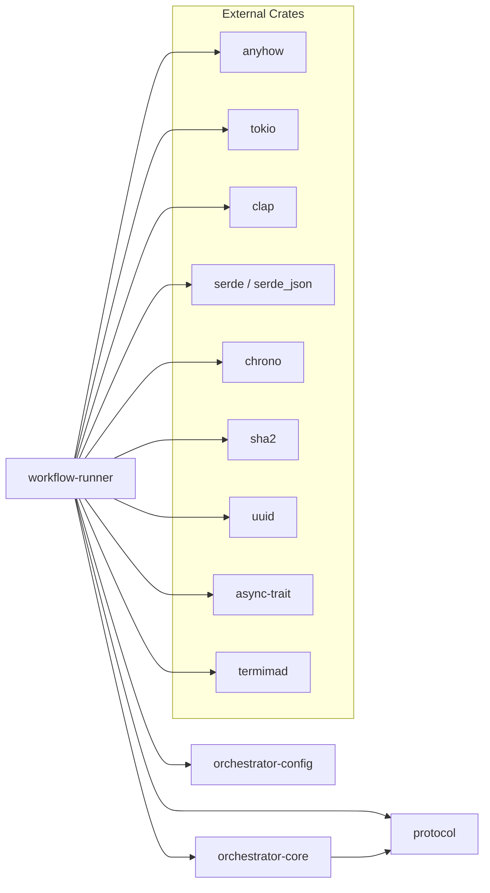

# workflow-runner

Standalone workflow phase execution engine for the AO agent orchestrator.

## Overview

The `workflow-runner` crate is responsible for executing multi-phase workflow pipelines against tasks, requirements, or custom subjects in the AO workspace. It serves as both a library (used by the daemon and CLI) and a standalone binary (`ao-workflow-runner`) that can be invoked as a subprocess.

The crate handles the full lifecycle of workflow execution: resolving the target subject, provisioning isolated git worktrees, sequencing phases, dispatching each phase to an AI agent via the runner IPC protocol, interpreting phase decisions (advance/rework/skip/fail), performing post-success actions (merge, PR creation, worktree cleanup), and persisting structured phase output artifacts.

## Architecture

## Workflow Execution Flow

## Key Components

### Entry Points

- **`ao-workflow-runner` binary** (`main.rs`): Standalone CLI with an `execute` subcommand. Emits structured `runner_start`/`runner_complete` JSON events to stderr for daemon observability.
- **`execute_workflow()`** (`workflow_execute.rs`): Core library entry point. Accepts `WorkflowExecuteParams` and returns `WorkflowExecuteResult` with per-phase results, timing, and post-success action outcomes.

### Workflow Orchestration (`workflow_execute.rs`)

- **`WorkflowExecuteParams`**: Input struct carrying project root, subject identifiers (task/requirement/custom), model/tool overrides, phase filters, timeout, event callbacks, and optional `ServiceHub`.
- **`WorkflowExecuteResult`**: Output struct with success flag, workflow/subject IDs, execution CWD, phase completion counts, per-phase JSON results, duration, and post-success action results.
- **`PhaseEvent`**: Enum emitted via callback for Started/Decision/Completed lifecycle events.
- **Rework loop**: Tracks per-phase rework counts against configurable budgets. Routes execution back to a target phase (configurable via verdict routing or defaulting to `implementation`) when a phase emits a `Rework` verdict.
- **Post-success actions**: On full pipeline completion, handles git push, PR creation via `gh`, auto-merge (squash/merge/rebase strategies), and worktree cleanup.

### Phase Execution (`executor/`)

- **`CliPhaseExecutor`** (`phase_executor.rs`): Implements the `orchestrator_core::PhaseExecutor` trait. Handles the full phase execution lifecycle including target resolution with failover, runner IPC, output streaming, transcript parsing, phase decision extraction, commit message handling, and continuation support.
- **`PhaseExecutionOutcome`**: Enum with variants `Completed` (with optional decision and commit message), `NeedsResearch`, and `ManualPending`.
- **`PhaseExecutionMetadata`**: Tracks tool, model, phase mode, attempt number, and timing for each phase run.

### Phase Target Planning (`phase_targets.rs`)

- **`PhaseTargetPlanner`**: Resolves which AI tool and model to use for a given phase. Considers overrides (env vars, agent config), phase capabilities, complexity routing, and fallback chains. Enforces write-capable tool selection for phases that modify files.
- **`build_phase_execution_targets()`**: Produces an ordered list of (tool, model) pairs for failover, deduplicating and filtering suppressed models.

### Phase Failure Classification (`phase_failover.rs`)

- **`PhaseFailureClassifier`**: Classifies phase failures to determine failover behavior. Detects transient runner errors (connection refused, timeouts), provider exhaustion (quota/rate limits/credit depletion), and target unavailability (missing CLI tools, unsupported models).
- **Diagnostic buffering**: Maintains a rolling window of diagnostic lines for error summarization.

### IPC Client (`ipc.rs`)

- **`connect_runner()`**: Establishes authenticated Unix socket (or TCP on non-Unix) connection to the agent-runner process. Handles socket path shortening for Unix path length limits.
- **`runner_config_dir()`**: Resolves the runner configuration directory based on scope (project-local or global) and environment overrides.
- **`build_runtime_contract()`** / **`build_runtime_contract_with_resume()`**: Constructs the JSON runtime contract that tells the runner how to launch AI CLI tools (claude, codex, gemini, opencode). Applies environment-driven overrides for web search, reasoning effort, network access, permissions, and extra CLI arguments.
- **`run_prompt_against_runner()`**: High-level helper for sending a prompt to the runner and collecting the transcript.

### Runtime Support (`runtime_support.rs`)

- **`WorkflowPhaseRuntimeSettings`**: Per-phase configuration for tool, model, fallback models, reasoning effort, web search, timeouts, max attempts, extra args, and continuation limits.
- **`inject_cli_launch_overrides()`**: Applies all tool-specific launch argument modifications to runtime contracts (Codex search flags, reasoning effort, network access, Claude permission bypass, extra config overrides, extra CLI args).
- **`phase_timeout_secs()` / `phase_runner_attempts()` / `phase_max_continuations()`**: Environment-driven execution parameters with defaults and bounds.

### Prompt Construction (`executor/phase_prompt.rs`)

- **`build_phase_prompt()`**: Assembles the full prompt for a workflow phase from a template, injecting subject details, phase directives, safety rules, decision contracts, prior phase context, rework context, and pipeline variables.

### Runtime Contract Builder (`executor/runtime_contract_builder.rs`)

- Resolves per-phase agent IDs, system prompts, tool/model overrides, fallback models, capabilities, output contracts, and decision contracts from agent runtime configuration.
- Injects MCP server configurations (default stdio, project-level, workflow-level) and agent tool policies into the runtime contract.

### Git Operations (`executor/phase_git.rs`)

- **`commit_implementation_changes()`**: Stages all changes and commits with the phase-provided message, ensuring git identity is configured.
- **`ensure_execution_cwd()`** (`executor/ensure_execution_cwd.rs`): Provisions isolated git worktrees for task execution, managing branch creation, path validation, and task metadata updates.

### Merge Conflict Recovery (`executor/workflow_merge_recovery.rs`)

- **`attempt_ai_merge_conflict_recovery()`**: Dispatches an AI agent to resolve merge conflicts in a dedicated worktree, validates the resolution with `cargo check`, and parses structured recovery responses.

### AI Failure Recovery (`executor/workflow_runner.rs`)

- **`attempt_ai_failure_recovery()`**: When a phase fails, dispatches an AI agent to analyze the error and recommend a recovery action (retry, decompose into subtasks, skip phase, or fail).
- **`task_requires_research()`** / **`workflow_has_completed_research()`**: Heuristics for determining whether a task needs a research phase.

## Dependencies

### Workspace Crate Relationships

| Crate | Role |
|---|---|
| `protocol` | Wire protocol types (`AgentRunRequest`, `AgentRunEvent`, `RunId`, `ModelId`), model routing defaults, phase capabilities, IPC auth, and configuration loading |
| `orchestrator-core` | Domain types (`OrchestratorTask`, `OrchestratorWorkflow`, `PhaseDecision`), `ServiceHub` trait, `FileServiceHub`, workflow config loading, agent runtime config, git provider abstraction |
| `orchestrator-config` | Workflow configuration types (`MergeStrategy`, pipeline definitions) |

## Environment Variables

Key environment variables that influence execution behavior:

| Variable | Purpose |
|---|---|
| `AO_PHASE_TIMEOUT_SECS` | Per-phase timeout (0 or unset = no timeout) |
| `AO_PHASE_RUN_ATTEMPTS` | Max attempts per phase (default: 3, range: 1-10) |
| `AO_PHASE_MAX_CONTINUATIONS` | Max session continuations per phase (default: 3, range: 0-10) |
| `AO_PHASE_MODEL` / `AO_PHASE_TOOL` | Global model/tool overrides for all phases |
| `AO_PHASE_MODEL_{PHASE}` / `AO_PHASE_TOOL_{PHASE}` | Per-phase model/tool overrides |
| `AO_PHASE_FALLBACK_MODELS` | Comma-separated fallback model list |
| `AO_ALLOW_NON_EDITING_PHASE_TOOL` | Skip write-capability enforcement |
| `AO_RUNNER_SCOPE` | Runner scope: `project` (default) or `global` |
| `AO_STREAM_PHASE_OUTPUT` | Output streaming level (`quiet` default) |
| `AO_CLAUDE_BYPASS_PERMISSIONS` | Enable Claude `bypassPermissions` mode |
| `AO_CODEX_WEB_SEARCH` | Enable/disable Codex web search (default: true) |
| `AO_CODEX_REASONING_EFFORT` | Override Codex reasoning effort level |
| `AO_CODEX_NETWORK_ACCESS` | Enable/disable Codex network access (default: true) |

## Notes

- This crate should remain resilient to phase-level failures and provide clear retry/fail-fallback behavior.
- The rework loop has configurable budgets per phase to prevent infinite retry cycles.
- Post-success merge actions support squash, merge, and rebase strategies with automatic conflict detection.
- AI-assisted merge conflict recovery and failure recovery provide self-healing capabilities for the workflow pipeline.
