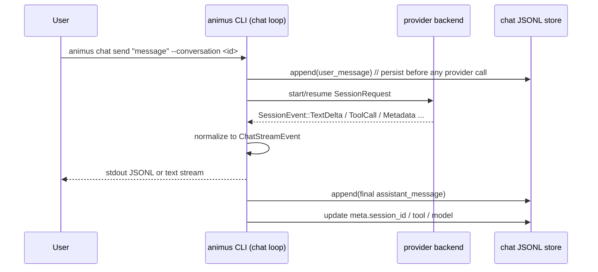

# Animus Chat

## Status

- **Version:** v0.5.10 target (retargeted from v0.6 — ship the working vertical slice in the 0.5.x line, defer only the HTTP-surface breadth)
- **Type:** Product architecture + implementation notes
- **Builds on:** [plugin-system.md](./plugin-system.md), [subject-backend-plugins.md](./subject-backend-plugins.md), [control-protocol.md](./control-protocol.md), [multi-tenant-rbac-v0.5.5.md](./multi-tenant-rbac-v0.5.5.md), [kernel-and-flavors.md](./kernel-and-flavors.md)
- **New plugin roles:** none in v0.5.10; the shipped CLI reuses existing `provider_backend` plugins
- **First shipped client:** `animus chat` in `orchestrator-cli`

## TL;DR

Animus already had the hard part: installed provider backends that can stream,
accept a resume handle, and talk to Animus's MCP server. v0.5.10 turns that
into a durable multi-turn CLI chat surface by adding:

1. An append-only JSONL conversation store under scoped runtime state.
2. A chat turn loop that chooses **resume** or **replay** on each turn.
3. A normalized stream sink for `--json`, `--stream`, and non-streaming output.
4. A conversation cost rollup at `animus cost conversation <id>`.

The result is intentionally CLI-first: `animus chat` reuses the same
`SessionBackendResolver` path as `animus agent run`, captures the provider's
native `session_id`, and persists a portable transcript plus a thin continuity
pointer for fallback replay.

## Why now / why this shape

The landscape research (June 2026) produced one decision-forcing fact:

> **OpenAI's Assistants/Threads API is deprecated** — announced 2025-08-26,
> sunset **2026-08-26**. It is being replaced by the **Responses API +
> Conversations API** (Assistants→Prompts, Threads→Conversations, Runs→Responses,
> RunSteps→Items). Sources: [OpenAI deprecations](https://developers.openai.com/api/docs/deprecations),
> [Assistants migration guide](https://developers.openai.com/api/docs/assistants/migration).

The lesson: **do not model Animus conversations on anyone's server-side thread
object.** OpenAI just spent a year walking the entire ecosystem off the
Threads/Runs model they originally pushed. The durable primitives across every
surviving system are:

- **Anthropic Messages API** — stateless. The client holds the full message
  history and resends it each turn. Tool use is `tool_use` / `tool_result`
  content blocks. Streaming is SSE with a fixed event sequence (verified below).
  Source: [Anthropic streaming](https://platform.claude.com/docs/en/docs/build-with-claude/streaming).
- **OpenAI Responses API** — "send input items, get output items." Server-side
  persistence is *optional* (Conversations), not mandatory.
- **MCP** — the tool-call loop is provider-agnostic: model emits a tool call,
  the host executes it, the result is fed back as a new message, the model
  continues.
- **Vercel AI SDK / Letta / Claude Code** — all keep the conversation as an
  ordered list of messages-with-content-blocks; persistence is *their* concern,
  not the model API's.

So the durable architecture is: **Animus owns the conversation state. Providers
are stateless translators.** This is also exactly how Animus already treats
subject backends and providers — we are not inventing a new pattern, we are
applying the existing one to a new subject kind.

## Decision 1 — Conversation schema: Anthropic-native content blocks

**Chosen: a normalized internal schema modeled on Anthropic content blocks, with
an OpenAI-compatible projection at the HTTP edge.**

Rationale:

- **Content blocks are the superset.** A message is `{role, content: [block...]}`
  where a block is one of `text`, `tool_use`, `tool_result`, `thinking`, `image`.
  OpenAI's `{role, content: str, tool_calls: [...]}` is losslessly *projectable*
  from this, but not vice-versa (OpenAI splits tool calls into a sibling field
  and tool results into separate `role: tool` messages — flattening content
  blocks into that loses ordering for interleaved text+tool turns).
- **Thinking blocks.** Extended-thinking models emit `thinking` + `signature`
  blocks that must round-trip verbatim for multi-turn integrity. Only a
  block-structured schema preserves them.
- **We normalize at the turn loop boundary.** Provider `SessionEvent`s are
  folded into a small provider-agnostic `ChatStreamEvent` set for stdout and a
  portable `ChatMessage` record for storage. The core continuity logic never
  depends on a vendor-specific wire format.

### Internal message schema (`animus.chat.v1`)

```jsonc
{
  "schema": "animus.chat.message.v1",
  "id": "msg_01H...",              // ULID, monotonic within a conversation
  "conversation_id": "conv_01H...",
  "role": "user" | "assistant" | "system" | "tool",
  "content": [
    { "type": "text", "text": "What's the weather in SF?" },

    { "type": "tool_use",
      "id": "toolu_01A...",
      "name": "animus.subject.list",
      "input": { "kind": "task" } },

    { "type": "tool_result",
      "tool_use_id": "toolu_01A...",
      "is_error": false,
      "content": [ { "type": "text", "text": "[{...}]" } ] },

    { "type": "thinking",
      "thinking": "The user wants...",
      "signature": "EqQBCgIYAh..." }
  ],
  "model": "claude-opus-4-8",       // null for user/system
  "stop_reason": "end_turn" | "tool_use" | "max_tokens" | null,
  "usage": { "input_tokens": 25, "output_tokens": 142,
             "cache_read_input_tokens": 0, "cache_creation_input_tokens": 0 },
  "created_at": "2026-06-08T15:00:00Z",
  "principal_id": "sami"            // RBAC actor that authored this turn
}
```

### Verified Anthropic-style streaming sequence (one provider shape the turn loop can normalize)

```
event: message_start          → {message: {id, role, content:[], usage}}
event: content_block_start     → {index, content_block: {type:"text", text:""}}
event: ping
event: content_block_delta     → {index, delta: {type:"text_delta", text:"Hel"}}
event: content_block_delta     → {index, delta: {type:"text_delta", text:"lo"}}
event: content_block_stop      → {index}
  // tool_use block:
event: content_block_start     → {index, content_block: {type:"tool_use", id, name, input:{}}}
event: content_block_delta     → {index, delta: {type:"input_json_delta", partial_json:"{\"loc"}}
event: content_block_stop      → {index}   // accumulate partial_json, parse once
event: message_delta           → {delta: {stop_reason:"tool_use"}, usage:{output_tokens}}
event: message_stop
```

Tool-use input arrives as **partial JSON string deltas** that the provider
accumulates and parses on `content_block_stop`. This is the one non-obvious bit
of provider implementation.

## Decision 2 — Streaming protocol: JSONL to stdout (CLI-first), SSE/control later

**The v0.5.10 primary surface is the CLI, and `animus chat send --json` emits
newline-delimited `ChatStreamEvent` objects to stdout.** This is the simplest
possible streaming surface, it needs no daemon, and it composes with the
existing machine-readable CLI envelope style.

```
$ animus chat send "weather in SF?" --conversation conv-01H... --stream --json
{"type":"turn_started","conversation_id":"conv-01H...","tool":"claude","model":"claude-sonnet-4-6","resumed":true}
{"type":"text_delta","text":"Let me "}
{"type":"text_delta","text":"check."}
{"type":"tool_call","tool_name":"weather.get","arguments":{"city":"San Francisco"}}
{"type":"tool_result","tool_name":"weather.get","success":true}
{"type":"metadata","tokens":{"input":123,"output":45},"cost_usd":0.0042}
{"type":"turn_completed","conversation_id":"conv-01H...","seq":8,"session_id":"sess_abc123"}
```

Each line is a self-describing `ChatStreamEvent`. A consumer can pipe
`animus chat send --json` into `jq`, a Node/Python script, or any subprocess
reader and get a live stream without speaking a daemon or HTTP protocol.
Without `--json`, `--stream` renders text deltas directly to the terminal.
Without either flag, the command blocks and prints the final assembled assistant
message once the turn completes.

**The two other surfaces reuse the identical event type, added in fast-follow:**

- **HTTP (v0.5.11):** `POST /v1/chat/completions` with `"stream": true` → standard
  OpenAI SSE chunks projected from the same `ChatStreamEvent`s. The "point any
  chat SDK at Animus" story.
- **TUI / daemon-mediated (v0.5.11):** the control-protocol event channel (the
  newline-delimited JSON-RPC stream the `workflow/events` broadcaster already
  uses — [control-protocol.md](./control-protocol.md)) carries `chat/delta`
  notifications for multi-client UIs. Same events, daemon-brokered.

The through-line: **one event type, three transports.** JSONL-to-stdout is the
v0.5.10 ship; SSE and control-channel are the same bytes wrapped differently.

## Decision 3 — The tool-use loop

**The loop lives in the `animus` CLI process itself; no daemon is required for
v0.5.10 chat.** This mirrors how `animus agent run` already resolves and runs
provider backends over `SessionBackendResolver`. The CLI process persists each
turn to the conversation JSONL store, captures the provider's native
`session_id` into conversation metadata, and streams normalized
`ChatStreamEvent`s to stdout.

The load-bearing continuity rule is XOR:

- if a stored `session_id` is still valid for the same tool, Animus sends only
  the new user message and resumes the provider's native session;
- otherwise Animus replays the full stored history and sends no `session_id`.

Doing both would duplicate context and cost, so the turn loop couples prompt
shape and resume state tightly. If a resume attempt fails with a stale-session
error, the loop drops the stored `session_id`, replays full history once, and
retries exactly one time.



Step-by-step:

1. **Persist user turn first.** The file-backed conversation store appends the user
   message before any model call so a crash mid-turn never loses input.
2. **Provider streams.** The CLI resolves the selected provider backend,
   starts or resumes a session, and folds each `SessionEvent` into normalized
   `ChatStreamEvent`s plus the eventual persisted `ChatMessage`.
3. **Tool calls stay provider-driven in v0.5.10.** The wrapped CLI tool reaches
   Animus tools through its configured MCP endpoint; Animus records the visible
   tool call / result events but does not run a separate daemon-owned tool loop.
4. **Result feeds back through the provider's native session.** When the
   provider returns a usable `session_id`, the next turn resumes that native
   session; otherwise the next turn replays the full stored history.
5. **Every step persists.** The JSONL log is the source of truth; clients are
   pure renderers and can disconnect/reconnect mid-turn.

**What is in the loop:** provider call orchestration, continuity choice,
stream normalization, persistence.
**What is outside:** the terminal UI, provider-native session storage, and any
future HTTP/TUI broker layer.

## Decision 4 — Persistence: append-only JSONL per conversation

**Chosen: one JSONL file per conversation under scoped state, mirroring how runs
and artifacts already persist.**

```
~/.animus/<repo-scope>/chat/
├── conv-01H8XY.../
│   ├── meta.json       # {id, title, agent_profile, model, created_at, principal}
│   └── messages.jsonl  # one message-v1 object per line, append-only
```

- **Resume is free.** Reopen = read `messages.jsonl`, replay into the provider.
  No server-side thread to rehydrate, no vendor lock.
- **Crash-safe.** Append-only + persist-before-model-call means a killed daemon
  leaves a valid prefix. The worst case is a missing final assistant turn, which
  the next `chat/turn` regenerates.
- **Debuggable.** `tail -f messages.jsonl` shows a live conversation.
- **Portable but thin.** v0.5.10 keeps conversations in a dedicated chat store
  under scoped runtime state, separate from the subject router. The store is
  intentionally minimal: metadata plus append-only messages. Assistant
  messages persist both aggregated `content` and an ordered `blocks` timeline
  (`text`, `thinking`, `tool_call`, `tool_result`) so reloads can reconstruct
  the same interleaved view the live stream showed.

We explicitly do **not** use SQLite here. Conversations are append-heavy,
read-sequential, and rarely queried by field — JSONL is the right shape, and it
matches `runs/`.

## Decision 5 — v0.5.10 reuses the EXISTING providers; `chat_provider` is deferred

**Revised after grounding in the actual provider contract.** The original plan
added a new `chat_provider` plugin role (direct-API). That is over-built for the
CLI-first ship. The existing `provider` plugins already do what v0.5.10 needs:

The provider contract (`animus-session-backend`'s `SessionRequest`/`SessionRun`):
- `SessionRequest { tool, model, prompt, cwd, mcp_endpoint, permission_mode,
  extras, ... }` — `extras` already carries `system_prompt`, `mcp_servers`,
  `tools`, **`session_id`**.
- `SessionRun { session_id: Option<String>, events: mpsc::Receiver<SessionEvent>,
  ... }` — **already streaming**, and **already returns a session_id**.

So the existing providers (`animus-provider-claude` / `codex` / `gemini` / `oai`)
already:
1. **Stream** — `events: mpsc::Receiver<SessionEvent>`.
2. **Do multi-turn** — `session_id` comes back, and `extras.session_id` goes in.
   The CLI tools' native continuity (`claude --resume <id>`, etc.) is plumbed.
3. **Reach Animus's tools** — `mcp_endpoint` points the wrapped CLI tool at the
   in-tree MCP server, so the model can already call `animus.*` tools through the
   harness.
4. Are **installed + authenticated** with zero new API keys.

**v0.5.10 chat is built on these.** The chat loop calls `SessionBackendResolver`
(the same path `animus agent run` uses), threads `session_id` for continuity,
normalizes the `SessionEvent` stream into `ChatStreamEvent`s for stdout and
`ChatMessage`s for the JSONL store. No new provider, no new key, no new role.

### What this gives up — and when `chat_provider` earns its keep (v0.5.11+)

Routing through the CLI-tool providers means tool use happens **inside the CLI
harness** (Claude Code's own loop reaching Animus via `mcp_endpoint`), not as
content blocks the chat loop intercepts. You do not own the turn structure
byte-for-byte. For the common case — *"chat with the tool I have, multi-turn,
streaming, with my tools available"* — that is exactly right and costs nothing.

A direct-API `chat_provider` is only justified for the **build-apps** use case
where you must:
- own the conversation as clean content blocks you control byte-for-byte, and
- run the tool loop yourself (intercept `tool_use`, route to arbitrary MCP tools,
  inject `tool_result`) instead of delegating to the CLI harness.

That is deferred to **v0.5.11**, alongside the OpenAI-compat HTTP surface (which
genuinely needs the owned-conversation model). If/when it lands, it's an additive
sibling role with the `chat/stream` RPC:

```toml
plugin_kind = "chat_provider"        # v0.5.11+, NOT v0.5.10
[capabilities]
streaming = true; tool_use = true; prompt_caching = true
```
```
chat/stream  {messages[], system, tools[], model, max_tokens} → streams ChatStreamEvent
chat/models  {} → [ChatModelInfo]
```
First reference impl would be `animus-chat-anthropic` (Messages API, zero schema
impedance), then `animus-chat-openai` (Responses API).

The chat loop is written **provider-agnostic** so adding `chat_provider` later is
a new `TurnProducer` impl, not a rewrite.

## Decision 6 — TUI as the first client

`launchapp-dev/animus-tui` (Ratatui + crossterm + tokio) becomes the first chat
surface. It already speaks the control protocol to the daemon, so it gains a chat
pane that:

1. Opens a conversation: `chat/open {agent_profile, model}` → `conversation_id`.
2. Sends a turn: `chat/turn {conversation_id, text}`.
3. Renders the `chat/delta` notification stream token-by-token (text blocks
   inline; tool_use/tool_result as collapsible call cards).
4. Cancels with `$/cancelRequest` (already wired).

No new transport — the TUI uses the same Unix-socket control client every other
command uses. This is the cheapest possible first client and it dogfoods the
`chat/*` RPC before we expose HTTP.

## CLI surface (shipped v0.5.10)

```
animus chat new [--id <id>] [--title <title>]
animus chat send "message" [--conversation <id>] [--tool <tool>] [--model <id>] [--cwd <path>] [--stream]
animus chat get <conversation-id>
animus chat list
animus chat rename <conversation-id> --title <title>
animus chat delete <conversation-id>
```

`--json` selects JSONL event output, `--stream` selects plain-text incremental
output, and omitting both prints the final assistant reply after persistence.
`rename` trims the supplied title and clears it when the value is empty;
`delete` removes the conversation directory and is idempotent for missing ids.

## HTTP surface (transport plugin)

```
POST /v1/chat/completions                # OpenAI-compatible, SSE when stream=true
POST /v1/animus/conversations            # {agent, model} → {conversation_id}
POST /v1/animus/conversations/:id/turns  # {message} → SSE stream
GET  /v1/animus/conversations/:id        # full history (message-v1[])
Auth: Authorization: Bearer <api-key>    # keys minted via `animus secret`, gated by RBAC
```

The `/v1/chat/completions` shape is the unlock: **any existing chat app, LangChain
client, or `openai` SDK can set `base_url` to the Animus endpoint and work
unmodified** — with the bonus that every Animus MCP tool is available to the model
and every turn is persisted + auditable. That is the "build chat applications on
top of these agents" story.

## Auth & multi-tenancy

- **Local (TUI, CLI):** peer-cred over the Unix socket — the v0.5.8 RBAC
  chokepoint already resolves the principal.
- **Remote (HTTP):** bearer API keys. Keys are stored in the keychain via
  `animus secret set CHAT_API_KEY_<name>` and mapped to a principal. The HTTP
  transport resolves `Bearer <key>` → principal → RBAC policy. Per-principal
  conversations: a principal can only list/read/continue conversations it owns
  (or is granted, under `enforce` mode).
- **Tool authorization is per-turn.** Even mid-conversation, each tool call
  re-checks the principal's permission — a `viewer` principal in a shared
  conversation can read but its tool calls that mutate state are denied with a
  recoverable `tool_result` error.

## Cost accounting

Every assistant message persists its `usage` block plus `cost_usd` when the
provider reports them. A conversation's cost is the sum over those persisted
assistant turns — no separate ledger:

```bash
animus cost conversation <conversation-id>
```

## What we will NOT do in v0.6

- **No fine-tuning / model hosting.** `chat_provider` plugins call hosted APIs or
  local Ollama. We do not run inference ourselves.
- **No vector store / RAG inside conversations.** Memory binding
  ([knowledge-rag-binding-v0.5.5.md](./knowledge-rag-binding-v0.5.5.md) +
  `memory_store` plugins) stays a separate concern. A conversation can *call* a
  memory tool, but conversations are not auto-embedded.
- **No multi-agent conversations (agent-to-agent in one thread).** One persona
  per conversation in v0.6. Multi-party is a v0.7 question.
- **No server-side thread object exposed to clients.** We deliberately reject the
  OpenAI Assistants/Threads model that is being sunset. Clients hold a
  conversation_id; the daemon holds the JSONL.
- **No WebSocket / bidirectional streaming.** SSE only. Revisit if real-time
  voice/interruption lands.
- **No automated migration from `agent run` history.** Past fire-and-forget runs
  stay as runs; conversations are a new primitive.
- **No web UI chat pane.** TUI first. The `animus-web-ui` plugin gets a chat pane
  in v0.7 once the `chat/*` protocol is proven by the TUI.

## v0.5.10 sprint plan

Retargeted from a 90-day v0.6 wave to an aggressive v0.5.10 sprint. The goal is
the **complete working vertical slice** — multi-turn chat with tool use, from the
TUI, against Claude, persisted + RBAC-gated — shipped in the 0.5.x line. Only the
HTTP-surface *breadth* (second provider, external SDK compat) is deferred to a
fast-follow. The dependency edges force three serial gates; everything else
fans out in parallel.

**Implementation slices that shipped in v0.5.10**
- CLI surface: `animus chat new/send/get/list`, top-level routing, and metrics
  grouping in `orchestrator-cli`.
- File-backed conversation storage under `~/.animus/<repo-scope>/chat/`.
- `runtime_chat` sink abstractions plus the XOR continuity turn loop.
- Conversation cost aggregation at `animus cost conversation <id>`.
- Reference docs and architecture notes updated to the shipped shape.

**v0.5.10 milestone (CLI-first):** create a conversation, send turns, get
streamed JSONL or text responses with tool use, exit, and continue later by
targeting the same conversation id — all through the `animus` CLI against the
installed provider backends, fully persisted. No daemon, no UI. This is the
ship.

**Deferred to v0.5.11 fast-follow (NOT in v0.5.10):**
- TUI chat pane in `animus-tui` — daemon-mediated `chat/delta` rendering. The CLI
  proves the loop + protocol first.
- Daemon-side chat loop + `chat/turn` control RPC + `chat/delta` broadcaster —
  wraps the same Gate-2 library for multi-client UIs.
- OpenAI-compat HTTP surface (`/v1/chat/completions` SSE, bearer auth) — the
  "point any chat SDK at Animus" story.
- `animus-chat-openai` (Responses API) — second provider.
- Web UI chat pane.

Each agent runs in an isolated worktree, self-vets with `codex review` before
commit (per the repo's contributor instructions), and pushes to its own branch for the
main loop to verify + merge — the same pattern that shipped v0.5.8 and v0.5.9.
