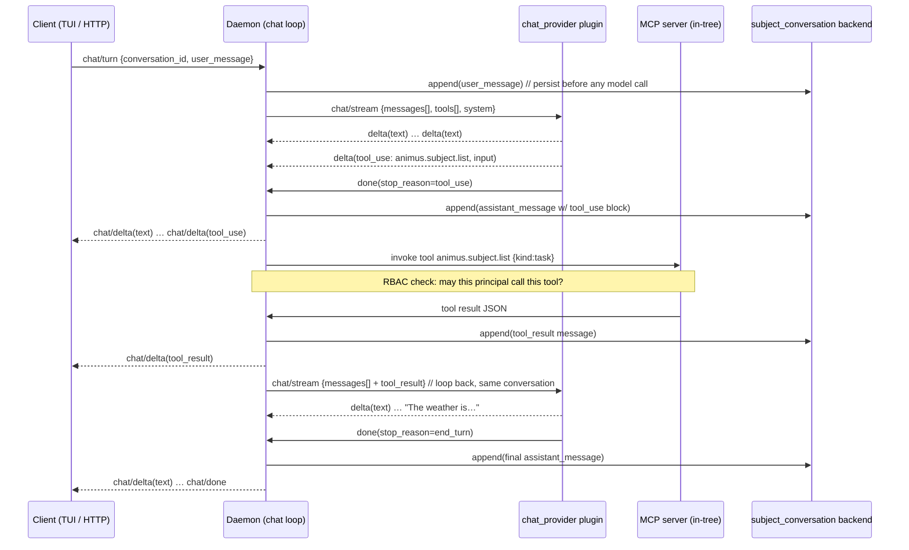

# Animus Chat

## Status

- **Version:** v0.5.10 target (retargeted from v0.6 — ship the working vertical slice in the 0.5.x line, defer only the HTTP-surface breadth)
- **Type:** Product architecture + new plugin role
- **Builds on:** [plugin-system.md](./plugin-system.md), [subject-backend-plugins.md](./subject-backend-plugins.md), [control-protocol.md](./control-protocol.md), [multi-tenant-rbac-v0.5.5.md](./multi-tenant-rbac-v0.5.5.md), [kernel-and-flavors.md](./kernel-and-flavors.md)
- **New plugin roles:** `chat_provider`, `subject_kind=conversation`
- **First client:** `launchapp-dev/animus-tui` (Ratatui)

## TL;DR

Today Animus runs agents **fire-and-forget**: `animus agent run --prompt` spawns a
provider CLI, runs one turn to completion, returns a run-id. There is no
multi-turn conversation, no streaming response, no session you can reopen and
continue.

Animus Chat makes Animus a **conversation platform you can build apps on**. It
adds:

1. A normalized internal **conversation schema** (Anthropic-style content blocks),
   stored as an append-only JSONL log per conversation via a new
   `subject_kind=conversation` backend.
2. A new **`chat_provider` plugin role** that speaks streaming chat against an
   upstream API (Anthropic Messages, OpenAI Responses, local Ollama) — distinct
   from the existing CLI-wrapping `provider` role.
3. A daemon-side **chat session loop** that drives the multi-turn + tool-use
   cycle, streaming tokens back over the existing control-protocol event channel.
4. An **OpenAI-compatible HTTP surface** (`POST /v1/chat/completions`, SSE) via a
   transport plugin, so any existing chat SDK/app can point at Animus.
5. The **TUI plugin as the first client**, speaking a new `chat/*` control RPC
   stream to the daemon.

The agent profile you already configure (system prompt + model + allowed MCP
tools) becomes the **persona**. The MCP server you already run becomes the
**tool surface**. The keychain (v0.5.8) holds the **API keys**. RBAC (v0.5.8)
gates **who can talk to whom**. We are mostly wiring existing substrate together.

## Why now / why this shape

The landscape research (June 2026) produced one decision-forcing fact:

> **OpenAI's Assistants/Threads API is deprecated** — announced 2025-08-26,
> sunset **2026-08-26**. It is being replaced by the **Responses API +
> Conversations API** (Assistants→Prompts, Threads→Conversations, Runs→Responses,
> RunSteps→Items). Sources: [OpenAI deprecations](https://developers.openai.com/api/docs/deprecations),
> [Assistants migration guide](https://developers.openai.com/api/docs/assistants/migration).

The lesson: **do not model Animus conversations on anyone's server-side thread
object.** OpenAI just spent a year walking the entire ecosystem off the
Threads/Runs model they originally pushed. The durable primitives across every
surviving system are:

- **Anthropic Messages API** — stateless. The client holds the full message
  history and resends it each turn. Tool use is `tool_use` / `tool_result`
  content blocks. Streaming is SSE with a fixed event sequence (verified below).
  Source: [Anthropic streaming](https://platform.claude.com/docs/en/docs/build-with-claude/streaming).
- **OpenAI Responses API** — "send input items, get output items." Server-side
  persistence is *optional* (Conversations), not mandatory.
- **MCP** — the tool-call loop is provider-agnostic: model emits a tool call,
  the host executes it, the result is fed back as a new message, the model
  continues.
- **Vercel AI SDK / Letta / Claude Code** — all keep the conversation as an
  ordered list of messages-with-content-blocks; persistence is *their* concern,
  not the model API's.

So the durable architecture is: **Animus owns the conversation state. Providers
are stateless translators.** This is also exactly how Animus already treats
subject backends and providers — we are not inventing a new pattern, we are
applying the existing one to a new subject kind.

## Decision 1 — Conversation schema: Anthropic-native content blocks

**Chosen: a normalized internal schema modeled on Anthropic content blocks, with
an OpenAI-compatible projection at the HTTP edge.**

Rationale:

- **Content blocks are the superset.** A message is `{role, content: [block...]}`
  where a block is one of `text`, `tool_use`, `tool_result`, `thinking`, `image`.
  OpenAI's `{role, content: str, tool_calls: [...]}` is losslessly *projectable*
  from this, but not vice-versa (OpenAI splits tool calls into a sibling field
  and tool results into separate `role: tool` messages — flattening content
  blocks into that loses ordering for interleaved text+tool turns).
- **Thinking blocks.** Extended-thinking models emit `thinking` + `signature`
  blocks that must round-trip verbatim for multi-turn integrity. Only a
  block-structured schema preserves them.
- **We translate at the edges, not the core.** The `chat_provider` plugin
  converts internal blocks → upstream wire format on the way out, and upstream
  stream → internal blocks on the way back. The OpenAI-compat HTTP transport
  converts internal blocks → OpenAI JSON for external clients. The core never
  sees a vendor format.

### Internal message schema (`animus.chat.v1`)

```jsonc
{
  "schema": "animus.chat.message.v1",
  "id": "msg_01H...",              // ULID, monotonic within a conversation
  "conversation_id": "conv_01H...",
  "role": "user" | "assistant" | "system" | "tool",
  "content": [
    { "type": "text", "text": "What's the weather in SF?" },

    { "type": "tool_use",
      "id": "toolu_01A...",
      "name": "animus.subject.list",
      "input": { "kind": "task" } },

    { "type": "tool_result",
      "tool_use_id": "toolu_01A...",
      "is_error": false,
      "content": [ { "type": "text", "text": "[{...}]" } ] },

    { "type": "thinking",
      "thinking": "The user wants...",
      "signature": "EqQBCgIYAh..." }
  ],
  "model": "claude-opus-4-8",       // null for user/system
  "stop_reason": "end_turn" | "tool_use" | "max_tokens" | null,
  "usage": { "input_tokens": 25, "output_tokens": 142,
             "cache_read_input_tokens": 0, "cache_creation_input_tokens": 0 },
  "created_at": "2026-06-08T15:00:00Z",
  "principal_id": "sami"            // RBAC actor that authored this turn
}
```

### Verified Anthropic streaming sequence (what `chat_provider` parses)

```
event: message_start          → {message: {id, role, content:[], usage}}
event: content_block_start     → {index, content_block: {type:"text", text:""}}
event: ping
event: content_block_delta     → {index, delta: {type:"text_delta", text:"Hel"}}
event: content_block_delta     → {index, delta: {type:"text_delta", text:"lo"}}
event: content_block_stop      → {index}
  // tool_use block:
event: content_block_start     → {index, content_block: {type:"tool_use", id, name, input:{}}}
event: content_block_delta     → {index, delta: {type:"input_json_delta", partial_json:"{\"loc"}}
event: content_block_stop      → {index}   // accumulate partial_json, parse once
event: message_delta           → {delta: {stop_reason:"tool_use"}, usage:{output_tokens}}
event: message_stop
```

Tool-use input arrives as **partial JSON string deltas** that the provider
accumulates and parses on `content_block_stop`. This is the one non-obvious bit
of provider implementation.

## Decision 2 — Streaming protocol: JSONL to stdout (CLI-first), SSE/control later

**The v0.5.10 primary surface is the CLI, and the CLI streams `ChatStreamEvent`
objects as newline-delimited JSON to stdout.** This is the simplest possible
streaming surface, it needs no daemon, and it's already how Animus emits
machine-readable output (`animus.cli.v1` JSONL).

```
$ animus chat send --conversation conv_01H... --message "weather in SF?" --stream --json
{"type":"message_start","message_id":"msg_01H...","role":"assistant","usage":{...}}
{"type":"content_block_start","index":0,"block":{"type":"text"}}
{"type":"content_block_delta","index":0,"delta":{"type":"text_delta","text":"Let me "}}
{"type":"content_block_delta","index":0,"delta":{"type":"text_delta","text":"check."}}
{"type":"content_block_stop","index":0}
{"type":"content_block_start","index":1,"block":{"type":"tool_use","id":"toolu_...","name":"weather.get"}}
{"type":"content_block_delta","index":1,"delta":{"type":"input_json_delta","partial_json":"{\"city\":"}}
{"type":"content_block_stop","index":1}
{"type":"message_delta","stop_reason":"tool_use","usage":{...}}
{"type":"tool_result","tool_use_id":"toolu_...","is_error":false}
{"type":"content_block_delta","index":0,"delta":{"type":"text_delta","text":"It's 64°F."}}
{"type":"message_stop"}
```

Each line is a `ChatStreamEvent` from `animus-chat-protocol` — the same type the
provider plugin emits and the same type the (later) HTTP/TUI surfaces carry. A
consumer pipes `animus chat send --json` into `jq`, a Node/Python script, or a
desktop app's subprocess reader and gets a live token stream with zero protocol
translation. Without `--stream` the command blocks and prints the final assembled
message; without `--json` it renders text to the terminal.

**The two other surfaces reuse the identical event type, added in fast-follow:**

- **HTTP (v0.5.11):** `POST /v1/chat/completions` with `"stream": true` → standard
  OpenAI SSE chunks projected from the same `ChatStreamEvent`s. The "point any
  chat SDK at Animus" story.
- **TUI / daemon-mediated (v0.5.11):** the control-protocol event channel (the
  newline-delimited JSON-RPC stream the `workflow/events` broadcaster already
  uses — [control-protocol.md](./control-protocol.md)) carries `chat/delta`
  notifications for multi-client UIs. Same events, daemon-brokered.

The through-line: **one event type, three transports.** JSONL-to-stdout is the
v0.5.10 ship; SSE and control-channel are the same bytes wrapped differently.

## Decision 3 — The tool-use loop

**The loop lives in the orchestrating process — which for CLI-first chat is the
`animus` CLI process itself, no daemon required.** This mirrors how `animus agent
run` already spawns provider plugins directly over `SessionBackendResolver`
(no socket bridge since v0.5.3). The CLI process spawns the chat_provider plugin
via the plugin host, runs the tool loop, executes MCP tools through the in-tree
MCP handlers in-process, persists each turn to the conversation JSONL, and streams
`ChatStreamEvent`s to stdout.

When a daemon IS running (v0.5.11 multi-client path), the same loop runs
daemon-side so UI clients share one broker — but the loop logic is identical and
lives in a shared crate both the CLI and daemon call. The provider is always a
dumb translator; the client always just renders.

The diagram below shows the daemon-mediated variant; for CLI-first, collapse
"Client" and "Daemon" into the single `animus` process.



Step-by-step:

1. **Persist user turn first.** The conversation backend appends the user
   message before any model call so a crash mid-turn never loses input.
2. **Provider streams.** Daemon sends the full message history + tool schemas +
   system prompt to the `chat_provider`. Provider translates to the upstream
   API, streams deltas back as normalized blocks.
3. **Stop reason branches.** `end_turn` → done. `tool_use` → enter tool loop.
4. **Tool execution is daemon-side + RBAC-gated.** The daemon invokes the named
   MCP tool through the in-tree MCP server. Chokepoint #1 (v0.5.8 RBAC) checks
   whether the conversation's principal may call that tool. A denied tool returns
   a `tool_result` with `is_error: true` — the model sees the denial and can
   recover, it does not crash the conversation.
5. **Result feeds back.** The `tool_result` message is appended and the daemon
   re-invokes the provider with the extended history. Loop until `end_turn` or a
   configurable max-iterations guard (default 10) trips.
6. **Every step persists.** The JSONL log is the source of truth; clients are
   pure renderers and can disconnect/reconnect mid-turn.

**What is in the loop:** model call, tool execution, persistence.
**What is outside:** the client (renders only), the provider (translates only),
auth (resolved once at conversation open).

## Decision 4 — Persistence: append-only JSONL per conversation

**Chosen: one JSONL file per conversation under scoped state, mirroring how runs
and artifacts already persist.**

```
~/.animus/<repo-scope>/conversations/
├── conv_01H8XY.../
│   ├── meta.json       # {id, title, agent_profile, model, created_at, principal}
│   └── messages.jsonl  # one message-v1 object per line, append-only
```

- **Resume is free.** Reopen = read `messages.jsonl`, replay into the provider.
  No server-side thread to rehydrate, no vendor lock.
- **Crash-safe.** Append-only + persist-before-model-call means a killed daemon
  leaves a valid prefix. The worst case is a missing final assistant turn, which
  the next `chat/turn` regenerates.
- **Debuggable.** `tail -f messages.jsonl` shows a live conversation.
- **The conversation IS a subject.** It routes through the existing
  `SubjectRouter` as `subject_kind=conversation`, so `animus subject list --kind
  conversation`, `animus subject get`, and the MCP `animus.subject.*` tools work
  on conversations for free. The chat-specific verbs (`append_message`,
  `stream_turn`) are additional methods on the backend.

We explicitly do **not** use SQLite here. Conversations are append-heavy,
read-sequential, and rarely queried by field — JSONL is the right shape, and it
matches `runs/`.

## Decision 5 — `chat_provider` is a new plugin role

The existing `provider` role wraps a **CLI tool** (`claude`, `codex`, `gemini`)
and runs one batch turn. Chat needs **streaming against an API** with function
calling and real token accounting. Rather than overload `provider`, add a sibling
role.

```toml
# plugin.toml
plugin_kind = "chat_provider"

[capabilities]
streaming = true
tool_use = true
vision = false
prompt_caching = true
```

RPC surface (stdio JSON-RPC, same host as every other plugin):

```
chat/stream   {messages[], system, tools[], model, max_tokens, temperature}
              → streams: {delta: <content-block-delta>} … {done: {stop_reason, usage}}
chat/models   {} → [{id, context_window, supports_tools, supports_vision}]
chat/count_tokens  {messages[], system, tools[]} → {input_tokens}   // optional
```

### First two reference plugins

1. **`animus-chat-anthropic`** (build first). Wraps the Anthropic Messages API
   directly. Highest fidelity to our internal schema (zero impedance — our blocks
   *are* their blocks), supports prompt caching + thinking blocks, and it's the
   model family the team already uses. API key from keychain (`ANTHROPIC_API_KEY`).
2. **`animus-chat-openai`** (build second). Wraps the **Responses API** (not the
   dead Assistants API). Translates internal blocks → Responses input items and
   the Responses event stream → internal blocks. Gives us GPT models + the
   broadest "point your existing tooling at us" compatibility story.

Deferred: `animus-chat-ollama` (local models, Hermes-style), `animus-chat-gateway`
(Vercel AI Gateway / OpenRouter fan-out). Both are straightforward once the role
exists.

## Decision 6 — TUI as the first client

`launchapp-dev/animus-tui` (Ratatui + crossterm + tokio) becomes the first chat
surface. It already speaks the control protocol to the daemon, so it gains a chat
pane that:

1. Opens a conversation: `chat/open {agent_profile, model}` → `conversation_id`.
2. Sends a turn: `chat/turn {conversation_id, text}`.
3. Renders the `chat/delta` notification stream token-by-token (text blocks
   inline; tool_use/tool_result as collapsible call cards).
4. Cancels with `$/cancelRequest` (already wired).

No new transport — the TUI uses the same Unix-socket control client every other
command uses. This is the cheapest possible first client and it dogfoods the
`chat/*` RPC before we expose HTTP.

## CLI surface

```
animus chat start  --agent <profile> [--model <id>]   → conversation_id
animus chat send   --conversation <id> --message <text> [--stream]
animus chat list   [--json]
animus chat get    --conversation <id>
animus chat resume --conversation <id>                # reopen + continue
animus chat tail   --conversation <id>                # follow live (events)
animus chat rm     --conversation <id> --yes
```

`animus chat send --stream` renders deltas to the terminal directly (the
no-daemon-UI path). Everything routes through the conversation subject backend.

## HTTP surface (transport plugin)

```
POST /v1/chat/completions                # OpenAI-compatible, SSE when stream=true
POST /v1/animus/conversations            # {agent, model} → {conversation_id}
POST /v1/animus/conversations/:id/turns  # {message} → SSE stream
GET  /v1/animus/conversations/:id        # full history (message-v1[])
Auth: Authorization: Bearer <api-key>    # keys minted via `animus secret`, gated by RBAC
```

The `/v1/chat/completions` shape is the unlock: **any existing chat app, LangChain
client, or `openai` SDK can set `base_url` to the Animus endpoint and work
unmodified** — with the bonus that every Animus MCP tool is available to the model
and every turn is persisted + auditable. That is the "build chat applications on
top of these agents" story.

## Auth & multi-tenancy

- **Local (TUI, CLI):** peer-cred over the Unix socket — the v0.5.8 RBAC
  chokepoint already resolves the principal.
- **Remote (HTTP):** bearer API keys. Keys are stored in the keychain via
  `animus secret set CHAT_API_KEY_<name>` and mapped to a principal. The HTTP
  transport resolves `Bearer <key>` → principal → RBAC policy. Per-principal
  conversations: a principal can only list/read/continue conversations it owns
  (or is granted, under `enforce` mode).
- **Tool authorization is per-turn.** Even mid-conversation, each tool call
  re-checks the principal's permission — a `viewer` principal in a shared
  conversation can read but its tool calls that mutate state are denied with a
  recoverable `tool_result` error.

## Cost accounting

Every assistant message persists its `usage` block (input/output/cache tokens).
A conversation's cost is the sum over its messages — no separate ledger. This
plugs directly into the existing `animus cost` surface (v0.5.5): add a
`--conversation <id>` dimension alongside the existing per-workflow rollup.

## What we will NOT do in v0.6

- **No fine-tuning / model hosting.** `chat_provider` plugins call hosted APIs or
  local Ollama. We do not run inference ourselves.
- **No vector store / RAG inside conversations.** Memory binding
  ([knowledge-rag-binding-v0.5.5.md](./knowledge-rag-binding-v0.5.5.md) +
  `memory_store` plugins) stays a separate concern. A conversation can *call* a
  memory tool, but conversations are not auto-embedded.
- **No multi-agent conversations (agent-to-agent in one thread).** One persona
  per conversation in v0.6. Multi-party is a v0.7 question.
- **No server-side thread object exposed to clients.** We deliberately reject the
  OpenAI Assistants/Threads model that is being sunset. Clients hold a
  conversation_id; the daemon holds the JSONL.
- **No WebSocket / bidirectional streaming.** SSE only. Revisit if real-time
  voice/interruption lands.
- **No automated migration from `agent run` history.** Past fire-and-forget runs
  stay as runs; conversations are a new primitive.
- **No web UI chat pane.** TUI first. The `animus-web-ui` plugin gets a chat pane
  in v0.7 once the `chat/*` protocol is proven by the TUI.

## v0.5.10 sprint plan

Retargeted from a 90-day v0.6 wave to an aggressive v0.5.10 sprint. The goal is
the **complete working vertical slice** — multi-turn chat with tool use, from the
TUI, against Claude, persisted + RBAC-gated — shipped in the 0.5.x line. Only the
HTTP-surface *breadth* (second provider, external SDK compat) is deferred to a
fast-follow. The dependency edges force three serial gates; everything else
fans out in parallel.

**Gate 1 — Protocol (must land first, everything compiles against it)**
- *Agent A:* `animus-chat-protocol` crate on `launchapp-dev/animus-protocol` —
  the `message-v1` schema, `chat/*` RPC types + method constants, content-block
  enums, conversation subject schema. **Dispatched.**

**Gate 2 — Persistence + provider + shared loop (parallel, all depend on Gate 1)**
- *Agent B:* `animus-subject-conversation` plugin — JSONL persistence, the
  `subject_kind=conversation` backend, `append_message` / `stream_turn` / resume.
- *Agent D:* `animus-chat-anthropic` plugin — Messages API streaming, partial-JSON
  tool-use accumulation, prompt caching, thinking blocks. Keychain `ANTHROPIC_API_KEY`.
- *Agent C:* the **chat loop as an in-process library** (new module in
  `orchestrator-core` or a `chat_runtime` crate) — drives multi-turn + tool-use,
  spawns the chat_provider via the plugin host, executes MCP tools in-process,
  persists each turn, emits `ChatStreamEvent`s through a sink. Called by the CLI
  directly (no daemon). The daemon wraps the *same* library in v0.5.11.

**Gate 3 — CLI client (depends on Gate 2)**
- *Agent F:* CLI `animus chat start/send/resume/list/get/rm` — wires the chat loop
  to stdout. `send --stream --json` emits `ChatStreamEvent` JSONL; `send` alone
  blocks + prints the final message; `resume`/`send` on an existing conversation
  replays the JSONL and continues. Plus `subject_kind=conversation` routing,
  `animus cost --conversation` rollup, and docs (`docs/reference/chat.md`).

**v0.5.10 milestone (CLI-first):** start a conversation, send turns, get streamed
JSONL responses with tool use, exit, and `resume` to continue — all through the
`animus` CLI against Claude, fully persisted. No daemon, no UI. This is the ship.

**Deferred to v0.5.11 fast-follow (NOT in v0.5.10):**
- TUI chat pane in `animus-tui` — daemon-mediated `chat/delta` rendering. The CLI
  proves the loop + protocol first.
- Daemon-side chat loop + `chat/turn` control RPC + `chat/delta` broadcaster —
  wraps the same Gate-2 library for multi-client UIs.
- OpenAI-compat HTTP surface (`/v1/chat/completions` SSE, bearer auth) — the
  "point any chat SDK at Animus" story.
- `animus-chat-openai` (Responses API) — second provider.
- Web UI chat pane.

Each agent runs in an isolated worktree, self-vets with `codex review` before
commit (per the repo's contributor instructions), and pushes to its own branch for the
main loop to verify + merge — the same pattern that shipped v0.5.8 and v0.5.9.
