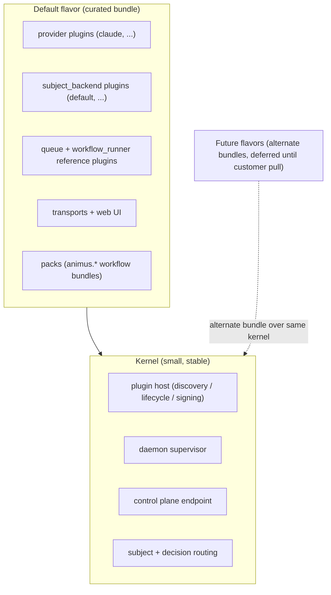

# Kernel and Flavors

## Status

- **Version:** v0.5 architectural commitment
- **Type:** Product architecture + positioning decision
- **Supersedes:** Ad-hoc "Animus is an orchestrator" framing in v0.4.x
- **Builds on:** [plugin-pack-kernel.md](./plugin-pack-kernel.md), [plugin-system.md](./plugin-system.md), [subject-dispatch-daemon.md](./subject-dispatch-daemon.md)
- **Marketing-facing companion:** `README.md` hero and "Who is this for?" section

## TL;DR

Animus is a **kernel for AI agent workflows**. The kernel is small, stable, and
boring on purpose. Everything else — providers, subject backends, triggers,
transports, UI, packs, workflow templates — ships as plugins.

The v0.5 commitment is the **flavor model**: Animus distributes one curated
bundle of plugins ("the default flavor") that works out of the box for portfolio
builders. The kernel underneath is composable; advanced users and ecosystems can
build other flavors on top of it.

This is the Linux distro model applied to AI agent orchestration. The kernel
compounds across flavors; flavors capture verticals.

A small kernel core sits inside a curated default flavor (a bundle of packs and
plugins); future verticals are alternate flavors over the same kernel:



The kernel never grows to accommodate a flavor; capabilities are pushed down into
plugins and packs.

## Why this naming exists

For most of v0.4.x the product was described as an "AI agent orchestrator," a
"control plane," or a "founder OS." Each framing oscillated under customer
pressure and made it ambiguous whether new functionality belonged in the daemon,
in a plugin, or in a separate product surface.

Kernel + flavors resolves the ambiguity:

- If it's general-purpose, stable, and required by every workflow, it is in
  the **kernel**.
- If it's an opinionated default that ships out of the box, it is part of the
  **default flavor** (a plugin manifest).
- If it serves a specific vertical, customer, or buyer segment, it is a
  **future flavor** — not built until real pull justifies it.
- Anything not covered by those three categories does not belong in this
  repository.

## The kernel

The kernel is the set of capabilities that every Animus deployment needs, no
matter which flavor is installed on top.

**The kernel owns ONLY:**

- Plugin host (discovery, lifecycle, signing, control protocol routing)
- Daemon process management (start, stop, signal handling, supervise with restart+backoff)
- Subject identity contract (`SubjectRef`, `SubjectDispatch` types — though these live in the protocol crate, the kernel routes by them)
- Decision verdict semantics (the typed `advance/rework/skip/fail` enum)
- Control plane endpoint (for CLI/MCP/transports to talk to)
- State directory layout conventions (paths only; backends are plugin-shaped)

**Removed from the kernel (now plugin-shaped or out-of-kernel):**

- Phase execution coordinator → moves to `workflow_runner` plugin kind
- Built-in workflow runner → bundled in default flavor as reference plugin
- Queue + dispatch → moves to `queue` plugin kind, bundled in default flavor
- Scheduler → becomes a cron trigger (existing `trigger_backend` plugin kind)
- Worktree isolation primitive → moves to command phases (`git worktree`) called by workflow_runner plugin
- Configuration loading → utility crate, not kernel responsibility
- CLI surface → separate binary, talks to daemon via control protocol

**The kernel does not own:**

- Specific agent providers (Claude, Codex, Gemini, OpenCode, Ollama, etc.)
- Specific subject backends (Linear, GitHub Issues, Asana, Jira, etc.)
- Specific triggers (webhook, Slack, Discord, email, etc.)
- Specific transports (HTTP, GraphQL, etc.)
- Web UI or any user-facing surface beyond the CLI
- Workflow patterns or domain logic (engineering, support, sales, etc.)
- Task or requirement lifecycle rules (those are flavor / pack concerns)

The technical kernel boundary is documented in
[plugin-pack-kernel.md](./plugin-pack-kernel.md). This document does not
re-state it; instead it stakes the **flavor model** on top of it.

## Flavors

A **flavor** is a named, opinionated bundle of plugins (providers, subject
backends, triggers, transports, packs, default configuration) that ships
together as a unit.

A flavor is not a separate product. It is a curated install profile on top of
the same kernel.

### What a flavor is

A flavor consists of:

1. A **plugin manifest** declaring which plugins to install and at which
   versions
2. A **default configuration** for those plugins (model routing, secrets shape,
   workflow defaults)
3. An **opinionated workflow set** (which packs ship pre-installed)
4. A **one-line install command** that installs everything atomically
5. A **documented use case** ("this flavor is for X")

A flavor is NOT:

- A fork of the kernel
- A repository of its own (it lives as a manifest + scripts)
- A separate product with separate branding
- A configurable wizard ("which agent would you like to use?")

Flavors are opinionated. They make the default choice for the user. Power users
can swap any plugin via `animus plugin install/remove` after install.

### How flavors are distributed

A flavor lives as:

- A short TOML / JSON manifest under `flavors/<name>.toml` (or similar)
- A shell function in `scripts/install.sh` that installs the manifest
- A line in the README naming the flavor and its target user

There is no separate flavor repository. There is no flavor marketplace at
v0.5. New flavors are added by adding manifests to this repository (or by
the community, via PRs).

## The default flavor (v0.5)

The v0.5 default flavor is **portfolio builders**: solo founders, indie hackers,
and small studios shipping multiple projects in parallel.

### Default flavor plugin manifest (target)

```toml
# flavors/default.toml
schema = "animus.flavor.v1"
id = "default"
version = "0.5.0"
title = "Animus Default"
description = "Curated bundle for solo founders and small studios running a portfolio of projects."

[providers]
required = ["launchapp-dev/animus-provider-claude"]
recommended = ["launchapp-dev/animus-provider-codex", "launchapp-dev/animus-provider-ollama"]

[subjects]
required = ["launchapp-dev/animus-subject-default"]
recommended = ["launchapp-dev/animus-subject-github"]

[transports]
required = ["launchapp-dev/animus-transport-http"]
recommended = ["launchapp-dev/animus-transport-graphql"]

[ui]
recommended = ["launchapp-dev/animus-web-ui"]

[triggers]
recommended = ["launchapp-dev/animus-trigger-cron", "launchapp-dev/animus-trigger-webhook"]

[packs]
recommended = ["launchapp-dev/animus-pack-engineering-backlog"]
# Maintenance pack added in 0.5.x once shipped:
# recommended = ["launchapp-dev/animus-pack-maintenance"]

[defaults]
model_routing = "engineering-portfolio"
cost_ceiling_daily_usd = 50
execution = "local"
cloud = "optional"
```

### What "ships with" the default flavor

| Plugin | Why it's in the default flavor |
|---|---|
| `animus-provider-claude` | Most-used coding agent; sensible default model |
| `animus-subject-default` | Built-in task surface that needs zero external setup |
| `animus-subject-github` | Most common task source for the target user |
| `animus-transport-http` | Required for Cloud + web UI |
| `animus-transport-graphql` | Required for web UI |
| `animus-web-ui` | Required for "see what's running" without leaving the browser |
| `animus-trigger-cron` | Most-used scheduling mechanism |
| `animus-trigger-webhook` | Most-used event-driven integration |
| `animus-pack-engineering-backlog` | The lighthouse pack — proves the value prop |

Everything else in the launchapp-dev plugin catalog is **opt-in**, not in the
default flavor. Users who want Linear instead of GitHub Issues run
`animus plugin install launchapp-dev/animus-subject-linear`. Users who want
Gemini instead of Claude run `animus plugin install
launchapp-dev/animus-provider-gemini`. Defaults work for 80% of users; the rest
swap in 30 seconds.

### What does NOT ship in the default flavor

- Specialized subject backends for niche public datasets (the bulk of the 200+
  staged `animus-subject-*` plugins)
- Non-coding domain packs (customer-support, sales-pipeline, marketing-outreach,
  recruiting-pipeline, ecommerce-fulfillment, organization-meetings) — these
  are seeds for future flavors, not default-bundle members
- Triggers for messaging platforms users may not have (Discord, SMS, Telegram,
  WhatsApp) — opt-in only

## Discipline rules

These are the rules that keep the v0.5 commitment from drifting back into the
horizontal-platform trap.

### Rule 1: One flavor at launch

The v0.5 release ships **only the default flavor**. No "Animus Enterprise,"
no "Animus for Game Devs," no "Animus Maintenance Edition" before there is
real customer pull for them.

The temptation to ship a second flavor before validating the first is the
single most common failure mode of this model. If you find yourself building a
second flavor, ask: "Has at least one paying customer asked for this by name?"
If the answer is no, defer.

### Rule 2: Kernel boundary stays sacred

The kernel does not grow new responsibilities to accommodate flavor needs.
If a flavor needs new capability:

- Prefer a plugin (Tier 1: declarative pack)
- Then a connector pack (Tier 2: MCP-backed)
- Then a native module behind a Cargo feature (Tier 3: rare)
- Kernel changes only as a last resort, and only if multiple flavors need the
  same capability

The tier discipline is defined in [plugin-pack-kernel.md](./plugin-pack-kernel.md).

### Rule 3: Flavors are opinionated, not configurable

The default flavor does not ask the user which provider to use, which subject
backend to use, or which model to default to. It picks for them. The install
path is `curl | bash`, not a wizard.

If a flavor requires the user to make choices during install, it is not a
flavor — it is a configuration UI. Build it as a separate post-install command
(`animus configure provider`), not in the install flow.

### Rule 4: Marketing layer ≠ architecture layer

The README and landing page describe the **default flavor** in user terms:
"Animus runs your AI engineering team for a portfolio of products." That is
what users install.

This document and `plugin-pack-kernel.md` describe the **architecture** in
developer terms: "Animus is a kernel; flavors are plugin manifests." That is
what developers, plugin authors, and investors read.

Both stories are true. They live on different surfaces (`README.md` vs.
`docs/architecture/`). They are not in tension.

### Rule 5: No new sibling products

The git service, the standalone task management product, "other LaunchApp
products" do NOT become flavors or kernel additions. They are separate
companies' worth of work. They live in the long-term vision deck, not in this
repository.

### Rule 6: Push down a tier

> **Rule 6: Push down a tier.** When a capability is proposed, the default answer is: can it be a workflow YAML phase, a command phase, a skill, or a community script? If yes — it is NOT a plugin kind. New plugin kinds require multi-RPC stateful protocols, lifecycle management, or event-driven long-running behavior. Anything less belongs in declarative or connector packs (Tier 1 or 2 per `plugin-pack-kernel.md`), not in the protocol.

### Aspiration: small enough for embedded / edge

> **Aspiration: kernel + default flavor stays small enough for embedded/edge deployment.** Concrete Pi-runnability is gated on specialized lightweight harness plugins (a `provider-direct-api` variant that calls LLM APIs without spawning Node.js CLI wrappers) which are NOT in v0.5 scope. Track as roadmap, not as a v0.5 hard rule. Run a memory + cold-start budget on regular dev hardware as a kernel-cleanliness gate, not a Pi claim.

## Dependency model: project manifest + lock (v0.6)

> **Status:** v0.6 spec. Ships incrementally across v0.6.x patches (no minor bump —
> breaking changes ship in patches per house style). Supersedes the implicit
> imperative install model, the duplicate `default-install.json`, AND the separate
> `FlavorManifest` / `flavors/*.toml` format. **A flavor is just an `animus.toml`.**

### The problem (what was funky)

Pre-v0.6, "what a project depends on" was scattered across **multiple overlapping
declarations** and resolved into **two overlapping state files**:

- `flavors/default.toml` (`FlavorManifest`, schema `animus.flavor.v1`) — the curated
  bundle, in its own bespoke format with an `animus flavor` command surface.
- `crates/orchestrator-cli/config/default-install.json` — a *separate* kernel-baked
  list of the **same** packs + plugins, used by `animus init`. A second copy that drifts.
- Pack manifests' `[[requires_plugins]]` / `[[dependencies]]` — transitive needs.
- `.animus/plugins.yaml` (registry) — what discovery/the daemon actually read.
- `.animus/plugins.lock` — an integrity pin layered on top.

Three+ ways to declare intent, two ways to hold resolved state, two bespoke manifest
formats (flavor vs default-install) for the same thing, and no single project manifest.

### The model (Cargo / npm / pip shaped)

Animus adopts the two-file pattern every package manager converged on: a **hand-edited
manifest of intent** + a **generated lock of resolved truth**. There is no separate
"flavor" format — **a flavor is simply an `animus.toml`** (a curated starting point).

| Layer | File | Role | Analogy |
|---|---|---|---|
| Declared intent | **`animus.toml`** | project deps: kernel range, plugins, packs | `Cargo.toml` / `package.json` |
| Dependency units | pack manifests | bundles that declare their own transitive deps | a crate / npm pkg with deps |
| Resolved + pinned | **`animus.lock`** | exact versions + per-target sha + source; **source of truth** | `Cargo.lock` |
| Materialized | `.animus/plugins.yaml` | discovery cache — **derived view of the lock** | a build cache |

`animus.toml` example — self-contained, no flavor reference at runtime:

```toml
[project]
kernel = ">=0.6.7"          # avm kernel range (subsumes .animus-version)

[plugins]
animus-provider-claude  = ">=0.2.8"
animus-queue-default    = ">=0.3.0"
animus-config-postgres  = { path = "deploy/plugin-src/animus-config-postgres" }  # vendored

[packs]
"animus.core-skills" = ">=0.1.0"
"animus.task"        = ">=0.1.0"
```

### How the old pieces fold in

- **`FlavorManifest` / `flavors/*.toml` / `animus flavor` → retired.** A flavor is no
  longer a bespoke format or a resolution step. A flavor is just a curated `animus.toml`
  — a **starter template** you `init` from and then own/edit. The "default flavor" is the
  default `animus.toml` that `animus init` scaffolds. (The kernel+flavors *product*
  concept survives — a flavor is still "a curated starting point for a vertical" — but it
  has no separate implementation; it's a manifest.)
- **`default-install.json` → deleted.** Its content becomes the default `animus.toml`
  template `animus init` writes. One declaration, one format, no drift.
- **Packs → ordinary `[packs]` deps** with their own transitive
  `requires_plugins`/`dependencies` resolved into the lock.
- **`plugins.yaml` registry → derived cache** regenerated from the lock on install.
- **`.animus-version` → subsumed** by `[project] kernel` (avm reads the manifest); may
  remain as an optional fast-path mirror for the avm shim.

### Lock is the source of truth

The lock — not the registry — is authoritative for the resolved set. Discovery and the
daemon derive from it; `--locked` reconstructs the exact set (binaries + registry) from
the lock alone. This is what makes "the container just installs the lock" true:
`animus plugin install --locked` is the entire plugin provisioning step.

The lock is **platform-aware** (v0.6.7): each entry records integrity per target triple
(`target → archive_sha256`), populated from each GitHub release's `SHA256SUMS.txt`. One
`install` on any machine records every published platform's hash, so a lock generated on
macOS verifies on a linux container. (Vendored `--path` plugins have no `SHA256SUMS` and
are single-target by nature; publishing them as releases makes them portably lockable.)

### Command surface (package-manager-shaped)

- `animus init [--template <name|url>]` — scaffold `animus.toml` from a starter template
  (the default template = the old "default flavor"). **Replaces both `default-install.json`
  and `animus flavor install`.**
- `animus add <plugin|pack>` — manifest + resolve + lock + install (`cargo add`).
- `animus install` — install from the manifest, update the lock; `--locked` installs
  exactly the lock and fails on manifest↔lock drift (the CI / container path).
- `animus remove` / `animus update [pkg]` — the obvious manifest + lock edits.

### v0.6.x sequencing

1. **v0.6.7** — platform-aware lock (per-target shas from `SHA256SUMS.txt`) + resident
   `config_source` host (kill fork churn). *(in flight)*
2. **v0.6.8** — lock = resolved source of truth; `plugins.yaml` becomes a derived view;
   discovery/daemon read from the lock.
3. **v0.6.9** — `animus.toml` manifest + `add`/`install`/`--locked` resolution; delete
   `default-install.json`; retire `FlavorManifest`/`flavors/*.toml`/`animus flavor`
   (flavors become `animus.toml` templates). The container redesigns to a single
   `animus plugin install --locked`.

### Open decisions (resolve before v0.6.9)

- **Manifest/lock filenames:** `animus.toml` + rename `plugins.lock` → `animus.lock`
  (Cargo parity). *(leaning yes)*
- **Kernel-version home:** authoritative in `[project] kernel`, with `.animus-version`
  as an optional avm fast-path mirror. *(leaning yes)*
- **Registry:** keep `plugins.yaml` as a derived cache (hot-path discovery) vs. delete it
  and derive from the lock every call. *(leaning: keep as derived cache)*
- **Templates:** where the default `animus.toml` template lives (in-tree under
  `templates/` vs. fetched) and whether `--template <url>` (community starters) ships in
  v0.6.9 or later.

## Extensibility: keep moving things toward plugins

The DBOS analysis ([animus-vs-dbos-transact.md](./animus-vs-dbos-transact.md))
surfaced a principle worth elevating: **when there are multiple plausible
implementations of a capability, that capability should be a plugin kind, not
kernel code.**

The kernel's job is mechanism (discovery, lifecycle, routing, the control
protocol). Policy (which provider, which store, which scheduler, which git
backend, which durability strategy) belongs in plugins. This is the same
mechanism-vs-policy separation that's worked for Linux, Kubernetes,
VS Code, and every other long-lived plugin-host architecture.

### What is already a plugin kind (good)

- Providers (Claude, Codex, Gemini, OpenCode, Ollama, future NVIDIA / NemoClaw)
- Subject backends (Linear, GitHub, Asana, Jira, default, requirements)
- Triggers (webhook, Slack, Discord, email, cron, file-watcher)
- Transports (HTTP, GraphQL)
- Web UI
- Log storage

### Config sourcing is now a pluggable role (v0.6)

As of v0.6, workflow/agent config sourcing is a `config_source` plugin role. The boundary is:
**plugins source, the kernel compiles.** A `config_source` plugin parses, reads, or fetches
config from its backing store and returns one normalized canonical model (the parsed
`WorkflowConfig`, schema `animus.workflow-config.v2`). The kernel keeps the heavy compiler —
pack-overlay merge, agent-runtime derivation, state-machine compilation, validation, and
caching. The compiler is not duplicated per plugin.

The default source remains the in-tree YAML scan (`.animus/workflows/*.yaml`). When no
`config_source` plugin is installed, `ConfigSourceClient::resolve_plugin_base` returns
`Ok(None)` and the kernel falls back to the in-tree YAML acquisition path, so existing
projects are completely unaffected.

`animus-config-postgres` (the LaunchApp portal) is the first production `config_source`
plugin. It lets the portal daemon read team/workflow definitions straight from a Postgres
metadata DB, removing the YAML-on-disk intermediary entirely. The same protocol supports
any future source (API, GitOps, remote control plane) without kernel changes.

The `config_source` role is defined and its load path is wired (the `ConfigSourceClient`
in `orchestrator-config` resolves and calls an installed plugin), but the role is **not
yet required by the daemon preflight** (`daemon_default()`). Existing daemons continue
to satisfy preflight with no config plugin installed; the role will be added to
`daemon_default()` once `animus-config-yaml` is published as the default-flavor reference
impl (phase v0.6.x-b). Until then, `--skip-preflight` is not needed for YAML-only
projects.

### What should become a plugin kind (candidates, not v0.5 scope)

Each of these is currently kernel or workspace-internal code. None of them is
moving in v0.5 — but the kernel boundary should keep the door open for the
extraction. Document the candidates so future work isn't blocked by
accidental coupling.

| Candidate plugin kind | Today | Why it should be pluggable |
| --- | --- | --- |
| `state-store`           | Scoped JSON under `~/.animus/<repo-scope>/` | SQLite, Postgres, DBOS, self-hosted — users will want choices |
| `step-store` / `checkpoint` | Implicit; no durable-step semantics | DBOS-backed (Option A in the DBOS analysis), Temporal, custom — required for crash-safe phase resumption |
| `workflow-runner`       | `animus-runtime-shared` crate + installed `workflow_runner` plugin | Multiple workflow execution models: in-process (today), DBOS-driven (Option B in the DBOS analysis), Temporal, future |
| `agent-process-manager` | `orchestrator-plugin-host::session` + installed provider plugins | Local subprocess (today), detached/`nohup` (required for crash-safe agent reattach), cloud runners, sandboxes |
| `git-ops`               | `orchestrator-git-ops` crate | git CLI today; could be GitHub API, GitLab API, internal Gerrit, or a non-git VCS |
| `worktree-manager`      | git worktree primitives | Could be sandbox containers, ephemeral VMs, snapshot filesystems |
| `project-root-resolver` | Hardcoded git-common-root + cwd fallback | Non-git projects, monorepo-aware resolution, custom layouts |

### Discipline: "when in doubt, plugin it"

When a new capability is proposed in this repo, the default answer is:

1. **Can it be a declarative pack (Tier 1)?** Workflow YAML, agent overlays,
   schedules — most things can.
2. **If not, can it be a connector pack (Tier 2)?** MCP-backed, external
   process — most integrations can.
3. **If not, can it be a stdio plugin of an existing kind?** Add an instance,
   not a new kind.
4. **If not, does a new plugin kind belong?** This is rare and load-bearing
   — but the door must stay open for it. Adding a new plugin kind should
   require a one-page ADR (e.g., the DBOS analysis is the ADR for
   `step-store`).
5. **Only after all four fail** does kernel code grow.

The DBOS analysis is the worked example: the durable-step capability is
genuinely a new plugin kind (`step-store`), not an instance of an existing
kind, and not kernel code. The architecture supports adding it cleanly when
the time comes. v0.5 must preserve that path.

### What this means for v0.5 specifically

v0.5 commits to defining four new plugin kinds at the protocol level and
shipping one reference / demo-quality implementation of each. This includes
`workflow_runner` and `queue` (lift-and-shift of currently in-tree
responsibilities — protocol commits in v0.5, with the existing implementations
conceptually repositioned as "default flavor bundled reference implementations"
rather than physically extracted on day one) alongside the new
`durable_store` and `memory_store` kinds.

| Plugin kind | Implementation | Status |
| --- | --- | --- |
| `workflow_runner` | `animus-workflow-runner-default` (lift-and-shift from in-tree) | v0.5 protocol; reference impl bundled in default flavor |
| `queue` | `animus-queue-default` (lift-and-shift from in-tree) | v0.5 protocol; reference impl bundled in default flavor |
| `durable_store` | `animus-step-durable-dbos` (DBOS Option A) | v0.5 |
| `memory_store` | `animus-memory-zep` | v0.5 |

**Deferred from v0.5:**

- `session_capture` / `log_storage` extension for SpecStory — research
  ([animus-vs-dbos-transact.md](./animus-vs-dbos-transact.md) sibling
  investigation) found SpecStory exposes no public ingestion API. Per
  Discipline Rule #6, do not commit protocol surface for a hypothetical
  use case. Revisit when SpecStory ships an ingestion API or when a
  different session-capture partner (Continue.dev, OTel GenAI, in-house)
  emerges with a concrete contract.

v0.5 also does:

- Keep the plugin-host control protocol versioned and extensible (each new
  plugin kind is a typed enum extension on the existing stdio frame, not a
  breaking protocol change)
- Avoid coupling kernel code to specific implementations of these capabilities
  — the daemon consults installed plugins of each new kind through clean,
  versioned RPCs
- Ship each integration as **demo-quality**, not production-hardened. The
  four hard problems in the DBOS analysis (idempotency across IPC, agent
  reattach, deterministic replay, schema sync) are not all solved in v0.5;
  they are solved on the happy path with documented edge-case limits.
- Document the remaining candidates (state-store, workflow-runner,
  agent-process-manager, git-ops, worktree-manager, project-root-resolver)
  as deferred until later versions

## Marketing layers

The kernel/flavor split maps to two distinct surfaces with two distinct
audiences. Both must hold.

### User-facing (README, landing page, launch posts)

```
Animus runs the AI engineering team behind a portfolio of products.

One founder. Sixteen projects. Eighty agents in parallel.

Install: curl | bash
```

The user does not need to know about the kernel. They install "Animus" and
get the default flavor. Power users discover plugins via `animus plugin list`
once they need to customize.

### Developer / investor / plugin author facing (this doc, kernel docs)

> *"The Animus kernel is a plugin host with a supervisor and a control plane — under 5K lines of Rust by v1.0. Every other responsibility — workflow execution, queue, scheduling, state, durability, memory, telemetry, sandbox, auth — runs as a plugin. Today the default flavor bundles 6 reference plugins to give users a working install out of the box. As the ecosystem matures, every layer becomes swappable, but the kernel never grows. This is the Linux model applied to AI agent orchestration."*

This story sells the moat: incumbents (Devin, Codespaces, GitHub Agent HQ,
Cursor Cloud) cannot ship a kernel + composable flavors without breaking their
business models. Animus structurally can.

## Roadmap arc (informational)

This section is informational, not a commitment. It exists to make the
sequencing visible so future scope-creep can be checked against the plan.

- **v0.5 (now):** Kernel + default flavor for portfolio builders. Validate
  the wedge. Maintenance pack as the next visible default-flavor add-on.
- **v0.6.x:** Durability and multi-machine coordination land as plugin
  kinds (state-store, step-store, agent-process-manager). Local stays
  default; hosted backends are opt-in and out-of-tree.
- **v0.7.x:** Second flavor emerges from customer pull. Most likely candidate
  given the AI-accelerated-maintenance thesis: an "Animus Maintenance"
  flavor for teams with neglected codebases. Plugin signing and trust
  controls harden.
- **v0.8.x and beyond:** Plugin marketplace with monetization hooks (rev share
  on third-party plugins). Community-built flavors. Enterprise self-hosted
  control plane + SSO + audit.

Each rung earns the next. Skipping ahead breaks the kernel/flavor discipline.

## v0.5 implementation tasks

These are the concrete code and documentation changes implied by this
commitment. They are listed for visibility; each one will be tracked separately.

### Documentation

- [x] Write this doc (`docs/architecture/kernel-and-flavors.md`)
- [ ] Update `README.md` hero and "What is Animus?" sections to align with the
  default-flavor framing (partially done in pre-0.5 README edits — review for
  consistency with this doc)
- [ ] Add `docs/architecture/kernel.md` summarizing the kernel boundary in
  developer-facing language (or expand `plugin-pack-kernel.md` to serve as
  that surface)
- [ ] Reference this doc from `CLAUDE.md` so AI coding agents working in this
  repo understand the boundary
- [ ] Reference this doc from `docs/architecture/index.md`

### Code / configuration

- [ ] Introduce `flavors/default.toml` (or equivalent) as the canonical
  default-flavor manifest. Replace the implicit
  `animus plugin install-defaults` list with an explicit flavor reference.
- [ ] Add `animus flavor` CLI subcommand: `list`, `install <name>`, `current`,
  `describe <name>`. At v0.5 only `default` exists, but the surface should
  be there.
- [ ] Audit `crates/orchestrator-core/` and adjacent crates against the kernel
  boundary. Anything that is domain logic (specific subject lifecycle rules,
  specific phase templates, Claude-specific assumptions) gets either moved
  into a plugin or labeled as a default-flavor component for later extraction.
- [ ] Verify that `animus install` (whether via `curl | bash` or
  `animus plugin install-defaults`) installs the default flavor atomically and
  idempotently. The install should match the manifest exactly.
- [ ] Add a flavor identifier to `animus daemon health` / `animus status`
  output so users can see which flavor is active.
- [ ] Lift-and-shift of `workflow-runner-v2` crate into
  `launchapp-dev/animus-workflow-runner-default` (protocol commit in v0.5;
  reference implementation bundled in the default flavor).
- [ ] Lift-and-shift of queue / dispatch logic into
  `launchapp-dev/animus-queue-default` (protocol commit in v0.5; reference
  implementation bundled in the default flavor).
- [ ] Both bundled in the default flavor manifest (`flavors/default.toml`).
- [ ] Update the v0.5 plugin-kind task list to reflect **four** new plugin
  kinds at the protocol level (`workflow_runner`, `queue`, `durable_store`,
  `memory_store`) plus **one** extension (`log_storage` extended to carry
  SpecStory session entries).

### Marketing / launch

- [ ] Update README "What is Animus?" to use the kernel-and-default-flavor
  language above
- [ ] Add a "For developers and plugin authors" section in README linking to
  this doc
- [ ] Prepare launch posts (HN, Twitter, Reddit) using the user-facing
  marketing layer, with a link to this doc for the architectural story

## Non-goals for v0.5

To prevent scope drift, the following are explicitly out of scope for v0.5
even though they are interesting:

- Second flavor (enterprise, maintenance-focused, etc.) — deferred until
  customer pull is real
- Plugin marketplace, plugin monetization — design hooks now, ship later
- Hosted control plane and self-hosted variants — deferred until durability
  and coordination plugin kinds land
- Migration of every existing in-tree concept to the kernel boundary — only
  the boundary needs to be documented; the migration can be incremental
- Animus's own git service — deferred to long-term roadmap
- Standalone task management product — never under this kernel; lives as a
  flavor at most
- **Production-hardening of the three v0.5 integrations** — DBOS, Zep, and
  SpecStory ship as demo-quality. Idempotency-across-IPC, agent reattach,
  deterministic replay across LLM-based decision contracts, and schema sync
  between external partner state and Animus state are explicit deferrals to
  v0.5.x or v0.6.
- **Option B from the DBOS analysis** (DBOS as the workflow runner) — that
  is a 3–6 month refactor gated on detached agent execution. v0.5 ships
  Option A only.
- **Physical extraction of `workflow_runner` and `queue`** from the daemon
  into separate plugin processes. v0.5 commits to the protocol; the current
  implementations are tagged as "default flavor bundled reference
  implementations" and may be lifted in v0.6 when Cloud needs multi-machine
  coordination.
- **The Pi-runnability claim in launch copy.** Honest claim is "local-first,
  cloud-optional, runs on your machine."

## Open questions

These are the decisions deferred to future versions. Listed so they are not
forgotten.

- **Flavor naming convention.** Should the default flavor be named `default`,
  `portfolio`, `indie`, or branded (`launchapp`)? v0.5 picks `default` for
  the manifest id but the marketing name is just "Animus."
- **Flavor versioning.** When the default flavor's plugin set evolves (e.g.,
  adding the maintenance pack mid-cycle), does the flavor get its own
  semver, or does it inherit from the Animus release? v0.5 inherits.
- **Flavor composability.** Can a user install two flavors at once? At v0.5,
  no — one active flavor. Plugins on top are user-managed individually.
- **Flavor compatibility checks.** Should the kernel verify that an installed
  flavor's manifest matches the actual installed plugin set, and surface
  drift? Probably yes, but deferred to v0.5.x.
- **Hybrid bundled-plugin model (v0.7+).** The default flavor's plugin
  implementations (workflow_runner_default, queue_default) may be compiled
  into the daemon binary or loaded via shared library to recover performance
  for the common case while preserving the architectural separation.
  Postgres/nginx model. Decide when the first user files an issue about
  plugin IPC overhead.

## Summary

v0.5 commits Animus to a kernel + flavors architecture. The kernel is small
and stable. The default flavor is opinionated and ships out of the box for
portfolio builders. Future flavors are deferred until real customer pull. The
marketing layer leads with what users get; the architecture layer (this doc
and `plugin-pack-kernel.md`) leads with how the substrate works.

This is the discipline anchor for the next 12 months of decisions. When a new
scope question arises — "should we build X?" — the answer is one of:

1. It belongs in the kernel (rare; requires multi-flavor justification)
2. It belongs in the default flavor (only if it serves the v0.5 wedge)
3. It belongs in a future flavor (defer; document the future)
4. It belongs in a different repository or company (decline)

Anything that does not map cleanly to one of those four answers is the wrong
question.
