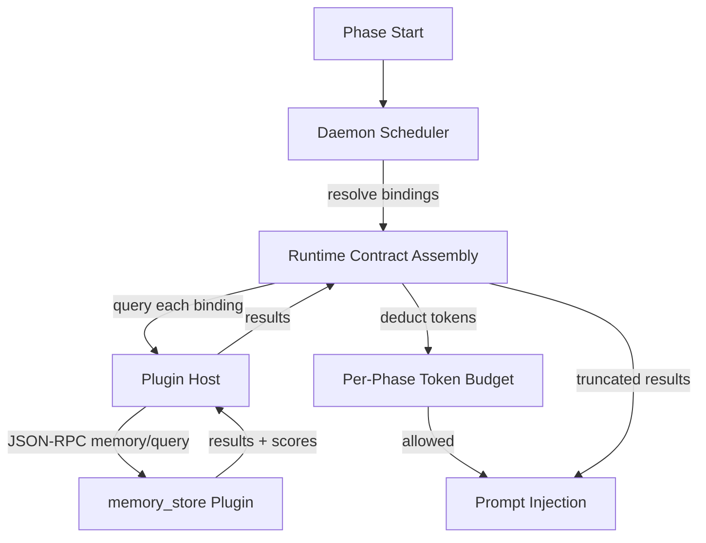

# Knowledge / RAG Memory Plugin Binding (v0.5.5 design, v0.6 banner work)

This document captures the design for first-class knowledge / RAG corpus binding
in Animus. It distinguishes the existing per-agent scratchpad (`memory:` block,
shipping today) from the new corpus-binding shape (`memory_bindings:`, proposed),
explains why the v0.5.5 protocol crate is sufficient as-is, and identifies the
two open dependencies that keep daemon-side prompt injection out of v0.5.5 and
move it to v0.6.

This is a design-only landing for v0.5.5. No `memory_bindings:` field, no
daemon-side query hook, and no `animus memory` CLI surface ship in this
dispatch. The honest stops are documented in the closing section.

## Source Files

| Area | Source |
|---|---|
| Existing per-agent scratchpad config | [`crates/orchestrator-config/src/agent_runtime_config.rs`](../../crates/orchestrator-config/src/agent_runtime_config.rs) (`AgentMemoryConfig`, `agent_memory_capability_enabled`) |
| Existing scratchpad MCP injection | [`crates/animus-runtime-shared/src/runtime_contract.rs`](../../crates/animus-runtime-shared/src/runtime_contract.rs) (`inject_memory_mcp_for_capable_agent`) |
| Existing scratchpad MCP tools | [`crates/orchestrator-cli/src/services/operations/ops_mcp/memory_tools.rs`](../../crates/orchestrator-cli/src/services/operations/ops_mcp/memory_tools.rs) |
| Memory plugin wire protocol | External `animus-memory-store-protocol` v0.1.0 (canonical source: `launchapp-dev/animus-protocol`) |
| Plugin host kind registration | [`crates/animus-plugin-protocol/src/lib.rs`](../../crates/animus-plugin-protocol/src/lib.rs) (`PluginKind` enum, `PLUGIN_KIND_*` constants) |
| Reference plugin (placeholder, no code yet) | `launchapp-dev/animus-memory-zep` (empty repo) |

## Two Concepts, One Word

Animus uses the word "memory" for two distinct things. Conflating them has
historically been the source of design churn. They are kept separate going
forward:

1. **Per-agent scratchpad** — the existing `memory:` block on `AgentProfile`.
   File-backed under the scoped runtime root, project-local, with a small
   character budget (default 6000). Exposed to the spawned agent CLI as the
   `animus.memory.*` MCP tool family via an in-tree stdio surface. This is a
   *workspace*, not a corpus. Use cases: agents jotting notes, recording
   intermediate state, leaving breadcrumbs for the next phase. **This concept
   stays as-is.** No changes to the type, the MCP tools, or the daemon-side
   injection in this dispatch or v0.6.

2. **Knowledge / RAG corpus binding** — the new `memory_bindings:` block
   proposed in this document. Plugin-backed (Zep, Pinecone, qdrant, Notion,
   Confluence, wiki crawlers), can be project-wide or per-agent or per-task,
   read-only or read-write, with token-budgeted injection at phase start. This
   is a *corpus*, not a workspace. Use cases: trade-analyst agents pulling
   market context, support agents grounding answers in the company wiki,
   research agents searching prior session graphs.

The wire protocol for (2) already exists as `animus-memory-store-protocol`
v0.1.0. Plugin authors implement five JSON-RPC methods on the `memory_store`
plugin kind:

- `memory/put` — store a value under a key in a scope
- `memory/get` — exact-key retrieval (O(1) on backends that support it)
- `memory/query` — semantic search within a scope (top-k by relevance)
- `memory/list_scopes` — paginated scope enumeration
- `memory/delete_scope` — idempotent scope deletion

Scopes are hierarchical: `{ project_id, agent_id?, task_id? }`. Capabilities
include `native_ttl`, `native_key_get`, `strong_consistency`, and
`max_query_top_k` so the daemon can adapt behavior to backend reality (Zep is
async-indexed; SQLite-backed plugins are strongly consistent).

## What v0.5.5 Cannot Ship End-to-End

Three things are required before the corpus-binding path is exercisable as a
real feature, and not all of them are within this dispatch's reach:

1. **Reference plugin.** `launchapp-dev/animus-memory-zep` is in the
   default-install list but the repo is empty. Without at least one working
   `memory_store` plugin, daemon-side wiring has no real surface to call into;
   it can only be exercised against mocks. Shipping the daemon-side hook
   without a paired plugin is a contract-only landing.

2. **Per-phase token budget framework.** The dispatch acknowledges this is
   landing in a parallel dispatch. Memory injection that does not respect a
   per-phase budget will overflow context windows on real corpora. Adding the
   `budget_tokens` field to the YAML shape is mechanical; honoring it
   correctly requires the budget framework to land first so we can deduct
   from a single source of truth instead of competing budgets.

3. **`PluginKind::MemoryStore` enum variant + preflight role.** Adding
   `memory_store` to the in-tree `PluginKind` enum is a single-line change,
   but to be useful, the daemon needs to discover memory plugins via
   `discover_by_kind("memory_store")` (already supported), wire a typed host
   client (queue / notifier pattern), and decide whether `memory_store` is a
   required role or an optional role. The honest answer for v0.5.5 is:
   optional. No installed memory plugin should not block daemon start, even
   when an agent profile has `memory_bindings`. The binding should warn and
   no-op until a matching plugin is installed.

## Target YAML Shape (v0.6)

The proposed binding shape lives at agent level for per-agent corpora and at
workflow level for shared corpora.

```yaml
agents:
  trade-analyst:
    # Existing per-agent scratchpad (unchanged):
    memory:
      enabled: true
      scope: trade-analyst
      max_context_chars: 6000

    # New corpus bindings (v0.6):
    memory_bindings:
      - plugin: memory-zep
        binding: market-context
        scope:
          kind: agent           # project | agent | task
        read: true
        write: true
        query_strategy: semantic
        top_k: 8
        budget_tokens: 2000
        inject_when:
          phases: [research, plan]   # only at these phases (default: all)

workflows:
  research:
    memory_bindings:
      - plugin: memory-confluence
        binding: company-wiki
        scope:
          kind: project
        read: true
        write: false
        query_strategy: semantic
        top_k: 5
        budget_tokens: 1500
```

Field semantics:

- `plugin` — the `memory_store` plugin id to route through (matches the
  installed plugin's manifest id, not its kind).
- `binding` — a logical label used for audit / debug / tracing. Becomes part
  of the runtime contract `mcp.additional_servers` entry name when the agent
  is given direct MCP access to the store.
- `scope.kind` — `project`, `agent`, or `task`; the daemon fills in
  `project_id` from the active project root, `agent_id` from the active
  phase's agent (when applicable), and `task_id` from the active subject id
  (when applicable).
- `read` / `write` — capability gates. `write: false` disables `memory/put`
  for this binding even if the underlying plugin supports it.
- `query_strategy` — `semantic` (calls `memory/query` with the phase
  prompt as the query string), `key` (calls `memory/get` keyed off subject
  id or a templated key), or `none` (no auto-inject; the agent must invoke
  the store explicitly via MCP).
- `top_k` — clamped by the plugin's `max_query_top_k` capability.
- `budget_tokens` — hard cap on injected token count. The daemon truncates
  query results in descending relevance until the budget is exhausted. Counts
  against the per-phase token budget framework.
- `inject_when.phases` — optional phase allowlist. Empty / absent means all
  phases.

## Runtime Topology (v0.6)



The injection point is the existing runtime contract assembly in
`animus-runtime-shared::runtime_contract`. The existing
`inject_memory_mcp_for_capable_agent` function provides the precedent for
shape and naming. The new function would be
`inject_memory_bindings_for_phase` and would:

1. Resolve all `memory_bindings` declared on the active agent profile and the
   active workflow.
2. For each binding with `query_strategy: semantic`, call `memory/query`
   through the plugin host's typed memory client.
3. For each binding with `query_strategy: key`, call `memory/get` with the
   resolved key.
4. Order results by score (descending), deduct from the per-phase token
   budget, truncate at exhaustion.
5. Append the surviving results as a structured section of the runtime
   contract (`runtime_contract.memory_context`) so the agent runner can fold
   it into the prompt envelope. Plugins that expose direct MCP access (Zep
   does this via its own MCP server) ALSO get a `mcp.additional_servers`
   entry so the agent can issue ad-hoc queries during execution.
6. Emit a structured audit log entry per query (binding id, plugin id, top_k,
   bytes returned, tokens deducted, phase id, agent id, task id).

## CLI Surface (v0.6)

A new `animus memory` command group, parallel to `animus subject`:

- `animus memory query --plugin <id> --scope <kind> [--project-id ...] [--agent-id ...] [--task-id ...] --query <text> --top-k <n>`
- `animus memory put --plugin <id> --scope <kind> --key <k> --value <json>`
- `animus memory get --plugin <id> --scope <kind> --key <k>`
- `animus memory list-scopes --plugin <id> [--project-id ...]`
- `animus memory prune --plugin <id> --scope <kind> [...] [--dry-run]`

All verbs route through the plugin host's `memory_store` discovery by plugin
id (matches the `subject` CLI pattern). The CLI must NOT silently pick a
plugin when multiple memory plugins are installed; an explicit `--plugin` is
required when more than one is available.

## Audit Trail

Every memory read and write hits the daemon's existing operational log
storage backend (`log_storage_backend` plugin kind) with a structured event:

```json
{
  "event": "memory_op",
  "op": "query" | "get" | "put" | "delete_scope" | "list_scopes",
  "plugin_id": "memory-zep",
  "binding": "market-context",
  "scope": { "project_id": "...", "agent_id": "...", "task_id": "..." },
  "phase_id": "research",
  "agent_id": "trade-analyst",
  "task_id": "task:RES-001",
  "bytes_in": 512,
  "bytes_out": 8192,
  "tokens_deducted": 1850,
  "result_count": 6,
  "latency_ms": 420
}
```

This makes RAG behavior debuggable per-run without depending on any specific
plugin's own logging.

## Preflight Policy

`memory_store` is NOT a required-role plugin kind for daemon start. The
required-role set stays at: `at_least_one_provider`, `subject_kind:task`,
`subject_kind:requirement`, `workflow_runner`, `queue`.

When an agent profile or workflow declares `memory_bindings` but no
installed plugin matches the requested plugin id, the daemon:

- Logs a warning at workflow compile time and at daemon start.
- At phase start, treats unmatched bindings as no-ops (no inject, no error).
- Exposes the binding state in `animus daemon preflight --json` as
  `memory_bindings.unmatched` so operators can see the gap.

This keeps the contract permissive: declaring a binding in YAML and not yet
installing the plugin is a setup-in-progress state, not a hard failure.

## Plugin Kind Registration

`PluginKind` in `crates/animus-plugin-protocol/src/lib.rs` does not currently
list `memory_store`. The v0.6 change is one line plus the matching constant:

```rust
pub const PLUGIN_KIND_MEMORY_STORE: &str = "memory_store";

pub enum PluginKind {
    Provider,
    SubjectBackend,
    // ...
    MemoryStore,
    // ...
}
```

The daemon already supports plugins of any string-typed kind via
`PluginKind::Other`, so adding the typed variant is purely ergonomic. The
queue and notifier plugin kinds use the same pattern in their own protocol
crates.

## Out of Scope

- Changes to the existing `memory:` block on `AgentProfile`. That stays as
  the project-scoped scratchpad concept.
- Implementing `launchapp-dev/animus-memory-zep`. That is a separate plugin
  repo build, owned by a different dispatch when the v0.6 binding work
  starts.
- Token-budget framework. That is landing in a parallel v0.5.5 dispatch.
  The binding shape declares `budget_tokens` so the YAML contract is forward
  compatible, but no daemon code in this dispatch consumes it.
- Cross-plugin federation (e.g., "ask all memory plugins, merge by score").
  v0.6 honors one binding per call. Federation is v0.7 territory if real
  customer pull justifies it.

## Honest Stops (Why v0.5.5 Ships Design Only)

This dispatch was authorized to ship a daemon-side implementation if the
plugin host could accept the new kind, the runtime contract assembly could
absorb a memory injection point without a large refactor, and the token
budget framework was not a hard dependency. The reality:

1. **Plugin host can accept `memory_store` cleanly.** `PluginKind::Other`
   already supports arbitrary string-typed kinds. `discover_by_kind` works
   today. Adding a typed variant and a typed host client mirrors the queue
   and notifier patterns. No refactor risk here.

2. **Runtime contract assembly absorbs the hook cleanly.**
   `inject_memory_mcp_for_capable_agent` is the precedent. A new
   `inject_memory_bindings_for_phase` slots into the same call site.

3. **Token budget framework IS a hard dependency.** Without a single source
   of truth for the per-phase budget, memory injection competes with skill
   prompts, MCP tool descriptions, system prompts, and history. Shipping
   without it means either: (a) over-injecting and blowing context windows,
   or (b) inventing a parallel budget that the parallel dispatch then has to
   reconcile. Both are worse than waiting one cycle.

4. **Reference plugin does not exist.** `launchapp-dev/animus-memory-zep` is
   an empty repo. Without it, end-to-end testing is impossible. Mocks would
   prove the wire shape but not the surface that operators see. Shipping the
   daemon hook without a paired plugin is a contract-only landing that
   slows down the v0.6 cycle (because the v0.6 plugin author has to
   reverse-engineer the daemon's actual behavior from tests).

The right move is to ship this design doc, let the token-budget dispatch
land, let the Zep plugin land in parallel, then implement the daemon-side
hook in v0.6 against a stable target. The protocol crate at
`animus-memory-store-protocol` v0.1.0 is already shipped and the wire
contract is settled.

## v0.6 Implementation Checklist

When v0.6 picks this up:

1. Add `PluginKind::MemoryStore` + `PLUGIN_KIND_MEMORY_STORE` constant to
   `animus-plugin-protocol`.
2. Add `MemoryBinding` struct to `crates/orchestrator-config` under
   `workflow_config/types.rs` (workflow level) and
   `crates/orchestrator-config/src/agent_runtime_config.rs` (agent level).
3. Pin `animus-memory-store-protocol` v0.1.0 in `orchestrator-cli` and
   `orchestrator-daemon-runtime`.
4. Add a typed host client in `crates/orchestrator-plugin-host/src/`
   following the queue / notifier pattern. Wrap the five RPC methods,
   surface capability flags, and route by plugin id.
5. Add `inject_memory_bindings_for_phase` to
   `animus-runtime-shared/src/runtime_contract.rs`. Slot it in next to
   `inject_memory_mcp_for_capable_agent`.
6. Deduct from the per-phase token budget (now available).
7. Add `animus memory` CLI command group in
   `crates/orchestrator-cli/src/cli_types/` and
   `crates/orchestrator-cli/src/services/operations/ops_memory.rs`.
8. Emit structured `memory_op` audit events to the operational log storage
   backend.
9. Surface unmatched bindings in `animus daemon preflight --json`.
10. Write the v0.6 reference plugin (`launchapp-dev/animus-memory-zep`)
    against this contract. Add to default-install with
    `--include-memory-stores` flag.

## References

- [Plugin System](plugin-system.md)
- [Subject Backend Plugins](subject-backend-plugins.md)
- [Kernel and Flavors](kernel-and-flavors.md)
- [Naming Contract](naming-contract.md)
- Per-agent scratchpad implementation:
  - `crates/orchestrator-config/src/agent_runtime_config.rs::AgentMemoryConfig`
  - `crates/animus-runtime-shared/src/runtime_contract.rs::inject_memory_mcp_for_capable_agent`
  - `crates/orchestrator-cli/src/services/operations/ops_mcp/memory_tools.rs`
- External: `animus-memory-store-protocol` v0.1.0 in
  `launchapp-dev/animus-protocol`.
