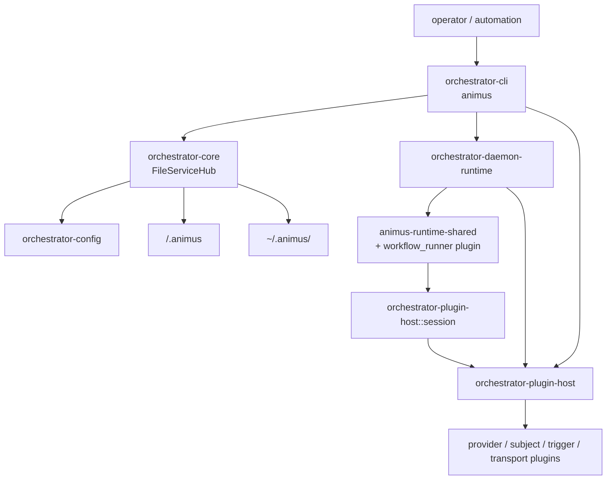
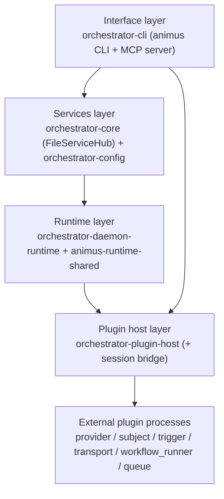
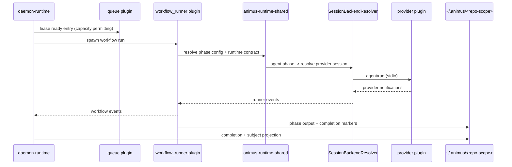

# Runtime Architecture

This document maps the current Animus runtime from CLI startup through daemon
dispatch, workflow execution, provider sessions, plugins, and persisted state.
When this document and code disagree, trust the source files listed here.

For the full end-to-end architecture narrative, including domain model,
control surfaces, daemon internals, workflow runner internals, security,
observability, and extension rules, see
[Full System Architecture](full-system-architecture.md).

## Source Files

| Area | Source |
|---|---|
| CLI entrypoint | [`crates/orchestrator-cli/src/main.rs`](../../crates/orchestrator-cli/src/main.rs) |
| Top-level command surface | [`crates/orchestrator-cli/src/cli_types/root_types.rs`](../../crates/orchestrator-cli/src/cli_types/root_types.rs) |
| Output envelope | [`crates/orchestrator-cli/src/shared/output.rs`](../../crates/orchestrator-cli/src/shared/output.rs) |
| Project root resolution | [`crates/orchestrator-core/src/config.rs`](../../crates/orchestrator-core/src/config.rs) |
| Service bootstrap and state | [`crates/orchestrator-core/src/services.rs`](../../crates/orchestrator-core/src/services.rs) |
| Workflow config loading | [`crates/orchestrator-config/src/workflow_config/`](../../crates/orchestrator-config/src/workflow_config/) |
| Shared config and scope types | External `protocol::Config` and `protocol::repository_scope::*` from the `launchapp-dev/animus-protocol` dependency pinned in the workspace `Cargo.toml` files |
| Workflow execution helpers | [`crates/animus-runtime-shared/src/`](../../crates/animus-runtime-shared/src/) |
| Daemon runtime | [`crates/orchestrator-daemon-runtime/src/`](../../crates/orchestrator-daemon-runtime/src/) |
| Plugin host | [`crates/orchestrator-plugin-host/src/`](../../crates/orchestrator-plugin-host/src/) |
| Provider session bridge | [`crates/orchestrator-plugin-host/src/session/`](../../crates/orchestrator-plugin-host/src/session/) |
| Web plugin resolution | [`crates/orchestrator-cli/src/services/operations/ops_web.rs`](../../crates/orchestrator-cli/src/services/operations/ops_web.rs) |

## System Shape



## Runtime Layering

Each layer depends only on the ones beneath it: the CLI/MCP interface sits on services, services on the daemon runtime and shared workflow helpers, and all runtime paths reach external integrations only through the plugin host.



## Workspace Responsibilities

| Layer | Crates | Responsibility |
|---|---|---|
| Interface | `orchestrator-cli` | CLI, MCP server, JSON output, operations, `animus web` plugin launch |
| Services | `orchestrator-core`, `orchestrator-config` | Bootstrap, config, workflow config, and file-backed state mutation APIs |
| Runtime | `orchestrator-daemon-runtime`, `animus-runtime-shared`, `animus-mcp-oauth` | Queue scheduling, workflow dispatch, shared phase/runtime-contract logic, and protected MCP OAuth proxy/token handling |
| Providers | `orchestrator-plugin-host::session`, external `launchapp-dev/animus-provider-oai-agent` plugin | Provider plugin sessions and the OpenAI-compatible runner binary resolved from installed plugins |
| Plugins | `orchestrator-plugin-host`, `animus-plugin-protocol`, `animus-plugin-runtime` | Discovery, manifests, stdio JSON-RPC host, runtime helpers |
| Support | `orchestrator-logging`, external `protocol` dependency | Tracing, log plumbing, shared types, config, and repository-scope helpers |

## Startup Flow

The workspace also depends on external `launchapp-dev/animus-protocol` crates.
The authoritative dependency pins live in the repo's `Cargo.toml` files,
especially the workspace root. The current runtime pins every Protocol crate,
including the application, control, plugin, queue, subject, provider, session,
journal, config, and kernel contracts, to the unified `v0.7.0-rc.12` source.
This removes the former queue/subject compatibility source split.

1. Parse global flags and top-level command in `orchestrator-cli`.
2. Resolve the project root with this precedence:
   - `--project-root`
   - Git common root for the current directory or linked worktree
   - current working directory
3. Bootstrap project-local `.animus/` config files when needed.
4. Resolve the repository scope and scoped runtime state under
   `~/.animus/<repo-scope>/`.
5. Construct `FileServiceHub`.
6. Dispatch into the selected CLI operation, daemon runtime, runner path, MCP
   server, or web plugin operation.

## State Model

Animus splits project-local configuration from scoped runtime state.

Project-local config in `<project>/.animus/`:

- `config.json`
- `workflows.yaml`
- `workflows/*.yaml`
- `plugins.lock`

Scoped runtime state in `~/.animus/<repo-scope>/`:

- `core-state.json`
- `resume-config.json`
- `workflow.db`
- `chat/`
- `config/`
- `daemon/`
- `docs/`
- `logs/`
- `metrics/`
- `runs/`
- `artifacts/`
- `secrets/`
- `state/`
- `worktrees/`

Global state in `protocol::Config::global_config_dir()` includes
`config.json`, `credentials.json`, `daemon-events.jsonl`, `cli-tracker.json`,
and `runner-sessions/`.

`<repo-scope>` is derived from the sanitized repository name plus a 12-character
SHA256 prefix of the canonical root. Managed worktrees live under the scoped
`worktrees/` directory.

## Control Surfaces

| Surface | Runtime path |
|---|---|
| CLI | `orchestrator-cli` operations, usually via `FileServiceHub` |
| MCP | `orchestrator-cli` MCP operation modules and `animus.*` tool namespace |
| Daemon control | Unix socket control protocol when daemon is running |
| Web | external transport and web UI plugins launched by `animus web` |
| Plugins | stdio JSON-RPC through `orchestrator-plugin-host` |

The web stack is not bundled in-tree. `animus web serve` and `animus web open`
discover installed `transport_backend` and `web_ui` plugins.

## Execution Pipeline

1. A subject or queue entry selects work.
2. The daemon starts a workflow run through an installed `workflow_runner` plugin.
3. Shared `animus-runtime-shared` logic resolves phase configuration and runtime contracts inside that plugin.
4. Agent phases resolve a provider session through `SessionBackendResolver`,
   which discovers and drives a provider plugin through
   `orchestrator-plugin-host`.
5. Events flow back through workflow state, daemon output, and logs.
6. Terminal state is persisted in scoped runtime state and surfaced through CLI,
   MCP, web transports, and output commands.

At runtime, a workflow run flows from queue selection through the workflow_runner plugin into provider sessions, with events and terminal state projected back into scoped state:



## Daemon Responsibilities

The daemon owns scheduling and runtime coordination:

- queue dispatch
- cron/reactive scheduling
- trigger plugin watching
- subject plugin routing
- workflow process management
- daemon events and health
- plugin preflight before autonomous work

The daemon should not own provider-specific session logic, web UI implementation,
or external system-of-record semantics.

## Plugin Boundaries

External integrations run as standalone executables. The host communicates over
JSON-RPC 2.0 on stdin/stdout; canonical writes remain newline-delimited and the
host readers also tolerate pretty-printed multi-line frames from plugins.
Plugin environments are cleared before spawn. Plugin behavior is documented in
[Plugin System](plugin-system.md).

The key runtime split is:

- subject and trigger plugins are daemon-facing
- provider plugins are session-host-facing
- transport and web UI plugins are `animus web`-facing
- log storage plugins are runtime logging-facing

## Failure Boundaries

| Failure | Boundary |
|---|---|
| Missing provider or subject plugin | daemon preflight fails by default |
| Plugin manifest probe failure | discovery warning, plugin skipped |
| Provider process death before any event | provider dispatch may retry once |
| Structured plugin JSON-RPC error | surfaced without consuming restart budget |
| Subject kind not claimed | `METHOD_NOT_FOUND` for that kind |
| Web plugin missing | `animus web` reports install/remediation command |

## Verification

Use source checks for architecture-affecting changes:

```bash
cargo animus-bin-check
cargo test -p orchestrator-plugin-host
cargo test -p orchestrator-cli
```
