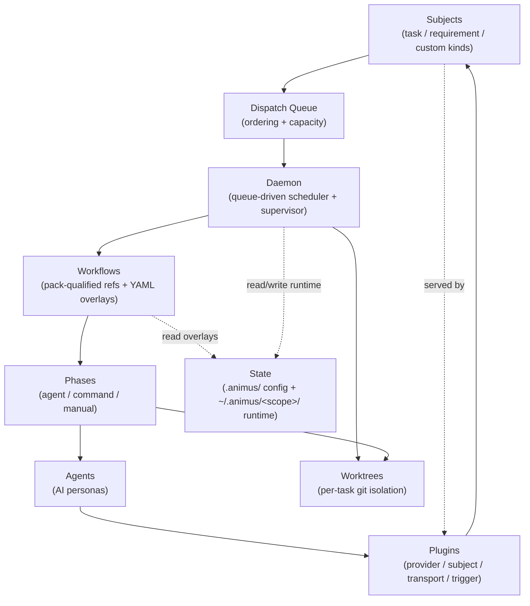

# Concepts

This section explains the core ideas behind Animus. Each page covers one architectural concept in depth.

The map below shows how the core concepts relate: work enters as a subject, is
queued and dispatched, the daemon leases and supervises it, the workflow runner
executes phases with agents through provider plugins, and everything reads and
writes scoped state.

## Pages

- [How Animus Works](./how-ao-works.md) -- Core architecture, the three-layer model, and the big picture.
- [Workflows](./workflows.md) -- Everything is a workflow: pack-qualified workflows, and project-local YAML.
- [Subject Dispatch](./subject-dispatch.md) -- The universal work envelope that drives all execution.
- [The Daemon](./daemon.md) -- The dumb scheduler: tick loop, capacity, and execution facts.
- [Agents and Phases](./agents-and-phases.md) -- AI personas, phase execution, rework loops, and phase guards.
- [MCP Integration](./mcp-tools.md) -- How agents use MCP tools to observe and mutate state.
- [State Management](./state-management.md) -- The split between project-local `.animus/` config and repo-scoped runtime state.
- [Worktree Isolation](./worktrees.md) -- Built-in tasks get isolated git worktrees; plugin-owned tasks can run directly from the project root.
