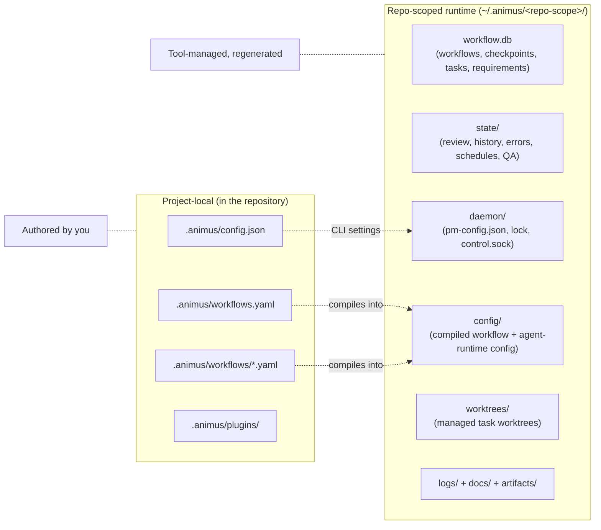
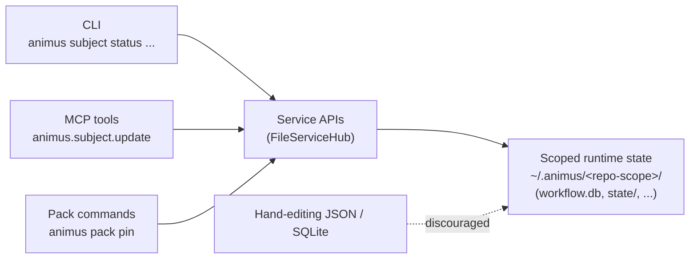

# State Management

Animus separates authored repository config from mutable runtime state. The
authored side lives in the repository under `.animus/`; the mutable side lives
outside the repository under `~/.animus/<repo-scope>/`.



## Project-Local `.animus/`

The repository keeps only the configuration you are expected to author:

```text
.animus/
├── config.json
├── workflows.yaml
├── workflows/
└── plugins/
```

These files define workflow behavior, overrides, and local pack customizations.

## Repo-Scoped Runtime State

Runtime state lives under `~/.animus/<repo-scope>/`, not in the repository:

```text
~/.animus/<repo-scope>/
├── core-state.json
├── resume-config.json
├── workflow.db
├── config/
├── daemon/
├── docs/
├── state/
└── worktrees/
```

Important runtime stores:

- `workflow.db` for workflows, checkpoints, tasks, and requirements
- `logs/` for redacted structured runtime events and run logs
- `runner/` for repo-scoped runner auth and socket state
- `state/` for review, history, error, schedule, QA, and pack-selection state
- `worktrees/` for managed task worktrees
- `docs/` for generated planning artifacts such as `product-vision.md`

## Why the Split Exists

Keeping mutable state outside the repository gives Animus a few important properties:

- linked worktrees resolve back to one shared repo scope
- runtime files do not pollute source control
- large and frequently updated state can evolve without rewriting repo-local config
- legacy `.animus/`-local state can be migrated forward without changing the authored YAML surface

## Pack and Workflow Resolution

Animus still resolves workflows from layered sources:

1. project pack overrides in `.animus/plugins/`
2. project YAML in `.animus/workflows.yaml` and `.animus/workflows/*.yaml`
3. installed packs in `~/.animus/packs/`
4. bundled workflow content compiled into the CLI

State location and workflow resolution are related but different concerns:

- workflow definitions come from YAML and pack content
- execution state and operational records live under `~/.animus/<repo-scope>/`

## Mutation Policy

Do not hand-edit Animus-managed runtime JSON or SQLite state unless you are explicitly working on Animus persistence or migrations.

Approved mutation surfaces:

- CLI commands such as `animus subject status --kind task`
- Animus MCP tools such as `animus.subject.update`
- pack commands such as `animus pack pin`

All approved surfaces funnel through service APIs, which own the writes to disk.
No surface writes scoped JSON or SQLite directly:



## Moving to a new machine

Use `animus state export` and `animus state import` to migrate a project's
runtime state to a new machine.

### Export

```sh
animus state export --out my-project.tar.zst
```

The archive contains, by default:

- `state/` — workflows, tasks, requirements, history, errors, pack-selection, etc.
- `chat/` — conversation continuity records.
- `docs/` — generated planning artifacts (`product-vision.md`, etc.).
- `secrets/index.json` — the _names_ of secrets registered for this project.
- `~/.animus/principals.yaml` — the RBAC principal list (if it exists).

Excluded by default (use `--include-runs` / `--include-artifacts` to add):

- `runs/` and `artifacts/` — potentially large per-run execution state.
- `daemon/` runtime files (`daemon.lock`, `daemon.log`, `control.sock`, etc.).
- `config/` — compiled workflow and agent-runtime config (regenerated on first run).
- `.project-root`, `.git-origin` — machine-local paths and credentials in the
  remote URL; both are re-created automatically.

**SECRETS ARE DELIBERATELY EXCLUDED.** The archive never contains actual secret
values. Values live in the OS keychain (`animus:<repo-scope>` service entries),
which is local to each machine. The `secrets/index.json` file in the archive
records only the _key names_ that were registered on the source machine — use it
as a checklist to re-enter values on the new machine:

```sh
# On the new machine, after importing:
animus secret list          # see which KEYs are expected
animus secret set LINEAR_API_TOKEN
animus secret set ANTHROPIC_API_KEY
# or bulk-import from a temporary .env file:
animus secret import-env --file keys.env
```

### Import

```sh
animus state import my-project.tar.zst
```

Flags:

- `--yes` — allow overwriting an existing non-empty scope directory. A safety
  snapshot is taken to `~/.animus/<scope>/.backup-pre-import-<ts>/` before
  any files are replaced.
- `--into-project <PATH>` — re-scope the archive into a different project root.
  The new scope id is computed from the given path so you can restore onto a
  repo checked out at a different location.
- `--yes-overwrite-principals` — explicit opt-in to overwrite an existing
  `~/.animus/principals.yaml` when the archived copy differs. `--yes` alone
  never touches RBAC config; you must pass this flag separately. This is
  intentional: principals govern who can act on all projects on the machine, so
  overwriting them silently on a shared host would be dangerous.

### Keychain scope mapping

Keychain entries are stored under `animus:<repo-scope>` (see [Secrets](../reference/secrets.md)
for the full layout). When you `--into-project` to a different root, the repo
scope changes and the old keychain entries are not automatically re-keyed. You
must re-enter secrets under the new scope with `animus secret set` after import.

## Repository Scope

The repo scope uses the canonical project path to derive a stable identifier:

```text
<sanitized-repo-name>-<12-hex-sha256-prefix>
```

This is what lets Animus keep one runtime home for a repository even when you invoke it from linked worktrees.
