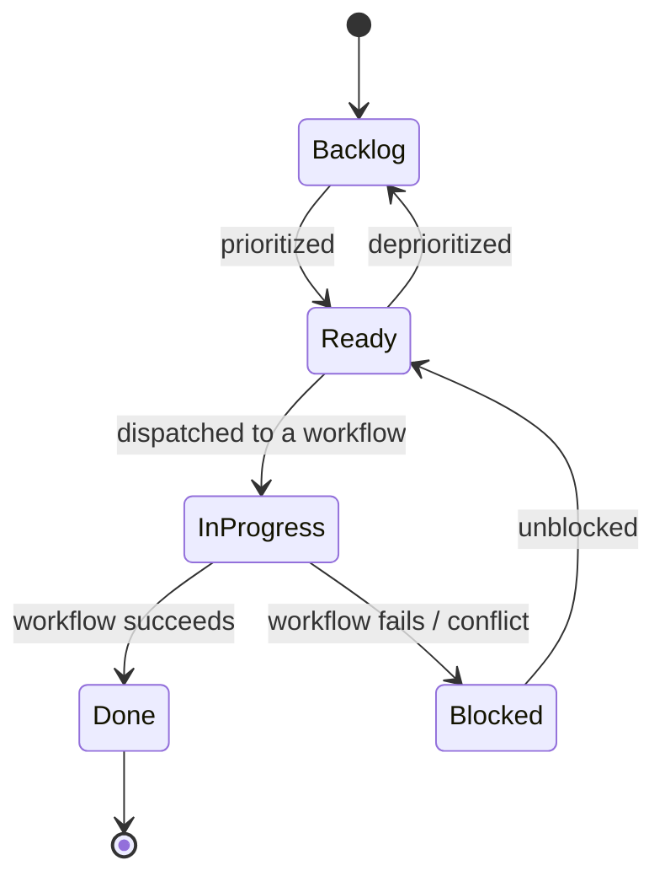
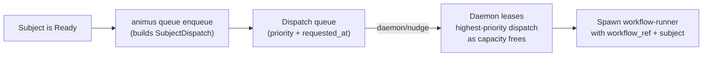

# Subject Dispatch

## What `SubjectDispatch` Is

`SubjectDispatch` is Animus's universal work envelope. Every workflow start,
whether it comes from the CLI, a queue tick, a schedule, or MCP, enters the
runtime through the same contract.

The daemon only needs this envelope plus execution facts. It does not need to
understand task rules, requirement rules, or pack-specific behavior.

## Subject Identity

Animus has moved from a task-shaped subject model toward a generic subject identity
contract:

```text
SubjectRef {
  kind: String,
  id: String,
  title: Option<String>,
  description: Option<String>,
  labels: Vec<String>,
  metadata: Value,
}
```

Common subject kinds today:

| Kind | Example |
|---|---|
| `task` | `TASK-042` |
| `requirement` | `REQ-007` |
| `custom` | `planning-intake` |

Compatibility adapters still preserve the existing task and requirement flows,
but routing is now keyed by generic `kind` and `id`.

A subject moves through a lifecycle of status states as work progresses; the
daemon never auto-promotes a subject — operators (or projectors reacting to
execution facts) drive these transitions.



## Dispatch Shape

```text
SubjectDispatch {
  subject: SubjectRef,
  workflow_ref: String,
  input: Option<Value>,
  vars: HashMap<String, String>,
  priority: Option<String>,
  trigger_source: String,
  requested_at: DateTime<Utc>,
}
```

| Field | Purpose |
|---|---|
| `subject` | Identity of the work item |
| `workflow_ref` | Workflow to execute, usually a pack-qualified ref |
| `input` | Optional JSON payload for the workflow |
| `vars` | Explicit string variables passed to the workflow |
| `priority` | Optional queue priority hint |
| `trigger_source` | Dispatch origin such as `manual`, `ready-queue`, `schedule`, or `mcp` |
| `requested_at` | UTC timestamp for auditability and queue ordering |

## Canonical Workflow Refs

Examples of current workflow refs consumed by dispatch and `animus workflow run`:

| Use Case | Subject | Workflow Ref |
|---|---|---|
| Requirement execution | `requirement:REQ-007` | `animus.requirement/execute` |
| Standard task delivery | `task:TASK-042` | `animus.task/standard` |

Legacy aliases such as `builtin/requirements-execute` still resolve, but they
are compatibility shims rather than the preferred surface.

## The Dispatch Path

A Ready subject does not run on its own. It must be enqueued onto the dispatch
queue, where the daemon leases it as capacity frees and spawns a workflow run.
The daemon is queue-driven and performs no auto-enqueue of its own.



## Why This Boundary Matters

The single dispatch contract lets Animus keep clean boundaries:

- the daemon schedules and supervises subprocesses
- subject adapters resolve subject-specific context and cwd policy
- workflows and packs define behavior
- execution projectors map facts back onto subject state

That is how Animus can add new domains without pushing more branching logic into the
daemon.
