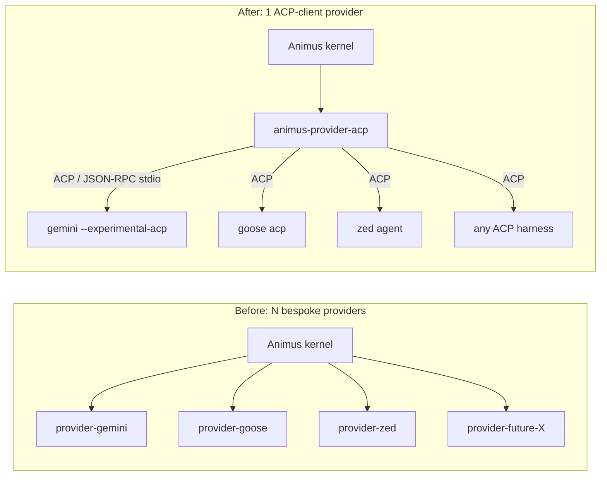

# `animus-provider-acp` — Animus as an ACP *Client* (Universal Provider On-Ramp)

**Date:** June 2026
**Status:** Design — Proposal
**Scope:** A single Animus `provider` plugin that speaks the Agent Client Protocol (ACP) as a **client**, so any ACP-compatible agent harness (Gemini CLI, Zed's agent, Goose, future ACP harnesses) plugs into Animus through ONE adapter instead of N bespoke per-CLI provider plugins.

> **Companion doc — read first for the other direction.** [`docs/design/acp-integration.md`](./acp-integration.md) covers Animus as an ACP **server** (IDEs like VS Code / JetBrains / Cursor connect *to* Animus as their agent). This doc is the complementary, opposite direction: Animus is the ACP **client** that *embeds/consumes* third-party ACP agents as Animus providers. The two are symmetric halves of the same `agent-client-protocol` Rust crate — one implements the `Agent` trait (server doc), this one implements the `Client` trait.

---

## 1. Goal + the "connect any harness" thesis

### 1.1 The problem today

Every coding-agent CLI Animus wants to drive needs its own provider plugin. We maintain a separate repo per harness:

- `launchapp-dev/animus-provider-claude`
- `launchapp-dev/animus-provider-codex`
- `launchapp-dev/animus-provider-gemini`
- `launchapp-dev/animus-provider-opencode`
- `launchapp-dev/animus-provider-oai`

Each one re-implements the same scaffolding: a `ProviderBackend` impl, a `SessionBackend` that shells out to a CLI, stdout/stream parsing for *that* CLI's bespoke JSON, cancellation plumbing, and — critically — **its own tool-approval interception**. The portal provider's `agent/src/tools/gate.ts` is the canonical example of the last point: because the harness has no native permission hook, the provider must *manually wrap every tool's `execute`* to first call `animus.agent.request_approval` and fail safe on deny. Every new harness re-pays that cost.

### 1.2 The thesis

ACP already standardizes exactly this surface. A harness that speaks ACP exposes:

- session lifecycle (`session/new`, `session/prompt`, `session/cancel`),
- streamed model output + tool calls (`session/update` notifications), and
- a **native, agent-initiated permission callback** (`session/request_permission`) plus filesystem/terminal callbacks the *client* fulfills.

So instead of writing a bespoke provider per harness, we write **one** ACP-client provider. Any harness that speaks ACP — present or future — becomes an Animus provider for free, configured by a binary path, not a new repo.



### 1.3 Which harnesses speak ACP — and scope

| Harness | ACP today? | Plan |
|---|---|---|
| **Gemini CLI** | Yes (`--experimental-acp` mode; ACP was co-driven with Gemini integration) | **Primary validation target.** |
| **Zed agent** | Yes (Zed co-authored ACP with JetBrains) | Validate second. |
| **Goose** (Block) | Yes / emerging ACP support | Validate third. |
| Claude Code CLI | Not natively ACP (native session JSON) | **Keep `animus-provider-claude` native.** ACP is additive, not a replacement. |
| Codex / oai / opencode | Not ACP | Keep native providers. |

**Additive, not a migration.** Native providers (`claude`, `codex`) keep their hand-tuned integrations and native approval wiring (claude's `--permission-prompt-tool` already routes to `animus.agent.request_approval`). `animus-provider-acp` *adds* a universal on-ramp for the growing set of harnesses that chose ACP, so we never write provider #6, #7, #8 by hand.

---

## 2. Protocol mapping table

ACP is symmetric JSON-RPC: the **Agent** side (the harness) initiates `session/*` results and emits `session/update` notifications + agent-initiated `fs/*`, `terminal/*`, and `session/request_permission` callbacks; the **Client** side (Animus, here) drives prompts and *implements* those callbacks. `animus-provider-acp` implements the `agent-client-protocol` crate's **`Client` trait** and connects to the harness subprocess over stdio.

| Animus `ProviderBackend` / session-backend | ACP method (direction) | Implemented by (in this plugin) | Notes |
|---|---|---|---|
| `run_agent` / `run_agent_streaming` start | `initialize` → `session/new` → `session/prompt` (client → agent) | ACP-client driver | One `AgentRunRequest` opens an ACP session and sends one prompt turn. |
| `SessionRequest.prompt` | `session/prompt` `prompt: [ContentBlock]` | driver | Animus prompt text becomes a `text` content block. |
| `SessionRequest.cwd` / `project_root` | `session/new` `cwd` | driver | The worktree/cwd Animus computed for the phase. |
| `SessionRequest.model` | harness-specific (model select varies) | driver / config | ACP has session modes, not a uniform model field; map via per-tool config (§5). |
| `SessionRequest.mcp_servers` / `mcp_endpoint` | `session/new` `mcpServers` | driver | ACP forwards MCP server configs to the harness — Animus's MCP bridge (`animus mcp serve`) is advertised here. |
| `SessionEvent::Started` | `session/new` result (`sessionId`) | driver | Capture `sessionId` for cancel/resume. |
| `SessionEvent::TextDelta` | `session/update` → `agent_message_chunk` | `Client::session_notification` | Streamed assistant text. |
| `SessionEvent::Thinking` | `session/update` → `agent_thought_chunk` | `session_notification` | Reasoning stream. |
| `SessionEvent::ToolCall` | `session/update` → `tool_call` (`toolCallId`, `title`, `kind`, `status`) | `session_notification` | Initial tool invocation. |
| `SessionEvent::ToolResult` | `session/update` → `tool_call_update` (`status: completed`, `content`) | `session_notification` | Tool completion/result. |
| (plan surfacing — optional) | `session/update` → `plan` (entries: `content`/`priority`/`status`) | `session_notification` | Can map to `SessionEvent::Metadata` artifacts. |
| `SessionEvent::FinalText` + `SessionEvent::Finished` | `session/prompt` **response** with `stopReason` (`end_turn`, `max_tokens`, `refusal`, `cancelled`, …) | driver | Turn end → drain final text, set exit code. |
| `cancel_agent(session_id)` / abort | `session/cancel` (client → agent notification) | driver | Maps `stopReason: cancelled`. |
| **Approval gate** (see §3) | `session/request_permission` (**agent → client**) | `Client::request_permission` | **The keystone.** Routes to `animus.agent.request_approval`. |
| File read | `fs/read_text_file` (**agent → client**) | `Client::read_text_file` | Behind approval gate (§4). |
| File write | `fs/write_text_file` (**agent → client**) | `Client::write_text_file` | Behind approval gate (§4). |
| Terminal spawn / stream / kill / release | `terminal/create`, `terminal/output`, `terminal/wait_for_exit`, `terminal/kill`, `terminal/release` (**agent → client**) | `Client` terminal methods | Behind approval gate (§4); honors cwd/worktree (§4.2). |
| `SessionEvent::Error` | JSON-RPC error / `session/update` error | driver | Recoverable vs fatal mapping. |

**Where each ACP method lands.** Because Animus is the ACP **client**, the *client-initiated* methods (`session/new`, `session/prompt`, `session/cancel`) are calls **we make** inside `run_agent_streaming`. The *agent-initiated* callbacks (`session/request_permission`, `fs/*`, `terminal/*`) are trait methods **we implement** on our `Client` impl — they fire mid-turn while the prompt future is in flight, which is why the driver runs the prompt and the connection's incoming-callback loop concurrently on one tokio runtime.

---

## 3. Approval synergy — the keystone insight

**ACP's `session/request_permission` maps 1:1 onto Animus's `animus.agent.request_approval` gate.** This is the single biggest reason to build this plugin.

### 3.1 What the bespoke providers must do today

From `animus-launchapp/agent/src/tools/gate.ts`:

> *"claude wires `--permission-prompt-tool ...animus_agent_request_approval` natively, so EVERY tool call it makes routes through Animus's approval contract. The portal provider has no such hook, so we replicate it here: when approvals are enabled, we wrap each tool's `execute` so it FIRST asks `animus.agent.request_approval` for a verdict and only runs the real tool on an `allow`. A deny (or any failure to obtain a verdict) fails SAFE."*

That wrapping is per-provider, per-tool, hand-maintained interception code. Every non-claude harness needs its own copy.

### 3.2 What ACP gives us for free

In ACP, before the harness runs a sensitive tool it sends the client a `session/request_permission` request carrying the proposed `toolCall` and a set of `PermissionOption`s (`allow_once`, `allow_always`, `reject_once`, `reject_always`). The client returns the chosen outcome. So **the harness already calls out for permission natively** — exactly the hook the portal provider had to fake.

`animus-provider-acp`'s `Client::request_permission` implementation is therefore a thin translator:

```text
ACP session/request_permission { toolCall, options }
        │
        ▼
animus.agent.request_approval  { tool, args, session_id, ... }
        │   (existing v0.6 approval policy: manual | allow | deny | llm)
        ▼
verdict: allow  → choose an "allow_*" PermissionOption
verdict: deny   → choose a "reject_*" PermissionOption
no verdict/error → fail SAFE → reject_once
```

### 3.3 The payoff

- **Zero per-provider interception code.** No `gateTools()` equivalent in this plugin — the policy logic lives once, in the kernel's approval contract, and *every ACP harness's tool calls flow through it natively.*
- **The `llm` auto-approve policy works out of the box.** Because the verdict comes from `animus.agent.request_approval`, the manual/allow/deny/**llm** policy gates the ACP harness's tool calls with the same logic that gates claude's — including the LLM auto-approver. This directly satisfies the "every provider needs its own interception" follow-up: it doesn't, anymore.
- **Fail-safe is centralized.** If the approval call errors, we map to `reject_once` (the ACP equivalent of `gate.ts`'s fail-safe).

This is the cleanest possible realization of the approval gate: the protocol *itself* enforces the call-out, and Animus only supplies the verdict.

---

## 4. fs / terminal callbacks

Because Animus is the ACP client, the harness asks *us* to touch the filesystem and run terminals. We honor those callbacks **behind the same approval gate** and **inside the phase's cwd/worktree model**.

### 4.1 Filesystem

- `fs/read_text_file { sessionId, path, line?, limit? }` → `Client::read_text_file`. Read is generally policy-`allow` by default (read-only; same rationale as `gate.ts` not gating `web_fetch`), but the path is still validated against the worktree boundary (§4.2). Returns `content`.
- `fs/write_text_file { sessionId, path, content }` → `Client::write_text_file`. Writes are **gated**: we issue a `request_approval` for the write before performing it, then write to the working tree. Returns `null` on success.

### 4.2 Terminal

- `terminal/create { command, args, cwd, env }` → spawn a child process; gated by `request_approval`.
- `terminal/output` / `terminal/wait_for_exit` → stream stdout/stderr and surface `exitStatus`.
- `terminal/kill` / `terminal/release` → terminate and clean up.

### 4.3 Relation to the workflow-runner cwd/worktree model

The Animus workflow runner already computes a per-phase **cwd / git worktree** and passes it down as `SessionRequest.cwd` / `project_root`. The ACP-client provider must:

1. Pass that cwd as the ACP `session/new` `cwd`, so the harness's own notion of the workspace matches the phase worktree.
2. **Clamp** every agent-initiated `fs/*` and `terminal/*` path to that worktree root — reject (fail-safe) absolute paths that escape it. ACP `fs/*` paths are absolute by spec, so this is an explicit boundary check, not an implicit chroot.
3. Inherit the phase's resolved secrets/env (keychain-sourced per repo-scope) into spawned terminals, with parent-env-wins-on-collision semantics matching the existing plugin-spawn path.

This keeps the ACP harness inside the same sandbox the native providers run in: its edits land in the phase worktree, are git-tracked, and are auditable — no special-casing in the runner.

---

## 5. Crate shape — `animus-provider-acp`

A new standalone repo `launchapp-dev/animus-provider-acp`, structured like the existing provider plugins (`plugin.toml` + `[[bin]]` + a `ProviderBackend` impl), but whose `SessionBackend` is an **ACP client** instead of a bespoke CLI parser.

### 5.1 Dependencies

```toml
[dependencies]
agent-client-protocol   = "..."                     # the ACP Rust crate (Client + Agent traits)
animus-plugin-protocol  = { git = "...animus-protocol", tag = "v0.1.13.x" }
animus-provider-protocol= { git = "...animus-protocol", tag = "v0.1.13.x" }
animus-plugin-runtime   = { git = "...animus-protocol", tag = "v0.1.13.x" }
animus-session-backend  = { git = "...animus-protocol", tag = "v0.1.13.x" }
tokio = { version = "1", features = ["rt-multi-thread","macros","io-util","process","sync","time"] }
serde = { version = "1", features = ["derive"] }
serde_json = "1"
async-trait = "0.1"
futures = "0.3"
anyhow = "1"; thiserror = "1"; tracing = "0.1"; tracing-subscriber = "0.3"
```

### 5.2 Module layout (mirrors `animus-provider-claude`)

- `src/main.rs` — `provider_main_with_capabilities(info, backend, extra_caps)`, plus `--manifest` emission. (Identical scaffolding to the claude provider.)
- `src/backend.rs` — `AcpProviderBackend` implementing `ProviderBackend`. `run_agent_streaming` translates `AgentRunRequest` → `SessionRequest`, starts an ACP session, and drains `SessionEvent`s into `AgentRunResponse` + `NotificationSink` (same `drain_session_run` shape as claude).
- `src/acp_session.rs` — the `SessionBackend` impl. Spawns/connects the ACP agent subprocess, builds a `ClientSideConnection` over its stdio, runs the prompt turn, and **forwards** `session/update` notifications into the `mpsc::Receiver<SessionEvent>` that `SessionRun` exposes.
- `src/acp_client.rs` — the `Client` trait impl: `request_permission`, `read_text_file`, `write_text_file`, terminal methods (§3, §4). Holds a handle back to the `animus.agent.request_approval` MCP surface and the worktree boundary.
- `src/config.rs` — `from_env()` config (§5.4).
- `plugin.toml` — `plugin_kind = "provider"`, `capabilities = { streaming, progress, cancellation }`.

### 5.3 How it spawns/connects the harness

**Default: stdio subprocess per session.** For each `start_session`, spawn the configured harness binary in its ACP mode (e.g. `gemini --experimental-acp`), take its stdin/stdout, and construct the ACP crate's stdio `ClientSideConnection`. Drive `initialize` → `session/new` → `session/prompt`; concurrently run the connection's incoming-callback loop so `request_permission` / `fs/*` / `terminal/*` are serviced mid-turn. On `cancel_agent`, send `session/cancel` and tear down the child.

**Optional: HTTP/remote.** ACP also supports HTTP transport for remote agents; a later phase can add an `endpoint = "http://..."` config to connect to a hosted ACP agent instead of spawning a subprocess. Stdio-subprocess is the v1 path (matches how every other Animus provider runs locally).

### 5.4 Config — which ACP agent per `tool` / `model`

The provider must know, for a requested `tool`/`model`, *which harness binary to spawn and in what mode*. Driven by env (the existing provider-config convention) plus an optional registry:

- `ACP_AGENT_BIN` — harness binary (e.g. `gemini`, `goose`, `zed`).
- `ACP_AGENT_ARGS` — extra args to enter ACP mode (e.g. `--experimental-acp`).
- `ACP_DEFAULT_MODEL` — fallback model/mode when the request omits one.
- Manifest `supported_models` advertises the model ids this ACP agent exposes (so the kernel's model routing can target them), and `tool` is the logical provider id (e.g. `"acp-gemini"`).

A single installed `animus-provider-acp` can be registered multiple times with different env (one per harness), or a small built-in table can map well-known `tool` ids → `(bin, args)`.

---

## 6. Tradeoffs / open questions

1. **Capability negotiation gaps.** ACP harnesses advertise differing agent capabilities (session modes, plan support, MCP transports). The provider must read the `initialize` response and degrade gracefully — e.g. if a harness doesn't support `fs/*`, fall back to letting it touch the disk directly inside the worktree (less safe; flag it). The `ProviderCapabilities` manifest we emit to Animus must reflect the *connected* harness's real capabilities, which are only known after `initialize` — so the static manifest is a superset and runtime degradation is per-session.
2. **Streaming-shape normalization.** ACP's `agent_message_chunk` / `tool_call` / `tool_call_update` granularity differs per harness (some batch, some stream token-by-token). We normalize into Animus's `SessionEvent` set, but token-usage and cost fields (`usage_update`) are not uniformly populated — `TokenUsage` may be `None` for some harnesses, weakening cost tracking.
3. **Multi-step session lifecycle vs Animus's one-shot `SessionRun`.** ACP sessions are long-lived and multi-turn; Animus's `SessionRun` models one prompt → drain → finish. v1 maps one Animus run to one ACP prompt turn and tears the session down. `resume_agent` can map to ACP `session/load`/`session/resume` (capability-gated) to preserve context across phases — open question whether to keep the child process alive between phases or reconnect.
4. **Auth.** ACP defines `authenticate`; some harnesses need their own credentials (Google auth for Gemini, etc.). These remain the harness's concern — Animus injects keychain-sourced env per repo-scope, but interactive auth flows (browser login) don't fit the headless daemon. Document "run the harness's login once, out of band" for v1.
5. **Permission-option fidelity.** Mapping a binary allow/deny verdict onto ACP's four-way `PermissionOption` set loses the once/always distinction. v1 maps `allow → allow_once`, `deny → reject_once` (most conservative). `allow_always` could later be wired to the policy's auto-allow list so "always" persists across the run.
6. **Which harnesses to validate first.** Gemini CLI (most mature ACP mode), then Zed's agent, then Goose. Validate each against the conformance testkit (`launchapp-dev/animus-conformance-testkit`) before advertising it as supported.

---

## 7. Phased plan (S / M / L)

### Phase S — Walking skeleton (Gemini only)
- Scaffold `animus-provider-acp` from the claude-provider template (`main.rs`, `plugin.toml`, `from_env` config).
- Implement the ACP-client `SessionBackend`: spawn `gemini --experimental-acp`, `initialize` → `session/new` → `session/prompt`, forward `agent_message_chunk` / `tool_call` / `tool_call_update` → `SessionEvent`, finish on `stopReason`.
- Implement `Client::request_permission` → `animus.agent.request_approval` (the keystone), fail-safe to `reject_once`.
- Stub `fs/*` + `terminal/*` as policy-gated, worktree-clamped passthroughs.
- Validate end-to-end: one Animus phase driving Gemini through approval-gated tool calls.

### Phase M — Hardening + second harness
- Full `fs/*` + `terminal/*` with worktree boundary clamping and env/secret injection (§4).
- `cancel_agent` → `session/cancel`; robust teardown.
- Capability negotiation + runtime degradation (§6.1); token-usage mapping where available.
- Add **Zed agent** + **Goose**; run all three through the conformance testkit.
- Per-harness config registry (§5.4); document `animus plugin install` + register flow.

### Phase L — Depth + remote
- `resume_agent` → ACP `session/load`/`resume`; optional keep-alive across phases (§6.3).
- HTTP/remote transport (`endpoint = http://…`) for hosted ACP agents (§5.3).
- `allow_always` → policy auto-allow persistence (§6.5); plan-update → artifact surfacing.
- Publish to the marketplace; add to `default-install.json` recommendations as an optional provider.

### How it shrinks the bespoke-provider surface over time
Today: 5 hand-maintained provider repos, each with its own stream parser **and its own approval interception**. As ACP adoption grows, every new ACP harness is onboarded by *config* (a `(bin, args)` entry), not a new repo. The bespoke set shrinks to the genuinely-non-ACP harnesses (claude, codex). The approval-interception code — the most error-prone, security-sensitive part — collapses from per-provider copies to **one** `request_permission` translator. Net: fewer repos, one audited gate, and a zero-marginal-cost path to "connect any harness."

---

## Appendix: references

- [`docs/design/acp-integration.md`](./acp-integration.md) — the ACP **server** direction (Animus serves IDEs).
- ACP — <https://agentclientprotocol.com> ; Rust library — <https://agentclientprotocol.com/libraries/rust> ; `agent-client-protocol` crate docs — <https://docs.rs/agent-client-protocol>.
- Provider contract reference — `launchapp-dev/animus-provider-claude` (`ProviderBackend`, `SessionRequest`/`SessionEvent`, `provider_main_with_capabilities`).
- Approval-gate prior art — `animus-launchapp/agent/src/tools/gate.ts` (the manual interception this plugin makes unnecessary).
- Session-backend protocol — `animus-session-backend` (tag v0.1.13.x).
