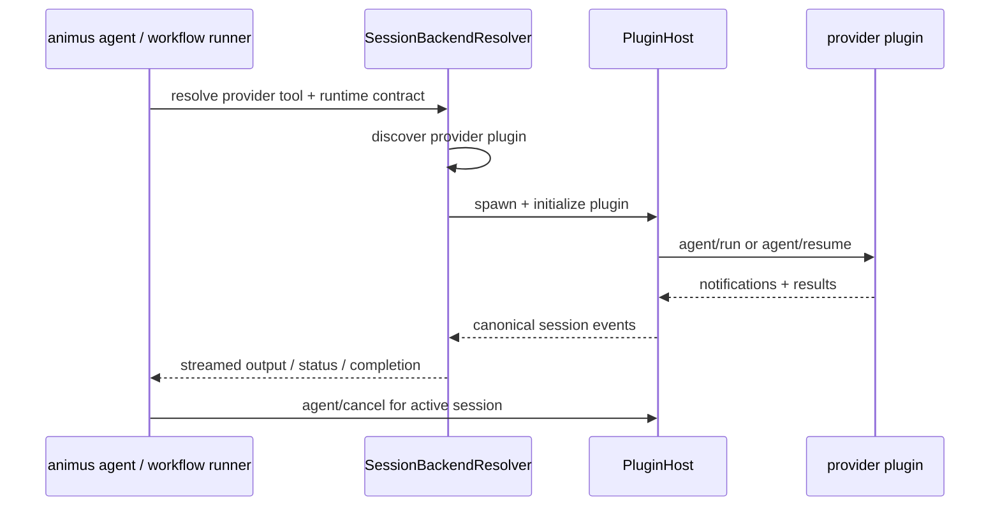

# Provider Sessions

This page keeps the historical `agent-runner-ipc.md` path for old links, but
the current implementation no longer has an in-tree `agent-runner` crate or IPC
server. Provider execution now routes through
`orchestrator-plugin-host::session` and installed provider plugins.

## Source Files

| Area | Source |
|---|---|
| Agent runtime entrypoint | [`crates/orchestrator-cli/src/services/runtime/runtime_agent/run.rs`](../../crates/orchestrator-cli/src/services/runtime/runtime_agent/run.rs) |
| Provider client | [`crates/orchestrator-cli/src/services/runtime/runtime_agent/provider_client.rs`](../../crates/orchestrator-cli/src/services/runtime/runtime_agent/provider_client.rs) |
| Session resolver | [`crates/orchestrator-plugin-host/src/session/session_backend_resolver.rs`](../../crates/orchestrator-plugin-host/src/session/session_backend_resolver.rs) |
| Plugin backend | [`crates/orchestrator-plugin-host/src/session/plugin_backend.rs`](../../crates/orchestrator-plugin-host/src/session/plugin_backend.rs) |
| Plugin supervisor | [`crates/orchestrator-plugin-host/src/session/plugin_supervisor.rs`](../../crates/orchestrator-plugin-host/src/session/plugin_supervisor.rs) |
| Runtime contract wiring | [`crates/orchestrator-core/src/runtime_contract.rs`](../../crates/orchestrator-core/src/runtime_contract.rs) |

## Current Flow

The resolver discovers plugins with `plugin_kind == "provider"`. There is no
in-tree provider fallback and no separate Unix-socket sidecar.

## Session Model

Important behavior in the current path:

- `animus agent run` starts a provider-owned session through the plugin host.
- `animus agent status` and `animus agent control` operate on the live provider
  session tracked by the resolver.
- `agent/resume` resumes a provider-owned session when that plugin supports it.
- Provider plugin cwd is pinned to the resolved `project_root` so relative state
  and child CLI paths stay anchored to the repository.
- Structured JSON-RPC errors from the provider plugin surface directly to the
  caller.
- Restart handling lives in the plugin supervisor rather than a standalone
  runner daemon.

## Environment And Tool Resolution

Provider selection and launch behavior are driven by the runtime contract and
tool routing code:

- default models live in `protocol::default_model_for_tool`
- CLI capability mapping lives in
  [`crates/orchestrator-core/src/runtime_contract.rs`](../../crates/orchestrator-core/src/runtime_contract.rs)
- the OpenAI-compatible runner now resolves to the installed
  `launchapp-dev/animus-provider-oai-agent` plugin rather than an in-tree
  binary

Reserved first-party provider names currently include `claude`, `codex`,
`gemini`, `opencode`, and `oai`.

## Historical Note

Older versions used a separate `agent-runner` sidecar and IPC transport. That
design was removed in the v0.5.3 surface-shrink. If you are tracing legacy
behavior, prefer historical architecture notes or tagged source snapshots over
this page.
