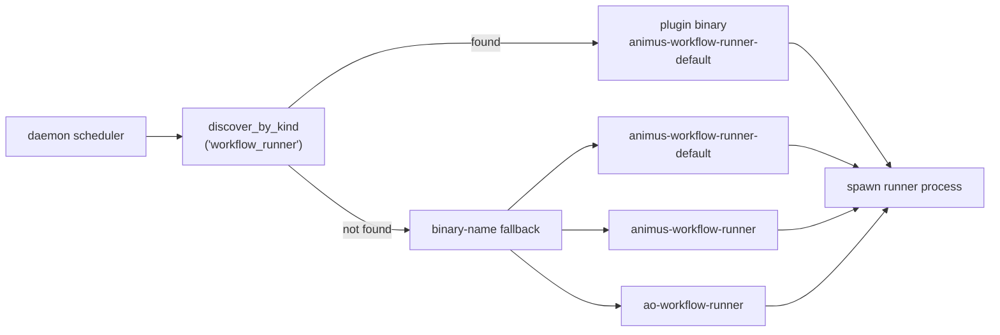
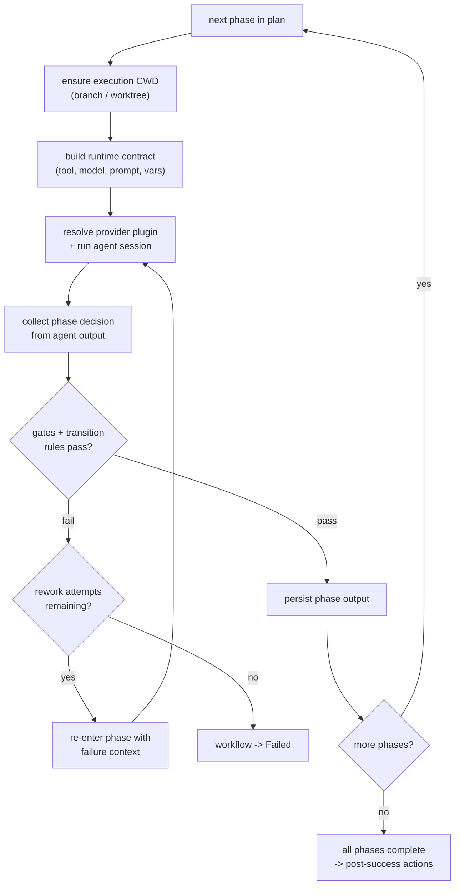
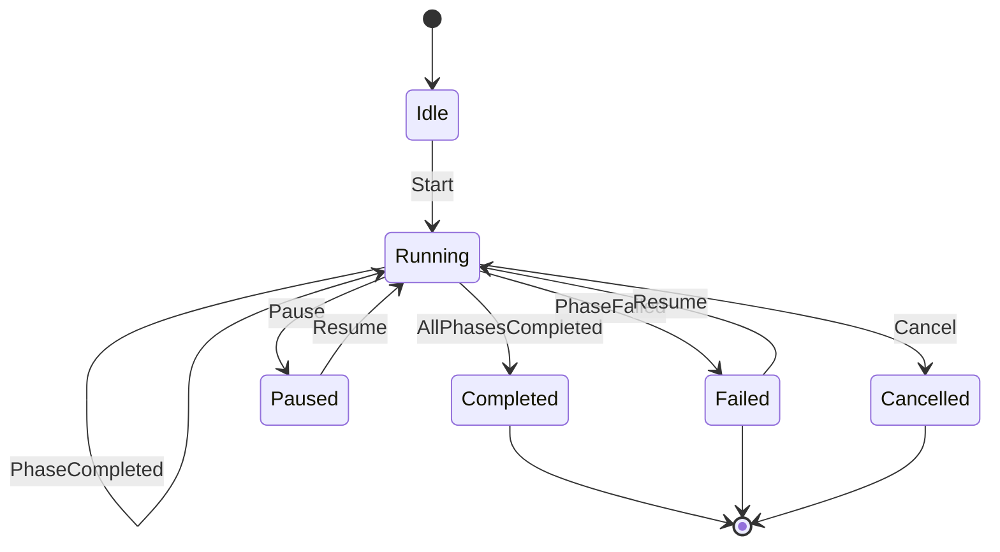
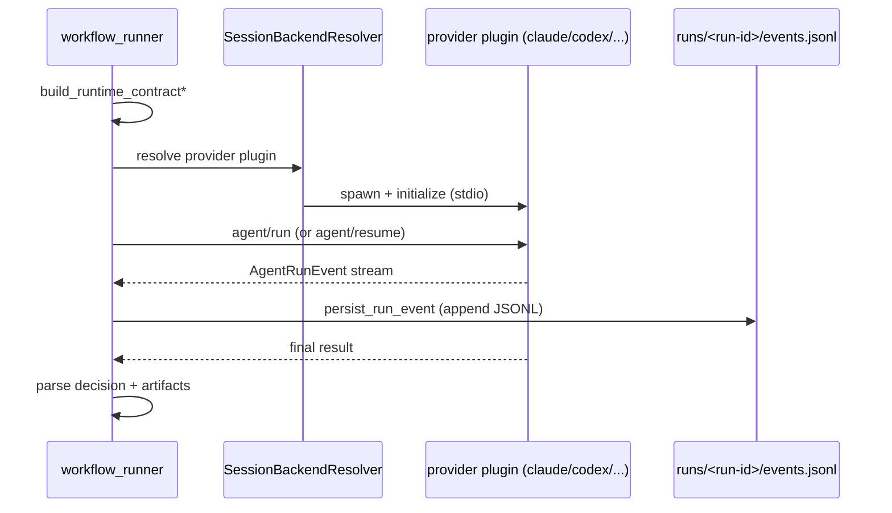

# Workflow Runner Internals

The in-tree workflow execution helpers now live in `animus-runtime-shared`.
External `workflow_runner` plugins, with `animus-workflow-runner-default` as
the preferred executable, consume those shared modules to execute workflow
phases. Legacy `animus-workflow-runner` / `ao-workflow-runner` names remain
fallback resolution targets for older installs.

The daemon resolves which executable to run by plugin kind, falling back to known binary names only for older installs.



## YAML Resolution

When a workflow is started, the runner resolves the `workflow_ref` to a compiled workflow definition:

1. Load the compiled workflow config from the project's state directory
2. Look up the workflow definition by its ref identifier
3. Resolve the phase plan -- which phases to execute, in what order, with what configuration
4. Expand workflow variables and apply any phase filters

The configuration crate (`orchestrator-config`) handles YAML parsing, variable expansion (`expand_variables`), and compilation (`compile_yaml_workflow_files`).

## Phase Execution Loop

The phase-execution machinery (`phase_executor`, `workflow_execute`,
`phase_targets`, `phase_failover`, `phase_command`, `skill_dispatch`,
`direct_exec`) is plugin-private to the `workflow_runner` plugin and is NOT in
this repository — see the `animus-runtime-shared` crate doc comment. The
in-tree `animus-runtime-shared` crate only carries the modules the plugin and
the kernel daemon must read byte-identically (phase session/output state,
runtime-contract construction, event emitters, the reattach back-channel). The
runner iterates through the resolved phase plan roughly as follows:

```
for each phase in phase_plan:
    1. Ensure execution CWD exists (branch checkout, worktree setup)
    2. Build runtime contract (tool, model, system_prompt, variables)
    3. Resolve the provider plugin and run the agent session
    4. Collect phase decision from agent output
    5. Evaluate phase gates and transition rules
    6. If failed and rework attempts remain, re-enter phase with failure context
    7. Persist phase output
```

Phase events (`PhaseEvent::Started`, `PhaseEvent::Decision`, `PhaseEvent::Completed`) are emitted to an optional callback for monitoring.

The same loop drawn as a flowchart, including the rework branch:



## State Machine

The workflow state machine (`crates/orchestrator-core/src/workflow/state_machine.rs`) governs valid transitions:



Guard conditions can be attached to transitions. The `evaluate_guard()` function checks runtime context (e.g., whether rework attempts are exhausted) to determine if a transition is allowed.

## Rework Loops

When a phase fails, the runner checks whether rework is allowed:

- `max_rework_attempts` (default from `DEFAULT_MAX_REWORK_ATTEMPTS`) limits how many times a phase can retry
- The recovery action is classified by `classify_phase_recovery()` in `crates/animus-runtime-shared/src/workflow_merge_recovery.rs` (the heavier failover/classifier logic is plugin-private)
- If rework is attempted, the failure context (error message, previous output) is passed back to the agent as additional context in the next attempt
- If rework attempts are exhausted, the workflow transitions to Failed

## Provider Session Path

There is no IPC socket and no standalone agent-runner sidecar. The sidecar and
its Unix-socket bridge were deleted in v0.5.3; provider plugins now own session
execution end to end. `crates/animus-runtime-shared/src/ipc.rs` retains only the
JSONL run-log layout (`run_dir`, `persist_run_event`, `append_line`) and the
`build_runtime_contract*` helpers — there is no connect, authenticate, token, or
socket code left in it.

For each agent phase the runner:

1. Builds the `runtime_contract` envelope via `build_runtime_contract*`
2. Resolves the provider plugin through `orchestrator-plugin-host::session`
   (`SessionBackendResolver`), which spawns and initializes the plugin
3. Drives the session (`agent/run` or `agent/resume`) over the plugin host
4. Streams `AgentRunEvent` notifications back from the provider plugin
5. Parses events to extract phase decisions, tool-call results, and artifacts

The provider runs directly over the plugin host — there is no socket bridge or sidecar between the runner and the provider plugin.



See [Provider Sessions](agent-runner-ipc.md) for the full session model.

## Runtime Contract Construction

The runtime contract is assembled via `animus-runtime-shared` before the agent
request is sent:

- **Tool** -- Which CLI tool to use (claude, codex, gemini, opencode), resolved from phase config or agent profile
- **Model** -- Which LLM model to target, with cascade: phase runtime override > agent profile > compiled defaults
- **System prompt** -- Assembled from phase prompt templates with variable substitution
- **Variables** -- Workflow-level and phase-level variables merged together
- **Capabilities** -- Read-only flags, response schema flags, and other tool-specific capabilities

Tool/model selection with fallback logic — including the write-capable redirect
that steers non-editing tools to a write-capable fallback for implementation
phases — lives in the plugin-private `phase_targets` / `phase_failover` modules
of the `workflow_runner` plugin, not in this repository.

## Post-Success Actions

After all phases complete successfully, the runner can execute post-success actions:

- **Merge** -- Merge the workflow branch back to the base branch (with strategy from config)
- **PR creation** -- Create a pull request for the workflow branch
- **Merge recovery** -- Handle merge conflicts via `workflow_merge_recovery.rs`
- **Cleanup** -- Remove worktrees and temporary state
