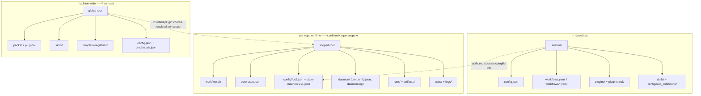

# Data Layout

Animus splits repository-authored configuration from repo-scoped runtime state.

At a glance: the in-repo `.animus/` holds authored sources, the per-repo `~/.animus/<repo-scope>/` holds mutable runtime state, and `~/.animus/` holds machine-wide installs shared by every project.



## Project-Local Layout

These files live in the repository:

```text
.animus/
├── config.json
├── config/
│   └── skill_definitions/
│       └── <skill-name>.yaml # optional project-scoped YAML skills
├── workflows.yaml              # optional single-file workflow source
├── workflows/
│   ├── custom.yaml
│   ├── standard-workflow.yaml
│   ├── hotfix-workflow.yaml
│   └── research-workflow.yaml
├── plugins.lock                # optional project-local plugin integrity lockfile
├── skills/
│   └── <skill-name>/SKILL.md   # optional project-scoped Markdown skills
└── plugins/
    ├── <plugin-binary>         # optional project-local STDIO plugin binary
    └── <pack-id>/              # optional project pack override root
```

Key points:

- `.animus/workflows.yaml` and `.animus/workflows/*.yaml` are the authored workflow sources
- `.animus/skills/<name>/SKILL.md` and `.animus/config/skill_definitions/<name>.yaml` are
  project-scoped skill sources at the highest skill-resolution priority
- `.animus/plugins/` is also scanned as the project-local plugin discovery directory
- `.animus/plugins/<pack-id>/` is the project override root for pack content during workflow
  resolution
- `.animus/plugins.lock` is the project-local plugin integrity lockfile when lockfile resolution
  is scoped to the repository instead of the global `~/.animus/plugins.lock` fallback
- `.animus/config.json` stores repository-local Animus config
- Daemon automation settings are persisted under the repo-scoped runtime root,
  not under project-local `.animus/` for new writes

## Repo-Scoped Runtime Layout

Mutable runtime state lives outside the repo:

```text
~/.animus/<repo-scope>/
├── core-state.json
├── resume-config.json
├── workflow.db
├── config/
│   ├── state-machines.v1.json
│   ├── workflow-config.v2.json
│   └── agent-runtime-config.v2.json
├── daemon/
│   ├── daemon.log
│   └── pm-config.json
├── chat/
│   └── <conversation-id>/
│       ├── meta.json
│       └── messages.jsonl
├── docs/
│   ├── architecture.json
│   ├── vision.json
│   └── product-vision.md
├── logs/
│   ├── events.jsonl
│   └── runs/
├── metrics/
│   ├── pending.jsonl
│   └── last-send.txt
├── runs/
│   └── <workflow-run-id>/
├── artifacts/
│   └── <workflow-run-id>/
├── secrets/
│   └── index.json
├── state/
│   ├── pack-selection.v1.json
│   ├── schedule-state.json
│   ├── handoffs.json
│   ├── history.json
│   ├── errors.json
│   └── ...
└── worktrees/
```

Key points:

- `workflow.db` stores persisted workflows, tasks, requirements, checkpoints,
  and actor-scoped workflow-launch idempotency reservations
- `core-state.json` stores the shared runtime snapshot Animus loads at startup
- `config/state-machines.v1.json` stores the effective state-machine document
- `config/workflow-config.v2.json` stores compiled workflow config when a compile/write flow
  persists it under the scoped runtime root
- `config/agent-runtime-config.v2.json` stores compiled agent runtime config when a compile/write
  flow persists it under the scoped runtime root
- `daemon/pm-config.json` stores persisted daemon settings
- `chat/<conversation-id>/meta.json` stores the continuity pointer for a conversation, and `chat/<conversation-id>/messages.jsonl` stores the append-only portable transcript; assistant lines may include a `blocks` timeline for text, thinking, and tool activity
- `daemon/daemon.log` is the autonomous daemon process log file
- `logs/events.jsonl` stores redacted structured runtime events under the
  scoped state root; daemon events are still mirrored here when a
  `log_storage_backend` plugin is active
- `runs/<workflow-run-id>/` stores per-run execution state (phase outputs,
  events, decision logs) and `artifacts/<workflow-run-id>/` stores run
  artifacts; neither is auto-deleted — reclaim disk with
  `animus workflow prune` (bulk, terminal runs only) or
  `animus workflow delete --run-id <id>` (single run)
- `metrics/pending.jsonl` buffers opt-in anonymous usage events, `metrics/flushing-*.jsonl` holds rotated in-flight batches during a flush, and `metrics/last-send.txt` records the last successful flush timestamp
- `secrets/index.json` stores only the set of known secret KEY names for this
  repo scope; secret values themselves stay in the OS keychain
- `state/handoffs.json`, `state/history.json`, and `state/errors.json` are the
  current domain-state JSON stores persisted under the repo-scoped runtime root
- other files under `state/` may appear over time as specific subsystems persist
  additional runtime state
- `worktrees/` stores managed task worktrees for that repository scope

## Machine-Wide Layout

Animus also uses machine-wide directories that are not tied to one repository:

```text
~/.animus/
├── config.json
├── credentials.json
├── daemon-events.jsonl
├── cli-tracker.json
├── runner-sessions/
│   └── <run-id>.session.json          # provider session-id sidecars (resume lookup)
├── packs/
│   └── <pack-id>/<version>/         # installed packs
├── plugins/
│   └── <plugin-name>                # installed STDIO plugin binaries (animus plugin install)
├── skills/
│   └── <skill-name>/                # user-scoped Markdown skills (SKILL.md)
└── template-registries/
    └── <registry-id>/               # cached project-template registries (animus init)
        ├── .commit                  # pinned upstream commit sha
        └── templates/
            └── <template-id>/template.toml
```

Notes:

- `~/.animus/packs/` holds machine-installed packs only. Current builds do not
  ship bundled pack content or bundled skill fallback.
- `~/.animus/runner-sessions/<run-id>.session.json` holds provider session-id
  sidecars used to resume native provider sessions; the directory is overridable
  with `ANIMUS_RUNNER_SESSION_DIR`.
- `~/.animus/template-registries/<registry-id>/` is pinned to a specific commit by default
  (v0.4.0 supply-chain hardening). `animus init --update-registry` fetches HEAD and re-pins.
- `~/.animus/plugins/` is the install target for `animus plugin install --path` and
  `animus plugin install --url --sha256`.

### Agent-host skill probes

Animus also scans well-known agent-host skill directories at discovery time. These are
treated as a separate, lower-trust source: only prompt text is honored, and structural
fields (`tool_policy`, `mcp_servers`, `env`, `extra_args`, `capabilities`, `adapters`,
`codex_config_overrides`) are stripped at parse time.

```text
~/.claude/skills/<name>/SKILL.md     # AgentHost { host: "claude-code", scope: Global }
~/.codex/skills/<name>/SKILL.md      # AgentHost { host: "codex",       scope: Global }
.claude/skills/<name>/SKILL.md       # AgentHost { host: "claude-code", scope: Project }
.codex/skills/<name>/SKILL.md        # AgentHost { host: "codex",       scope: Project }
```

These probes appear in `animus.skill.list` / `animus.skill.search` results with
`source: "agent_host"` and `source_detail.trust_tier: "prompt_text_only"`.

## Repository Scope Format

`<repo-scope>` is derived from the canonical project path:

```text
<sanitized-repo-name>-<12-hex-sha256-prefix>
```

This keeps runtime data stable across linked worktrees while avoiding collisions between repositories with the same basename.

## Mutation Policy

Do not hand-edit Animus-managed JSON or SQLite state unless you are explicitly working on Animus persistence or migrations.

Use Animus commands or Animus MCP tools instead.

## Resolution-Related Paths

| Path | Purpose |
|---|---|
| `.animus/workflows.yaml` | Single-file project workflow source |
| `.animus/workflows/*.yaml` | Multi-file project workflow sources |
| `.animus/plugins.lock` | Project-local plugin integrity lockfile |
| `.animus/skills/<name>/SKILL.md` | Project-scoped Markdown skill (highest skill priority) |
| `.animus/config/skill_definitions/<name>.yaml` | Project-scoped YAML skill definition (highest skill priority) |
| `.animus/plugins/` | Project-local plugin discovery/install directory |
| `.animus/plugins/<pack-id>/` | Project-local pack override root |
| `~/.animus/<repo-scope>/workflow.db` | Persisted workflows, tasks, requirements, checkpoints, and workflow-launch idempotency reservations |
| `~/.animus/<repo-scope>/config/state-machines.v1.json` | Repo-scoped state-machine config |
| `~/.animus/<repo-scope>/config/workflow-config.v2.json` | Compiled repo-scoped workflow config |
| `~/.animus/<repo-scope>/config/agent-runtime-config.v2.json` | Compiled repo-scoped agent runtime config |
| `~/.animus/<repo-scope>/daemon/daemon.log` | Autonomous daemon process log |
| `~/.animus/<repo-scope>/logs/events.jsonl` | Redacted structured runtime event log |
| `~/.animus/<repo-scope>/state/pack-selection.v1.json` | Repo-scoped pack selection state |
| `~/.animus/packs/<pack-id>/<version>/` | Machine-installed pack root |
| `~/.animus/skills/<name>/SKILL.md` | User-scoped Markdown skill |
| `~/.animus/config/skill_definitions/<name>.yaml` | User-scoped YAML skill definition |
| `~/.animus/plugins/<name>` | Installed STDIO plugin binary (`animus plugin install`) |
| `~/.animus/template-registries/<registry-id>/` | Cached project-template registry (pinned by `.commit`) |
| `~/.claude/skills/<name>/SKILL.md` | Agent-host (Claude Code) skill probe — prompt-text-only trust |
| `~/.codex/skills/<name>/SKILL.md` | Agent-host (Codex) skill probe — prompt-text-only trust |

## Registry Systems

Animus maintains three independent registries — for skills, packs, and plugins. Each tracks a different kind of installable artifact and lives at a different path. They are separate because their lifecycles, trust models, and resolution rules differ.

### Skill registry

| File | Purpose |
|---|---|
| `~/.animus/<repo-scope>/state/skills-registry.v1.json` | Catalog of installed skill versions for this project scope; written by `animus skill install` and `animus skill publish`. |
| `~/.animus/<repo-scope>/state/skills-lock.v1.json` | Integrity lock for the installed skill versions; pins the resolved version set and prevents silent drift. **Known limitation:** there is no per-skill `animus skill pin` verb (unlike `animus pack pin`); the lock pins the whole resolved set on `install` / `update`, so pinning a single skill independently is not yet supported. |

The skill registry is per-project-scope. Each project independently tracks which skill versions are installed and which registries (source URLs) are configured. `animus skill list` and `animus skill info` read from this registry.

### Pack registry (selection state)

| File | Purpose |
|---|---|
| `~/.animus/<repo-scope>/state/pack-selection.v1.json` | Per-project pack pin and enablement state: which packs are active, which are disabled, version overrides. |
| `~/.animus/packs/<pack-id>/<version>/` | Machine-wide installed pack content (materialized from a `pack.toml` bundle). |
| `~/.animus/state/pack-marketplaces.v1.json` | Machine-wide list of registered marketplace registries and their last-sync timestamps. |
| `~/.animus/marketplace-cache/<registry-id>/` | Local git clone of a marketplace registry; contains `.claude-plugin/marketplace.json` catalog. |

Pack installation is machine-wide (binary content lands in `~/.animus/packs/`). Activation is per-project (recorded in `pack-selection.v1.json` under the repo-scoped runtime root). This means the same installed pack version can be active for one project and disabled for another.

### Plugin registry

| File | Purpose |
|---|---|
| `~/.animus/plugins.yaml` | Machine-wide canonical plugin registry: names, binary paths, manifest metadata, and install-time integrity info. Written by `animus plugin install`. |
| `.animus/plugins.yaml` | Project-local plugin registry overlay; written by `animus plugin install --project`. Project-local entries shadow same-named global entries. |
| `~/.animus/plugins/<name>` | Installed plugin binary (or symlink). Discovery scans this directory at startup. |
| `.animus/plugins/<name>` | Project-local plugin binary; discovered at higher precedence than the machine-wide install dir. |
| `.animus/plugins.lock` | Project-local plugin integrity lockfile; committable so a repo can pin its plugin set. Falls back to `~/.animus/plugins.lock` when absent. |

The plugin registry is consulted at daemon start and by `animus plugin list` / `animus plugin status`. Unlike packs, plugins are not versioned through the Animus registry — binary updates happen by reinstalling from the source URL or local path.

### Why three separate registries

- **Lifecycle**: skills are versioned text artifacts; packs are versioned file bundles; plugins are opaque binaries. Each needs different integrity and resolution semantics.
- **Scope**: skill and pack state is per-project-scope (so two projects can pin different versions); plugin state is machine-wide (a binary is shared by all daemons on the machine).
- **Trust model**: plugin binaries are highest-trust (they run as child processes); pack content is medium-trust (YAML executed by the workflow runner); skill prompts are lower-trust (injected text only, and agent-host probes are further sandboxed to prompt-text-only).

See also: [Configuration](configuration.md), [State Management](../concepts/state-management.md), [Project Setup](../getting-started/project-setup.md).
